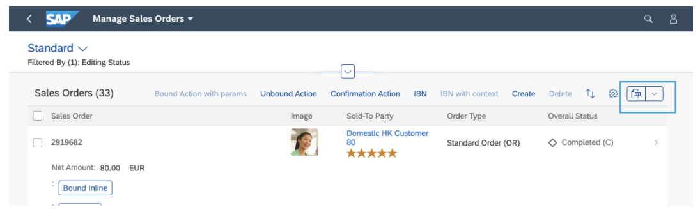
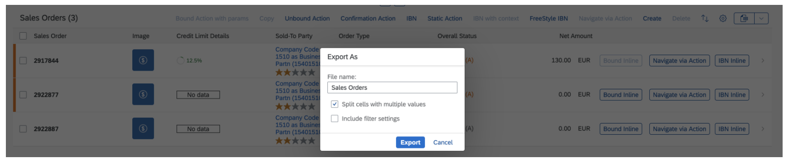

<!-- loio4bab6f2043814257974b52d4dafe1dcd -->

# Using the *Export* Feature

You can export a table into a spreadsheet or to PDF.

> ### Note:  
> This topic is only applicable to SAP Fiori elements for OData V4. For more information on the export option in V2, see [Adapting the UI: List Report and Object Page](adapting-the-ui-list-report-and-object-page-0d2f1a9.md).


<a name="loio4bab6f2043814257974b52d4dafe1dcd__section_jy3_4pg_mtb"/>

## Export to Spreadsheet

By default, export is enabled in the list report and on the object page. When enabled, the *Export* button is displayed in the table toolbar. When selected, it exports the values in the table .

On the object page, the paste feature is also available by default. For more details, see [Copying and Pasting from Spreadsheet Applications to Tables](copying-and-pasting-from-spreadsheet-applications-to-tables-f6a8fd2.md).

  

To disable the feature in the list report and enable it in the object page, use the `enableExport` property of the manifest of the application and set it to false/true. In the `controlConfiguration` section of the page, annotate the `LineItem` on which the export should be disabled/enabled as shown in the code sample below:

> ### Sample Code:  
> ```
> "SalesOrderManageList": {
>    "type": "Component",
>    "id": "SalesOrderManageList",
>    "name": "sap.fe.templates.ListReport",
>    "options": {
>       "settings": {
>          "entitySet": "SalesOrderManage",
>          "controlConfiguration": {
>             "@com.sap.vocabularies.UI.v1.LineItem": {
>                "tableSettings": {
>                   "enableExport": false
>                },
>             }
>          }
>       }
>    }
> },
> "SalesOrderManageObjectPage": {
>    "type": "Component",
>    "id": "SalesOrderManageObjectPage",
>    "name": "sap.fe.templates.ObjectPage",
>    "options": {
>       "settings": {
>          "entitySet": "SalesOrderManage",
>          "controlConfiguration": {
>             "_Item/@com.sap.vocabularies.UI.v1.LineItem": {
>                "tableSettings": {
>                   "enableExport": true
>                },
>             }
>          }
>       }
>    }
> },
> ```

**Menu Button**

Clicking the export icon starts the export with default settings.

Clicking the drop-down arrow opens a menu with two additional options:

-   *Export*

    Exports the table with default settings.

-   *Export As...*

    Opens a dialog for specifying the export settings:

    -   Split cells with multiple values: when selecting this option, the exported spreadsheet has one column per value. If one column contains multiple values in a cell \(for example, amount and currency/unit\), this results in two separate columns in the spreadsheet. The following list provides all cases that result in multiple columns exported with this mode:

        -   Amount and unit, or price and currency: One column will contain the value or price, the second will contain the unit or currency.

        -   Code and value \(properties annotated with `Text` or `TextArrangement`\): One column will contain the code, the second will contain the description. Note: the `TextArrangement` annotation is not read. The code and the description will always be exported as soon as there is a `Text` annotation.

        -   `dataFieldForAnnotation` pointing to a `DataPoint` with a target value \(rating, progress visualizations\): The value of the property and the target value will be exported into separate columns.

        -   `dataFieldForAnnotation` pointing to a `FieldGroup`: Every property of the `FieldGroup` will be exported into a separate column.

        -   Custom columns with several properties defined: Every defined property of the custom column will be exported into a separate column. See the note below for details.


    -   Include filter settings: the current filter is included on a second sheet in the exported file.


  

> ### Note:  
> You can export the custom columns you have defined via manifest settings. To allow the export of your custom column, you must maintain the `"properties"` array in the definition of the custom column. For more information about how to define custom columns, see the section Sorting and Filtering in the topic [Extension Points for Tables](extension-points-for-tables-d525522.md). The properties will be exported into the spreadsheet as described for a `FieldGroup`.

> ### Restriction:  
> -   The columns containing a multi-input field \(1:N\), `DataFieldForAnnotation` that points to `Charts` or a `DataFieldForAction`, are exported without any content.
> 
> -   Columns containing a property with a dynamic `UI.Hidden` expression are still exported
> 
> -   The numbers exceeding 15 digits are rounded in the spreadsheet file \(this is a JavaScript restriction\).


<a name="loio4bab6f2043814257974b52d4dafe1dcd__section_plw_ppg_mtb"/>

## Export to PDF

To enable the export to PDF, you must configure the following annotations at service level:

-   `@Org.OData.Capabilities.V1.SupportedFormats`

    This annotation must contain `"application/pdf"`.

-   `@com.sap.vocabularies.PDF.v1.Feature`

    For more information, see [https://github.com/SAP/odata-vocabularies/blob/main/vocabularies/PDF.md](https://github.com/SAP/odata-vocabularies/blob/main/vocabularies/PDF.md).


