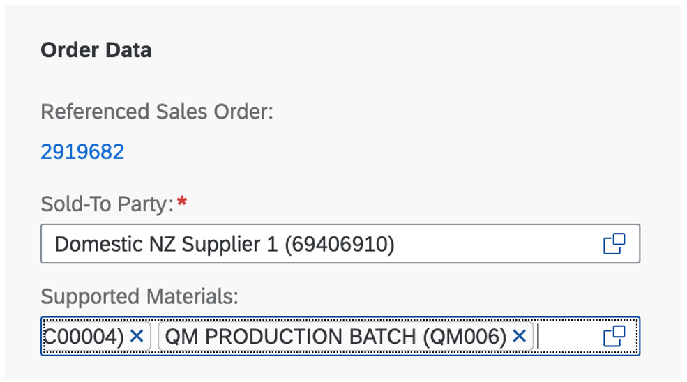
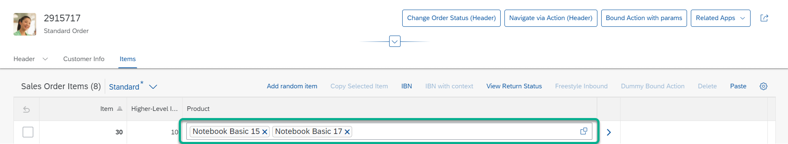

<!-- loio04ff5b1a81344a8e8169ea99630ff4e5 -->

# Using the Multi-Input Field on the Object Page

When you can enter more than one value, the multi-input field is rendered on the object page.

If the system identifies a 1:N association of a `DataField`, the multi-input field is activated automatically.

You must define a 1:N association in the data model.

In the following example, `"_supportedMaterial"` is a one-to-many `navigationProperty` pointing to the `"SupportedMaterial"` entity:

> ### Sample Code:  
> ```
> _SupportedMaterials : Composition of many SupportedMaterial on _SupportedMaterials.owner = $self;
> 
> ```

You can use the navigation property inside a `UI.DataField` to display values of the target entity. The following example shows how to display the `"material"` property of every associated `"SupportedMaterial"`:

> ### Sample Code:  
> XML Annotation
> 
> ```
> <Annotation Term="UI.LineItem">
>   <Collection>
> <Record Type="UI.DataField">
> 	  <PropertyValue Property="Value" Path="_SupportedMaterials.Material " />
> 	</Record>
>   </Collection>
> </Annotation>
> 
> ```

> ### Sample Code:  
> ABAP CDS Annotation
> 
> ```
> @UI: {  lineItem: [ { value: '_SupportedMaterials.Material', label: 'Supported Materials' } ] }  
> _SupportedMaterials;
> ```

> ### Sample Code:  
> CAP CDS Annotation
> 
> ```
> LineItem : {
> 	{
> 		$Type             : 'UI.DataField',
> 		Label			  : 'Supported Materials',
> 		Value             : _SupportedMaterials.Material,
> 	 },
> …
> }
> 
> ```

The following image shows the result on the UI:

  

> ### Tip:  
> Define the value help on the target property to add and remove existing values from the multi-input field.

> ### Note:  
> Multi-input fields are only supported in draft-enabled applications.

The multi-input field is also available for tables.

   
  
**Multi-Input Control on the Object Page Table**

  

> ### Restriction:  
> Note the following for SAP Fiori elements for OData V4:
> 
> -   You cannot edit the multi-input field within the table – even if you switch from display mode to edit mode and the rest of the table is editable. When you export to a spreadsheet, note that the respective column will be empty.
> 
> -   You cannot mark multi-input fields as mandatory.
> 
> -   You cannot use the multi-input field if you need to display more than 100 selected values, since this isn't supported. In this case we recommend that you use a table instead.

**Related Information**  


[Tables](tables-c0f6592.md "SAP Fiori elements supports several table types.")

