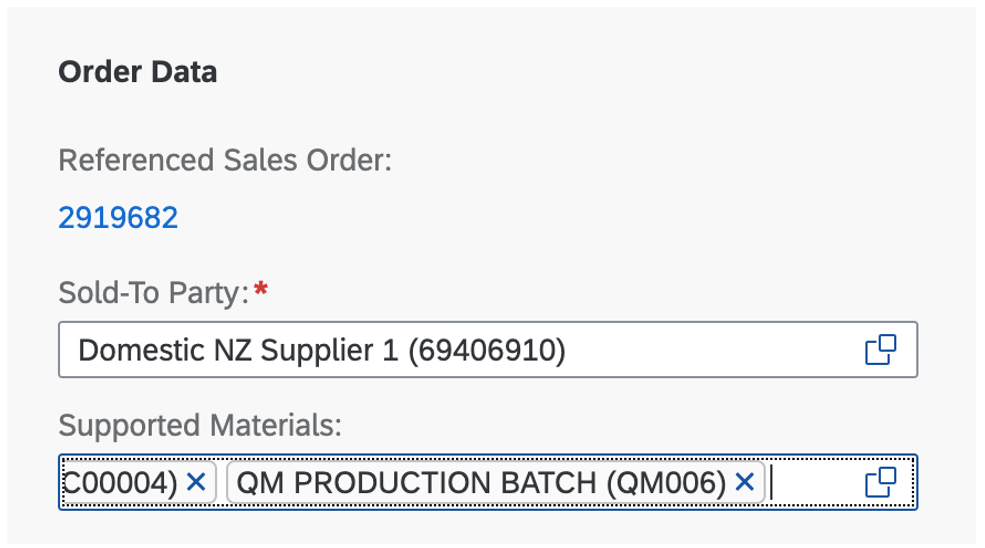
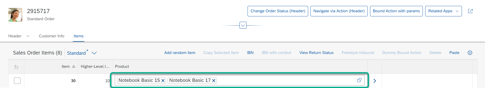

<!-- loio4e69fd347d0f4c3a8d776d958f862563 -->

# Using the Multi-Input Field on the Object Page

You can render a multi-input field on the object page.

> ### Note:  
> For information about SAP Fiori elements for OData V4, see [Using the Multi-Input Field on the Object Page](using-the-multi-input-field-on-the-object-page-04ff5b1.md).

If the system identifies a 1:n association of a `DataField` on an object page, the multi-input field is activated automatically.

You must define a 1:n association in the data model.

In the following example, `"_supportedMaterial"` is a one-to-many `navigationProperty` pointing to the `"SupportedMaterial"` entity:

> ### Sample Code:  
> ABAP CDS Annotation
> 
> ```
> composition [0..*] of SupportedMaterial as _SupportedMaterials
> ```

> ### Sample Code:  
> CAP CDS Annotation
> 
> ```
> _SupportedMaterials : Composition of many SupportedMaterial on _SupportedMaterials.owner = $self;
> ```

You can use the navigation property inside a `UI.DataField` to display the values of the target entity. The following example shows how to display the `"material"` property of every associated `"SupportedMaterial"`:

> ### Sample Code:  
> XML Annotation
> 
> ```
> 
> <Annotation Term="UI.LineItem">
>     <Collection>
>         <Record Type="UI.DataField">
>             <PropertyValue Property="Value" Path="_SupportedMaterials.Material " />
>         </Record>
>     </Collection>
> </Annotation>
> 
> ```

> ### Sample Code:  
> ABAP CDS Annotation
> 
> ```
> @UI: {
>     lineItem: [
>         {
>             value: '_SupportedMaterials.Material',
>             label: 'Supported Materials'
>         }
>     ]
> }
> @UI.fieldGroup: [
>     {
>         position: 10,
>         qualifier: 'FieldgroupID',
>         value: '_SupportedMaterials.Material'
>     }
> ]
> _SupportedMaterials
> ```

> ### Sample Code:  
> CAP CDS Annotation
> 
> ```
> 
> LineItem : {
>     {
>         $Type             : 'UI.DataField',
>         Label             : 'Supported Materials',
>         Value             : _SupportedMaterials.Material,
>     },
>     …
> }
> 
> ```

The following image shows the result on the UI:



> ### Tip:  
> Define the value help on the target property to add and remove existing values from the multi-input field.

You can bind the values entered into a multi-input field to a JSON model.

> ### Note:  
> Multi-input fields are only supported in draft-enabled applications.

The multi-input field is also available for tables.

  
  
**Multi-Input Control on the Object Page Table**



**Related Information**  


[Tables](tables-f242a02.md "You can configure the appearance, interactivity, and loading behavior of tables.")

