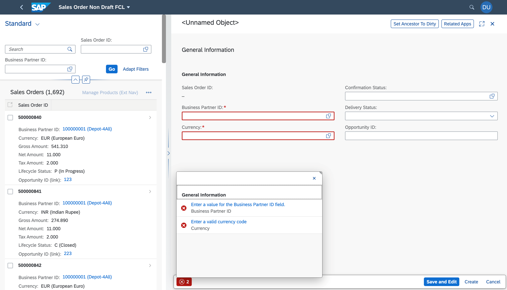

<!-- loio400565b3b81e4fceb2b9aef1679f005b -->

# Validation of Required Fields in Non-draft Applications

During object creation, before a request is sent to back end, the fields annotated with `RequiredProperties` under `InsertRestrictions` are validated to ensure that they are not empty. If these fields are empty, an error message is displayed in the message popover of the corresponding page with a link that navigates to the error field.

> ### Note:  
> This topic is currently only applicable to SAP Fiori elements for OData V2.

The following annotation needs to be configured individually for each entity set.

> ### Sample Code:  
> ```
> <Annotations Target="STTA_SALES_ORDER_ND_SRV_01.STTA_SALES_ORDER_ND_SRV_01_Entities/STTA_C_SO_SalesOrder_ND">
>        <Annotation Term="Org.OData.Capabilities.V1.InsertRestrictions">
>                 <Record Type="Org.OData.Capabilities.V1.InsertRestrictionsType">
>                         <PropertyValue Property="RequiredProperties">
>                              <Collection>
>                                  <PropertyPath> BusinessPartnerID </PropertyPath>
>                                  <PropertyPath> CurrencyCode </PropertyPath>
>                              </Collection>
>                         </PropertyValue>
>                 </Record>
>         </Annotation>
> </Annotations>
> 
> ```

  


<a name="loio400565b3b81e4fceb2b9aef1679f005b__section_lrk_tfx_gsb"/>

## Custom Text in the Message Box

You can overrite the default message provided by the framework with custom text. To overwrite the standard text, define new text for `CREATE_MANDATORY|PropertyName = CUSTOM TEXT`. For example, `CREATE_MANDATORY|CurrencyCode = Enter a valid currency code`.

In this sample code:

-   *Enter a value for the Business partner ID field* is the default text from the framework.

-   *Enter a valid currency code* is the custom text from the application.


> ### Note:  
> Required fields are not validated during create with dialog.

