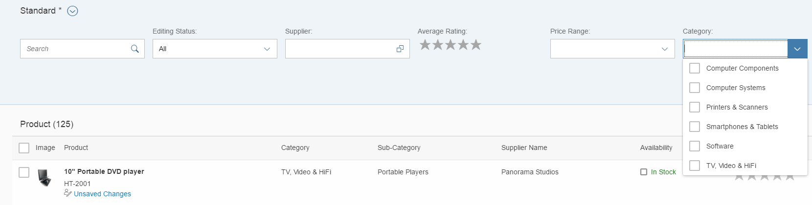
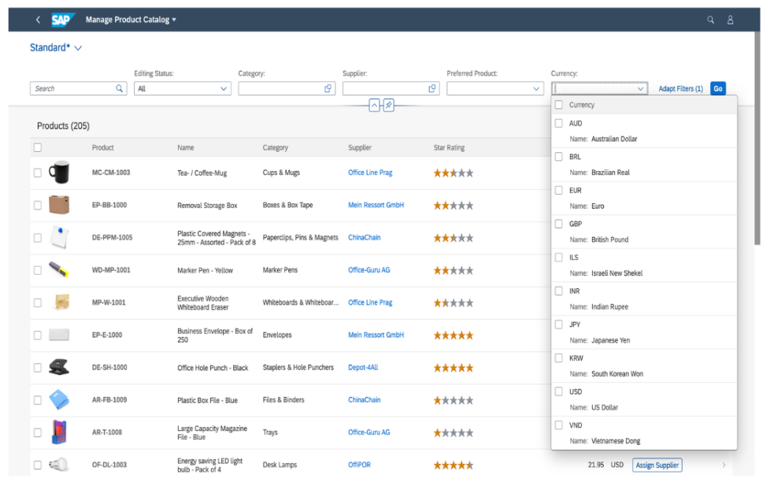

<!-- loio2a0a630e50c7472b803fb94dab922d18 -->

# Value Help as a Dropdown List

If your value help contains a fixed number of values, a dropdown list will be rendered.

For more information on how value help annotations are set in CDS, search for *UI Annotations* in the documentation of your SAP NetWeaver version on the SAP Help Portal at [https://help.sap.com/viewer/p/SAP\_NETWEAVER](https://help.sap.com/viewer/p/SAP_NETWEAVER).


<a name="loio2a0a630e50c7472b803fb94dab922d18__section_nfd_b3f_ymb"/>

## Additional Features in SAP Fiori Elements for OData V2

If the entity set of a value help has a fairly stable number of instances, you can render an input field with a value help and dropdown list box \(`sap.m.ComboBox` and in cases of multi selection a `sap.m.MultiComboBox`\) using the metadata extension `sap:semantics='fixed-values'` on the entity set level and the `sap:value-list='fixed-values'` on the property level.

In the following example the product category is implemented as a dropdown list box:

> ### Sample Code:  
> $metadata
> 
> ```
> <EntityType Name="SMART_C_ProductType" sap:label="Product" sap:content-version="1">
> 	<Key>...</Key>
> 	... 
> 	<Property Name="ProductCategory" Type="Edm.String" Nullable="false" MaxLength="40" sap:label="Category" sap:value-list="fixed-values" />
> 	...
> 	<EntityContainer Name="SMART_PROD_MAN_Entities" m:IsDefaultEntityContainer="true" sap:supported-formats="atom json xlsx">
> 	...
> 	<EntitySet Name="SEPMRA_I_ProductCategory" EntityType="SMART_PROD_MAN.SEPMRA_I_ProductCategoryType" 
> 							sap:creatable="false" sap:updatable="false" sap:deletable="false" sap:searchable="true" sap:content-version="1" sap:semantics="fixed-values" />
> ```

This is the rendering result:

  
  
**Product Category Values as Dropdown List Box**

  


<a name="loio2a0a630e50c7472b803fb94dab922d18__section_xdc_h3f_ymb"/>

## Additional Features in SAP Fiori Elements for OData V4

If the entity set of a value help has a fairly stable number of instances, you can render an input field with a value help and dropdown list box \(`sap.m.ComboBox` and in cases of multi selection a `sap.m.MultiComboBox`\) using the annotation `Common.ValueListWithFixedValues`.

In the following example the currency code is implemented as a dropdown list box:

> ### Sample Code:  
> XML Annotation
> 
> ```xml
> <Annotations Target="sap.fe.officesupplies.CatalogAdminService.Products/currency_code">
>    <Annotation Term="Common.Label" String="Currency"/>
>    <Annotation Term="Common.Text" Path="currency/name">
>       <Annotation Term="UI.TextArrangement" EnumMember="UI.TextArrangementType/TextOnly"/>
>    </Annotation>
>    <Annotation Term="Common.ValueListWithFixedValues" Bool="true"/>
>    <Annotation Term="Common.ValueList">
>      <Record Type="Common.ValueListType">
>        <PropertyValue Property="Label" String="Currency"/>
>        <PropertyValue Property="CollectionPath" String="Currencies"/>
>        <PropertyValue Property="Parameters">
>          <Collection>
>             <Record Type="Common.ValueListParameterInOut">
>                <PropertyValue Property="LocalDataProperty" PropertyPath="currency_code"/>
>                <PropertyValue Property="ValueListProperty" String="code"/>
>             </Record>
>             <Record Type="Common.ValueListParameterDisplayOnly">
>                <PropertyValue Property="ValueListProperty" String="name"/>
>             </Record>
>          </Collection>
>       </PropertyValue>
>     </Record>
>    </Annotation>
>    <Annotation Term="Core.Description" String="A currency code as specified in ISO 4217"/>
> </Annotations>
> ```

> ### Sample Code:  
> ABAP CDS Annotation
> 
> ```
> 
> annotate view PRODUCTS with {
> 	@Consumption.valueHelpDefinition:
> 	[{
> 	  entity :{
> 		 name    : 'Currencies',
> 		 element : 'code'
> 		},
> 	    label  : 'Currency'
> 	}]
> 
> 	@ObjectModel: {
> 		text: {
> 			element: [ 'name' ]
> 		 }
> 	}
> 	@UI.textArrangement: #TEXT_ONLY
>    currency_code;
> }
> 
> ```

> ### Sample Code:  
> CAP CDS Annotation
> 
> ```
> 
> annotate sap.fe.officesupplies.CatalogAdminService.Products with {
>     @Common.Label : 'Currency'
>     @Common : {
>         Text            : currency.name,
>         TextArrangement : #TextOnly
>     }
>     @Common.ValueListWithFixedValues : true
>     @Common.ValueList : {
>         $Type : 'Common.ValueListType',
>         Label : 'Currency',
>         CollectionPath : 'Currencies',
>         Parameters : [
>             {
>                 $Type : 'Common.ValueListParameterInOut',
>                 LocalDataProperty : currency_code,
>                 ValueListProperty : 'code'
>             },
>             {
>                 $Type : 'Common.ValueListParameterDisplayOnly',
>                 ValueListProperty : 'name'
>             }
>         ]
>     }
>     @Core.Description : 'A currency code as specified in ISO 4217'
>     currency_code
> };
> 
> ```

This is the rendering result:

  
  
**Currency Code as Dropdown List Box**

  

You can use `FilterRestrictions` annotations and set the `AllowedExpressions` property to `MultiValue` or `SingleValue`.

> ### Sample Code:  
> XML Annotation
> 
> ```xml
> <Annotation Term="SAP__capabilities.FilterRestrictions">
>     <Record>
>        <PropertyValue Property="FilterExpressionRestrictions">
>          <Collection>
>             <Record>
>                <PropertyValue Property="Property" PropertyPath="currency_code" />
>                <PropertyValue Property="AllowedExpressions" String="MultiValue" />
>             </Record>
> 	 </Collection>
>        </PropertyValue>
>     </Record> 
> </Annotation>
> ```

> ### Sample Code:  
> ABAP CDS Annotation
> 
> ```
> 
> @ObjectModel: { 
>     filter.enabled: false 
> }
> currency_code;
> ```

> ### Sample Code:  
> CAP CDS Annotation
> 
> ```
> 
> Capabilities.FilterRestrictions : {
>     FilterExpressionRestrictions : [
>         {
>             Property : currency_code,
>             AllowedExpressions : 'MultiValue'
>         }
>     ]
> }
> ```

