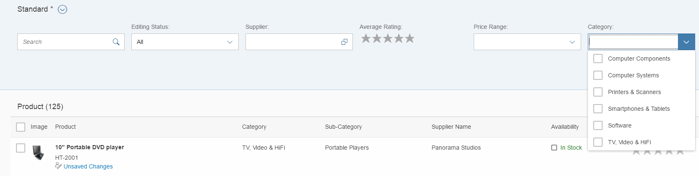

<!-- loiofa974ffd34ff4ada9fca8f1e82833c78 -->

# Value Help as a Dropdown List

You can configure value help as a dropdown list.

> ### Note:  
> For information about SAP Fiori elements for OData V4, see [Value Help as a Dropdown List](value-help-as-a-dropdown-list-2a0a630.md).

If the entity set of a value help has a fairly stable number of instances, you can render an input field with a value help and dropdown list box \(`sap.m.ComboBox` and in cases of multi selection a `sap.m.MultiComboBox`\) using the metadata extension `sap:semantics='fixed-values'` on the entity set level and the `sap:value-list='fixed-values'` on the property level.

In the following sample code, the product category is implemented as a dropdown list box:

> ### Sample Code:  
> $metadata
> 
> ```
> 
> <EntityType Name="SMART_C_ProductType" sap:label="Product" sap:content-version="1">
>     <Key>
>         ...
>     </Key>
>     ...
>     <Property 
>         Name="ProductCategory" 
>         Type="Edm.String" 
>         Nullable="false" 
>         MaxLength="40" 
>         sap:label="Category" 
>         sap:value-list="fixed-values" />
>     ...
> </EntityType>
> 
> <EntityContainer 
>     Name="SMART_PROD_MAN_Entities" 
>     m:IsDefaultEntityContainer="true" 
>     sap:supported-formats="atom json xlsx">
>     ...
>     <EntitySet 
>         Name="SEPMRA_I_ProductCategory" 
>         EntityType="SMART_PROD_MAN.SEPMRA_I_ProductCategoryType"
>         sap:creatable="false" 
>         sap:updatable="false" 
>         sap:deletable="false" 
>         sap:searchable="true" 
>         sap:content-version="1" 
>         sap:semantics="fixed-values" />
> </EntityContainer>
> 
> ```

The following screenshot shows the *Category* field displayed as a dropdown list box:

  
  
**Product Category Values as Dropdown List Box**



