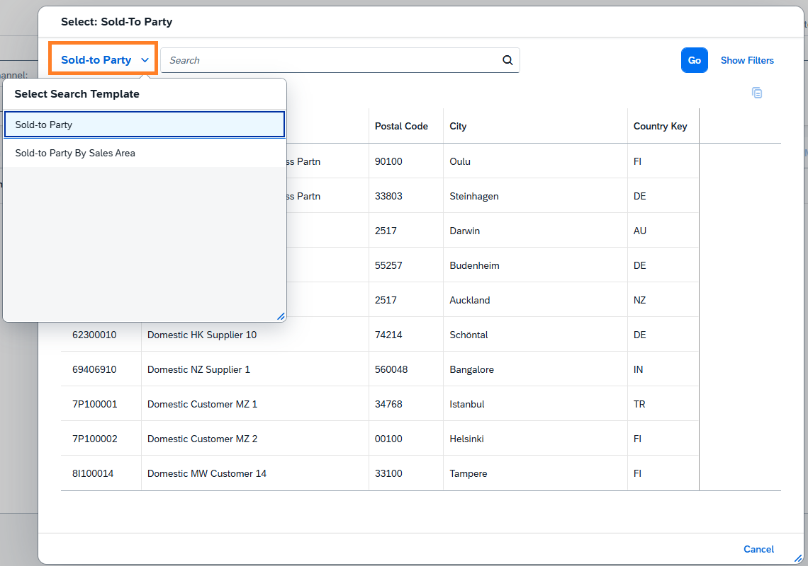
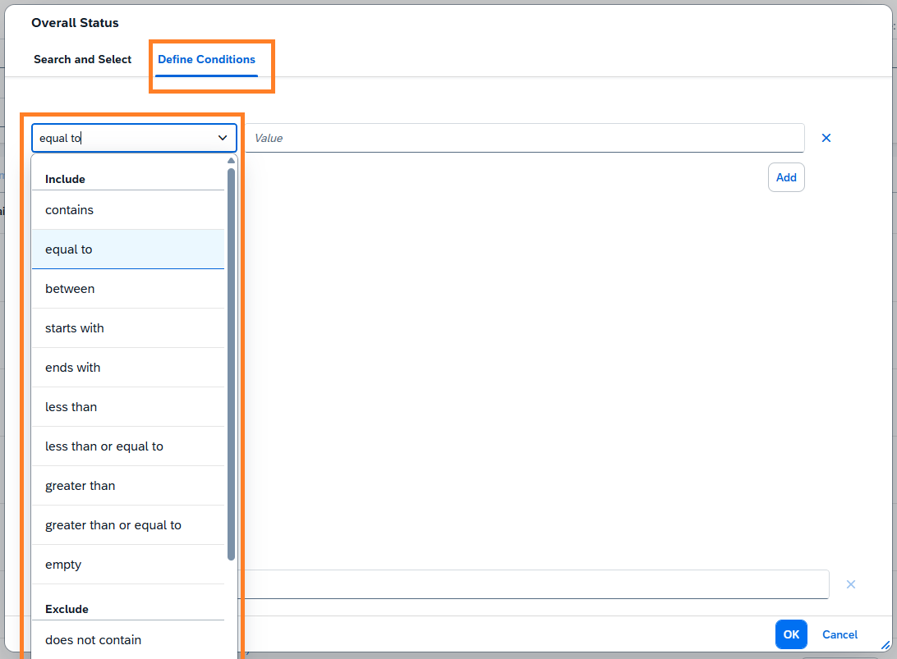

<!-- loio3faed838512648b099e14dfec458d847 -->

# Value Help Dialog

A field configured with value help typically allows end users to select values using a value help dialog. A value help dialog is useful when the associated value help entity contains a large dataset \(for example, more than 1000 items\), or when end users need to search using multiple attributes, such as city and company name.


<a name="loio3faed838512648b099e14dfec458d847__section_i4g_qmb_jfc"/>

## Configuring the Components of the Value Help Dialog

The value help dialog consists of several components, such as a filter bar, a table, and sometimes a dropdown list that allows end users to choose different flavors of the value help definition.


### Title

If the field is annotated with `DataField` and includes a `label` property, it is used as the title of the value help dialog. If the `label` property isn't defined in `DataField`, the `Common.Label` annotation of the property is used. If neither is defined, the `label` property defined in the `Common.ValueList` or `Common.ValueListMapping` annotation is used as a fallback.

When context-dependent value help is defined with `Common.ValueListRelevantQualifiers`, the label defined in the `Common.ValueList` or `Common.ValueListMapping` annotation is used as the title. If label isn't defined in either of these annotation, `Common.Label` annotation of the property is considered. If `label` is also not defined, the label from the `DataField` annotation is used as a fallback.


### Multiple Value Help Definitions

If there are more than one `Common.ValueList` or `Common.ValueListMapping` annotations for a field, the default \(unqualified\) is used as the default variant. Other variants are displayed as a dropdown list, allowing end users to switch between them.




### Filter Fields

Use the `SelectionFields` annotation on the value help entity to specify which filter fields appear in the filter panel. Ensure that all relevant fields are part of `SelectionFields`. If no `SelectionFields` are defined on the value help entity, all filterable properties of the entity are added as filter fields

The filter bar is collapsed by default. However, you can modify this behavior so that it expands automatically if any of the following conditions are met:

-   At least one filter field is mandatory.

-   Search is not enabled for the entity set of the value help.

-   Data is not loaded by default. This occurs when the `FetchValues` property in the `ValueList` annotation is set to `2`.


Use the `ValueListParameterConstant` annotation to provide a constant value that can be used as a default filter value when querying the value help entity.

The `ValueListParameterConstant` annotation supports the following properties:

-   `ValueListProperty`: String representing the property in the value list.

-   `Constant`: A string representing the constant value used to filter the value list with an `eq` comparison, using the same representation as property default values.


### Search Field

You can control the visibility of the search field in a value help dialog at both the entity level and in the value help definition.

-   At the entity level, set the `Capabilities.SearchRestrictions.Searchable` annotation to `false` to hide the search field. By default, the entity set of a value help is searchable. For more information about the `Searchable` annotation, see [Enabling the Search Function](enabling-the-search-function-3cdebee.md).

-   In the value list definition, set `SearchSupported : false` in either the `Common.ValueList` or `Common.ValueListMapping` annotation to hide the search field. This setting overrides the `Capabilities.SearchRestrictions.Searchable: true` setting of the value help entity, and the search field is not be displayed in the dialog. For more information about the `SearchSupported` property, see the [Annotations](value-help-fccb255.md#loiofccb255723d3489cae955648756411f6__Annotations) section in [Value Help](value-help-fccb255.md).


> ### Tip:  
> Type-ahead functionality is not supported for fields whose associated value help is configured as non-searchable.


### Table

The value help dialog displays all contents from the value help entity in the form of a table if the field has either of the  `Common.ValueList`  or  `Common.ValueListMapping`  annotations. The table definition is derived from these annotations. All `ValueListProperty` values referenced through the following properties in the annotation must be included in the table:

-   `Common.ValueListParameterInOut`

-   `Common.ValueListParameterOut`

-   `Common.ValueListParameterDisplayOnly`


> ### Note:  
> -   Columns annotated with `UI.Hidden` are not rendered.
> 
> -   Parameters are ignored if their values are already displayed in another column that uses the same property defined in the `Common.Text` annotation.

For more information about these properties, see [In/Out Mappings in the ValueList Annotation](in-out-mappings-in-the-valuelist-annotation-4de40b3.md).

**Defining the Behavior of Data Load in the Table**

By default, value help dialog loads the data immediately upon opening. To delay data loading until after user input, use  `FetchValues` annotation. This allows end users to load data only after clicking *Go*. For more information about `FetchValues`, see the [Annotations](value-help-fccb255.md#loiofccb255723d3489cae955648756411f6__Annotations) section in [Value Help](value-help-fccb255.md).

**Text Handling**

The text handling for fields displayed in the table is determined by the text association and text arrangement defined for the value help entity or its fields.

-   If no `Common.Text` annotation is defined for the ID field, only the ID value is shown.

-   If `Common.Text` is defined for the ID field, the associated text is also shown based on the following priority:

    -   `Common.TextArrangement` defined for the specific property of the value help entity.

    -   If not defined at the property level, the `Common.TextArrangement` defined at the entity level is used.

    -   If neither is defined, the default text arrangement `TextFirst` is used.


The text associated with the `ValueListParameterOut` parameters of the value help entity is carried forward to the corresponding property of the main entity, even if the main entity's property is annotated to have a different text.

For more information about the `Common.Text` or `Common.TextArrangement` annotations, see [Further Features of the Field](further-features-of-the-field-f49a0f7.md).

**Sorting the Table**

By default, the value help table is sorted based on the first column. If the first column has the `TextArrangement` annotation set to `TextOnly`, sorting is instead applied to the column referenced by the `Common.Text` annotation.

You can change the sorting of the table using `UI.PresentationVariant`.

> ### Note:  
> Using a presentation variant in this way can lead to inconsistent ordering when using search or type-ahead results, as the sort order defined in `UI.PresentationVariant` overrides the order returned by the back end search handler .

> ### Sample Code:  
> XML Annotation
> 
> ```
> <Annotations Target="serviceNamespace.BookingType/FlightDate">
>     <Annotation Term="common.ValueList">
>         <Record>
>             ……
>             ……
>             <PropertyValue Property="PresentationVariantQualifier" String="VH_Booking_to_Flight"/>
>         </Record>
>     </Annotation>
> </Annotations>
> 
> <Annotations Target="serviceNamespace.FlightType">
>     <Annotation Term="UI.PresentationVariant" Qualifier="VH_Booking_to_Flight">
>         <Record>
>             <PropertyValue Property="SortOrder">
>                 <Collection>
>                     <Record Type="common.SortOrderType">
>                         <PropertyValue Property="Property" PropertyPath="FlightDate"/>
>                         <PropertyValue Property="Descending" Bool="true"/>
>                     </Record>
>                 </Collection>
>             </PropertyValue>
>         </Record>
>     </Annotation>
> </Annotations>
> 
> 
> ```

> ### Sample Code:  
> ABAP CDS Annotation
> 
> ```
> annotate view C_BOOKINGS with
> {
>   @Consumption.valueHelpDefinition: [
>     {
>       entity: { name: 'VH_Flight', element: 'FlightDate' },
>       ...
>       ...
>       presentationVariantQualifier: 'VH_Booking_to_Flight'
>     }
>   ]
>   FlightDate;
>   ConnectionID;
>   AirlineID;
> }
> 
> @UI.presentationVariant: [{
>   qualifier: 'VH_Booking_to_Flight',
>   sortOrder: [{ by: 'FlightDate', direction: #DESC }]
> }]
> define view entity VH_Flight as select from Flight {
>   FlightDate;
>   Connection_ID;
>   Airline_ID;
> }
> 
> 
> ```

> ### Sample Code:  
> CAP CDS Annotation
> 
> ```
> annotate TravelService.Booking {
> 
>   FlightDate @Common.ValueList: {
>     CollectionPath : 'Flight',
>     ……
>     ……
>     PresentationVariantQualifier : 'VH_Booking_to_Flight',
>   };
> 
> }
> 
> annotate TravelService.Flight with @(
> 
>   UI.PresentationVariant #VH_Booking_to_Flight : {
>     $Type : 'UI.PresentationVariantType',
>     SortOrder : [
>       {
>         $Type     : 'Common.SortOrderType',
>         Property  : FlightDate,
>         Descending: true,
>       },
>     ],
>   }
> 
> );
> 
> 
> 
> ```

**Hierarchical Display**

You can display a hierarchy within a value help dialog. To do so, the hierarchy qualifier must be provided through the `RecursiveHiearchyQualifier` term within the `PresentationVariant` annotation. For more information, see [`RecursiveHiearchyQualifier`](https://help.sap.com/docs/link-disclaimer?site=https%3A%2F%2Fgithub.com%2FSAP%2Fodata-vocabularies%2Fblob%2F0b5633ecc0fb85498720a8da07a46ef24b99ca74%2Fvocabularies%2FUI.xml%23L1175). The initial expansion level of the hierarchy can be set additionally by using the `InitialExpansionLevel` term, as shown in the following sample code:

> ### Sample Code:  
> XML Annotation
> 
> ```
> <Annotations Target="Self.ArtistsType/CountryOfOrigin">
>     <Annotation Term="Common.ValueList">
>         <Record>
>             <PropertyValue Property="CollectionPath" String="myEntityName"/>
>             <PropertyValue Property="SearchSupported" Bool="true"/>
>             <PropertyValue Property="Parameters">
>                 <Collection>
>                     <Record Type="Common.ValueListParameterInOut">
>                         <PropertyValue Property="LocalDataProperty" PropertyPath="CountryOfOrigin"/>
>                         <PropertyValue Property="ValueListProperty" String="CountryCode"/>
>                     </Record>
>                     <Record Type="Common.ValueListParameterDisplayOnly">
>                         <PropertyValue Property="ValueListProperty" String="CountryCode_Text"/>
>                     </Record>
>                     <Record Type="Common.ValueListParameterDisplayOnly">
>                         <PropertyValue Property="ValueListProperty" String="CountryIndicator"/>
>                     </Record>
>                 </Collection>
>             </PropertyValue>
>             <PropertyValueProperty="PresentationVariantQualifier"String="Country_Pres" />
>         </Record>
>     </Annotation>
>     <Annotation Term="UI.PresentationVariant" Qualifier="Country_Pres">
>         <Record>
>             <PropertyValue Property="Visualizations">
>                 <Collection>
>                     <AnnotationPath>@UI.LineItem#DefaultLineItem</AnnotationPath>
>                 </Collection>
>             </PropertyValue>
>             <PropertyValue Property="InitialExpansionLevel" Int="2"/>
>             <PropertyValue Property="RecursiveHierarchyQualifier" String="CountryHierarchy"/>
>         </Record>
>     </Annotation>
> </Annotations>
> 
> ```

> ### Sample Code:  
> ABAP CDS Annotation
> 
> ```
> @Consumption.valueHelpDefinition: [
>     {
>           entity :{
>             name    : ' myEntityName', // ValueList CollectionPath (The collection path points to consumption VH entity and will have the ValueListParameterDisplayOnly fields within it)
>             element : ' CountryCode' // ValueListProperty of ValueListParameterInOut           
>           },
>           label  : 'mylabel', // ValueList label
>           qualifier: 'test'
>           presentationVariantQualifier: 'Country_Pres'  // value list presentvariantqualifier
>           }
> ]
> @UI.presentationVariant: [
>     {
>       visualizations: [
>         {
>           type: #AS_LINEITEM,
>           qualifier: 'DefaultLineItem'
>         }
>       ],
>       initialExpansionLevel: 2,
>       recursiveHierarchyQualifier: 'CountryHierarchy',
>       qualifier: 'Country_Pres'
>     }
> ]
> CountryOfOrigin, // LocalDataProperty of ValueListParameterInOut
> 
> ```

> ### Sample Code:  
> CAPCDS Annotation
> 
> ```
> entity Artist {
>     CountryOfOrigin                   : String(40)           @(Common : {
>    Label        : 'Country',
>     ValueList    : {
>         CollectionPath : 'myEntityName',
>         Parameters     : [
>         {
>             $Type             : 'Common.ValueListParameterInOut',
>             LocalDataProperty : CountryOfOrigin,
>             ValueListProperty : 'CountryCode'
>         },
>         {
>             $Type             : 'Common.ValueListParameterDisplayOnly',
>             ValueListProperty : 'CountryCode_Text'
>         },
>         {
>             $Type             : 'Common.ValueListParameterDisplayOnly',
>             ValueListProperty : 'CountryIndicator'
>         }
>         ],
>         PresentationVariantQualifier: 'Country_Pres'
>     }
>     },
>     UI : {
>         PresentationVariant #Country_Pres : {
>             Visualizations : [
>                 '@UI.LineItem#DefaultLineItem',
>             ],
>             InitialExpansionLevel : 2,
>             RecursiveHierarchyQualifier: 'CountryHierarchy'
>         }
>     }
> );
> 
> ```

For more information and live examples, see the SAP Fiori development portal.

-   Display of a hierarchy within a value help for a multi-input field at [Building Blocks - Field - Input Fields - Multi Value Field](https://ui5.sap.com/test-resources/sap/fe/core/fpmExplorer/index.html#/buildingBlocks/field/fieldMultiValueField)
-   Property with a tree table within a value help at [Filter Bar - Overview](https://ui5.sap.com/test-resources/sap/fe/core/fpmExplorer/index.html#/buildingBlocks/filterBar/filterBarDefault)

**Caching Table Contents**

When the value help dialog is initially opened, the table data is loaded and cached by default. On subsequent accesses within the same session, the data is retrieved from the cache instead of initiating a new back end request. To ensure the data reflects the latest changes, you can enforce a refresh when needed. For example, if an action updates the contents of the value help entity, you can trigger a data refresh by defining a side effect that targets the entity. For more information on side effects, see [Side Effects](side-effects-18b17bd.md). For more information and live examples, see the SAP Fiori development portal at [Global Patterns - Side Effects](https://ui5.sap.com/test-resources/sap/fe/core/fpmExplorer/index.html#/advancedFeatures/guidance/guidanceSideEffects).

> ### Note:  
> Caching of value help data is not supported in dropdown-based fields.

> ### Restriction:  
> The value help cache can be invalidated and refreshed only when the value help entity is defined within the same metadata as the main entity, as in CAP-based applications. This mechanism isn't supported in RESTful ABAP Programming \(RAP\)-based applications, where the value help entity is defined in a separate metadata file.


### Define Conditions

The *Define Conditions* tab is defined for fields used in filter contexts. It enables end users to apply filters on the value help entity, ensuring that the search results include only records that match the specified criteria.



You can control the visibility of this tab and the available filter options. This behavior depends on the base type of the field and the value of the `AllowedExpressions` property within the `Capabilities.FilterRestrictions` annotation.

The following table shows the available conditions based on the values of the `AllowedExpressions` property:


<table>
<tr>
<th valign="top">

`AllowedExpressions` Value

</th>
<th valign="top">

Available Conditions

</th>
</tr>
<tr>
<td valign="top">

`SingleValue` 

</td>
<td valign="top">

None

</td>
</tr>
<tr>
<td valign="top">

`MultiValue`

</td>
<td valign="top">

None

</td>
</tr>
<tr>
<td valign="top">

`SingleRange`

</td>
<td valign="top">

-   *Equal To*

-   Single range conditions such as:
    -   *Less than or equal to*
    -   *Less than*
    -   *Greater than or equal to*
    -   *Greater than*
    -   *Between*


</td>
</tr>
<tr>
<td valign="top">

`MultiRange`

</td>
<td valign="top">

Multiple conditions, matching the `SingleRange` conditions

</td>
</tr>
<tr>
<td valign="top">

`SearchExpression`

</td>
<td valign="top">

-   *Contains*
-   *Starts with*
-   *Ends with*


</td>
</tr>
<tr>
<td valign="top">

Not defined

</td>
<td valign="top">

All conditions

</td>
</tr>
</table>

> ### Note:  
> For both `SingleValue` and `MultiValue` expressions, the *Define Condition* tab is hidden.

The tab also includes a corresponding negation condition called *Exclude*, with the options such as *not less than* or *does not end with*. Additionally, an empty operator is available, displaying an <empty\> placeholder for the field. For nullable fields, it corresponds to *equal to ""* or *equal to null*, and for non-nullable fields, it corresponds to *equal to ""*.

> ### Note:  
> The `Edm.Date` fields with `AllowedExpressions` set to `SingleValue` or `SingleRange`, and `Edm.DateTimeOffset` fields with `AllowedExpressions` set to `SingleRange`, are displayed with semantic date options when used in a filter context. For more information, see [Enabling Semantic Operators in the Filter Bar](enabling-semantic-operators-in-the-filter-bar-fef65d0.md).

