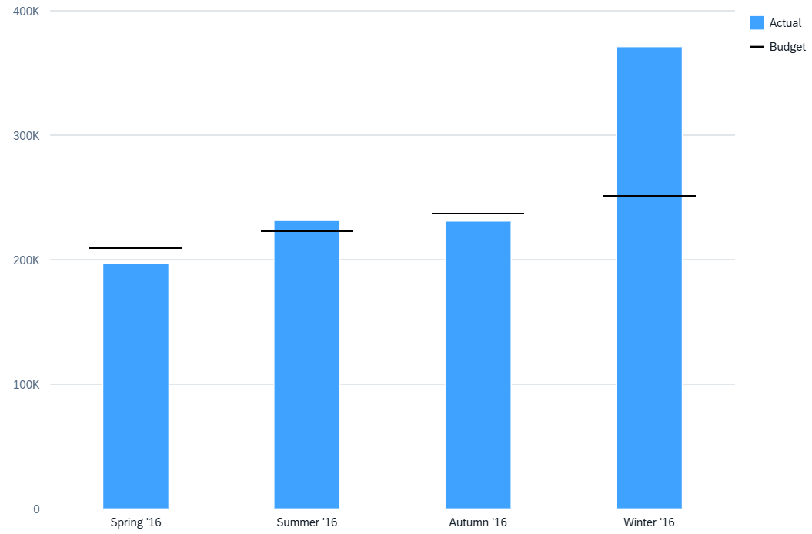

<!-- loiof4a899fec55246578a3387625f0a9fb3 -->

# Vertical Bullet Chart Card

Vertical bullet charts accept at least one measure and one dimension.

All dimensions, regardless of their role, are assigned to the **axis** category. All measures with the **axis1** role are represented as solid-colored columns, which represent actual values. All measures with **axis2** role are shown as a solid black line, which represents the target value.

   
  
**Example of a Vertical Bullet Chart Card**

  

