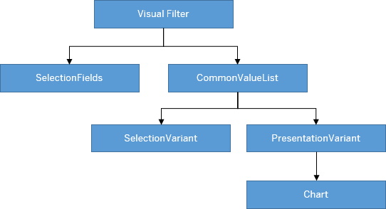
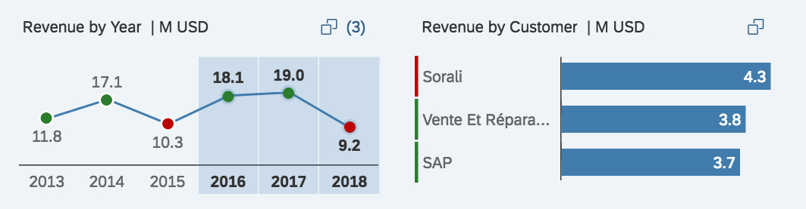
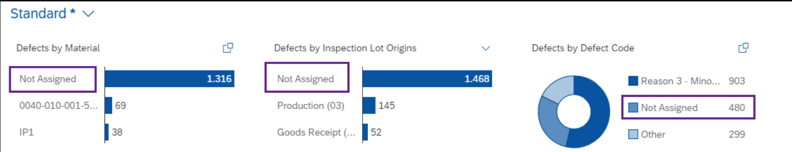
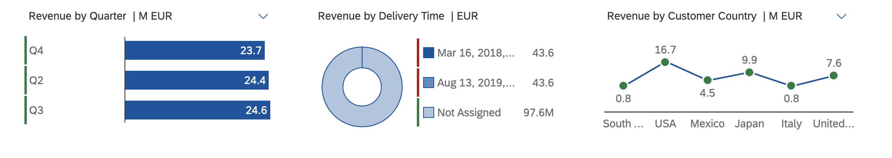
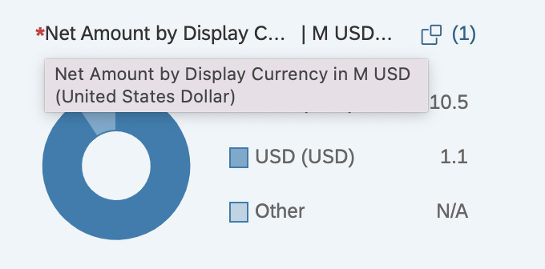

<!-- loio1714720cae984ad8b9d9111937e7cd38 -->

# Visual Filters

An intuitive way of choosing filter values from an associated measure value.


You configure visual filters by enhancing the `ValueList` annotation associated with the filter field. For more information, see [Enhancing ValueList Annotations for Visual Filters](enhancing-valuelist-annotations-for-visual-filters-16d43eb.md). This setup supports line and bar charts.

Application developers must ensure that the records available via the value help entity set associated with the visual filter are the same as the records available via the value help entity set associated with the regular filter field. This is required for a smooth sync of the selected values across the different filter modes.

The visual filter includes only the first measure and dimension from the first chart annotation within the specified `PresentationVariantQualifier`. Make sure that the dimension you specify in the chart and the `ValueListProperty` of the `OUT` parameter is the same. You can also define a `SortOrder` property in the `PresentationVariant` annotation to control the sort order.

> ### Note:  
> Sorting in visual filters is based on this logic:
> 
> -   For the bar chart \(and in SAP Fiori elements for OData V2 also for the donut chart type\), sorting is always based on the measure displayed \(the default is descending order\). To change the sort order, define the `SortOrder` property in the `PresentationVariant` annotation.
> -   For line charts with time-based dimensions, sorting is always based on the dimension displayed in ascending order, however, only the last six time periods are displayed.
> 
>     The sorting by the annotation is ignored for time-based dimensions for line-charts in the visual filter.
> 
> -   For line charts with non time-based dimensions, sorting is always based on the dimension \(the default is ascending order\). To change the sort order, define the `SortOrder` property in the `PresentationVariant` annotation.




### `ValueList` Annotation

This is an example of a code snippet for a value list annotation. You use it to configure visual filters. For more information, see [Enhancing ValueList Annotations for Visual Filters](enhancing-valuelist-annotations-for-visual-filters-16d43eb.md).

> ### Sample Code:  
> XML Annotation
> 
> ```
> <Annotations xmlns="http://docs.oasis-open.org/odata/ns/edm" Target="SEPMRA_ALP_SO_ANA_SRV.SEPMRA_C_ALP_SlsOrdItemCubeALPResult/SalesOrderOverallStatus">
>    <Annotation Term="Common.ValueList" Qualifier="VisualFilter">
>       <Record>
>          <PropertyValue Property="Label" String="Overall Status" />
>          <PropertyValue Property="CollectionPath" String="SEPMRA_C_ALP_SlsOrdItemCubeALPResults" />
>          <PropertyValue Property="SearchSupported" Bool="false" />
>          <PropertyValue Property="PresentationVariantQualifier" String="FilterNumberOfSalesOrdersByStatus" />
>          <PropertyValue Property="SelectionVariantQualifier" String="SVForStatus" />
>          <PropertyValue Property="Parameters">
>             <Collection>
>                <Record Type="Common.ValueListParameterInOut">
>                   <PropertyValue Property="LocalDataProperty" PropertyPath="SalesOrderOverallStatus" />
>                   <PropertyValue Property="ValueListProperty" String="SalesOrderOverallStatus" />
>                </Record>
>                <Record Type="Common.ValueListParameterInOut">
>                   <PropertyValue Property="LocalDataProperty" PropertyPath="MainProductCategory" />
>                   <PropertyValue Property="ValueListProperty" String="MainProductCategory" />
>                </Record>
>                <Record Type="Common.ValueListParameterInOut">
>                   <PropertyValue Property="LocalDataProperty" PropertyPath="ProductCategory" />
>                   <PropertyValue Property="ValueListProperty" String="ProductCategory" />
>                </Record>
>             </Collection>
>          </PropertyValue>
>       </Record>
>    </Annotation>
> </Annotations>
> ```

> ### Sample Code:  
> CAP CDS Annotation
> 
> ```
> annotate SEPMRA_ALP_SO_ANA_SRV.SEPMRA_C_ALP_SlsOrdItemCubeALPResult with {
>   @Common.ValueList #VisualFilter : {
>     Label : 'Overall Status',
>     CollectionPath : 'SEPMRA_C_ALP_SlsOrdItemCubeALPResults',
>     SearchSupported : false,
>     PresentationVariantQualifier : 'FilterNumberOfSalesOrdersByStatus',
>     SelectionVariantQualifier : 'SVForStatus',
>     Parameters : [
>         {
>             $Type : 'Common.ValueListParameterInOut',
>             LocalDataProperty : SalesOrderOverallStatus,
>             ValueListProperty : 'SalesOrderOverallStatus'
>         },
>         {
>             $Type : 'Common.ValueListParameterInOut',
>             LocalDataProperty : MainProductCategory,
>             ValueListProperty : 'MainProductCategory'
>         },
>         {
>             $Type : 'Common.ValueListParameterInOut',
>             LocalDataProperty : ProductCategory,
>             ValueListProperty : 'ProductCategory'
>         }
>     ]
>   }
>   SalesOrderOverallStatus
> };
> 
> ```

> ### Note:  
> For information about the IN/OUT mapping of visual filters, see [Enhancing ValueList Annotations for Visual Filters](enhancing-valuelist-annotations-for-visual-filters-16d43eb.md).


### `PresentationVariant` Qualifier

The `PresentationVariant` qualifier provides chart definitions for visual filters. The visual filter picks up the first chart annotation in the `PresentationVariant` annotation to render the chart. If the chart type isn't supported, the ALP renders a bar chart \(default chart type\).

> ### Sample Code:  
> XML Annotation
> 
> ```
> <Annotation Term="UI.PresentationVariant" Qualifier="FilterNumberOfSalesOrdersByStatus">
>    <Record>
>       <PropertyValue Property="Text" String="Filter: Number of Sales Order by Status" />
>       <PropertyValue Property="SortOrder">
>          <Collection>
>             <Record Type="Common.SortOrderType">
>                <PropertyValue Property="Property" PropertyPath="NumberOfSalesOrders" />
>                <PropertyValue Property="Descending" Bool="true" />
>             </Record>
>          </Collection>
>       </PropertyValue>
>       <PropertyValue Property="Visualizations">
>          <Collection>
>             <AnnotationPath>@UI.Chart#FilterNumberOfSalesOrdersByStatus</AnnotationPath>
>          </Collection>
>       </PropertyValue>
>    </Record>
> </Annotation>
> ```

> ### Sample Code:  
> ABAP CDS Annotation
> 
> ```
> @UI.PresentationVariant: [
>   {
>     text: 'Filter: Number of Sales Order by Status',
>     sortOrder: [
>       {
>         by: 'NUMBEROFSALESORDERS',
>         direction: #DESC
>       }
>     ],
>     visualizations: [
>       {
>         type: #AS_CHART,
>         qualifier: 'FilterNumberOfSalesOrdersByStatus'
>       }
>     ],
>     qualifier: 'FilterNumberOfSalesOrdersByStatus'
>   }
> ]
> annotate view VIEWNAME with {
> 
> }
> ```

> ### Sample Code:  
> CAP CDS Annotation
> 
> ```
> UI.PresentationVariant #FilterNumberOfSalesOrdersByStatus : {
>     Text : 'Filter: Number of Sales Order by Status',
>     SortOrder : [
>         {
>             $Type : 'Common.SortOrderType',
>             Property : NumberOfSalesOrders,
>             Descending : true
>         },
>     ],
>     Visualizations : [
>         '@UI.Chart#FilterNumberOfSalesOrdersByStatus'
>     ]
> },
> ```


### Chart Annotation

> ### Sample Code:  
> XML Annotation
> 
> ```
> <Annotation Term="UI.Chart" Qualifier="FilterNumberOfSalesOrdersByStatus">
>    <Record Type="UI.ChartDefinitionType">
>       <PropertyValue Property="Title" String="Sales Orders by Status" />
>       <PropertyValue Property="Description" String="Number of Sales Orders by Status" />
>       <PropertyValue Property="ChartType" EnumMember="UI.ChartType/Donut" />
>       <PropertyValue Property="Dimensions">
>          <Collection>
>             <PropertyPath>SalesOrderOverallStatus</PropertyPath>
>          </Collection>
>       </PropertyValue>
>       <PropertyValue Property="DimensionAttributes">
>          <Collection>
>             <Record Type="UI.ChartDimensionAttributeType">
>                <PropertyValue Property="Dimension" PropertyPath="SalesOrderOverallStatus" />
>                <PropertyValue Property="Role" EnumMember="UI.ChartDimensionRoleType/Category" />
>             </Record>
>          </Collection>
>       </PropertyValue>
>       <PropertyValue Property="Measures">
>          <Collection>
>             <PropertyPath>NumberOfSalesOrders</PropertyPath>
>          </Collection>
>       </PropertyValue>
>       <PropertyValue Property="MeasureAttributes">
>          <Collection>
>             <Record Type="UI.ChartMeasureAttributeType">
>                <PropertyValue Property="Measure" PropertyPath="NumberOfSalesOrders" />
>                <PropertyValue Property="Role" EnumMember="UI.ChartMeasureRoleType/Axis1" />
>                <PropertyValue Property="DataPoint" AnnotationPath="@UI.DataPoint#NumberOfSalesOrders" />
>             </Record>
>          </Collection>
>       </PropertyValue>
>    </Record>
> </Annotation>
> ```

> ### Sample Code:  
> ABAP CDS Annotation
> 
> ```
> @UI.Chart: [
>   {
>     title: 'Sales Orders by Status',
>     description: 'Number of Sales Orders by Status',
>     chartType: #DONUT,
>     dimensions: [
>       'SALESORDEROVERALLSTATUS'
>     ],
>     dimensionAttributes: [
>       {
>         dimension: 'SalesOrderOverallStatus',
>         role: #CATEGORY
>       }
>     ],
>     measures: [
>       'NUMBEROFSALESORDERS'
>     ],
>     measureAttributes: [
>       {
>         measure: 'NumberOfSalesOrders',
>         role: #AXIS_1,
> 		asDataPoint: true
>       }
>     ],
>     qualifier: 'FilterNumberOfSalesOrdersByStatus'
>   }
> ]
> annotate view VIEWNAME with {
> 
> }
> 
> ```

> ### Sample Code:  
> CAP CDS Annotation
> 
> ```
> UI.Chart #FilterNumberOfSalesOrdersByStatus : {
>     $Type : 'UI.ChartDefinitionType',
>     Title : 'Sales Orders by Status',
>     Description : 'Number of Sales Orders by Status',
>     ChartType : #Donut,
>     Dimensions : [
>         SalesOrderOverallStatus
>     ],
>     DimensionAttributes : [
>         {
>             $Type : 'UI.ChartDimensionAttributeType',
>             Dimension : SalesOrderOverallStatus,
>             Role : #Category
>         }
>     ],
>     Measures : [
>         NumberOfSalesOrders
>     ],
>     MeasureAttributes : [
>         {
>             $Type : 'UI.ChartMeasureAttributeType',
>             Measure : NumberOfSalesOrders,
>             Role : #Axis1,
>             DataPoint : '@UI.DataPoint#NumberOfSalesOrders'
>         }
>     ]
> }
> 
> ```


### Annotation: `SelectionFields`

Define the `SelectionFields` annotation for sorting the order of the fields displayed in the visual filters. If there are any mandatory filter fields that aren't specified in the `SelectionFields`, then these fields appear first, followed by the other entries in the `SelectionFields`.

> ### Sample Code:  
> XML Annotation
> 
> ```
> <Annotation Term="UI.SelectionFields">
>   <Collection>
>     <PropertyPath>DeliveryCalendarYear</PropertyPath>
>     <PropertyPath>SoldToParty</PropertyPath>
>     <PropertyPath>Product</PropertyPath>
>     <PropertyPath>MainProductCategory</PropertyPath>
>     <PropertyPath>DeliveryCalendarQuarter</PropertyPath>
>   </Collection>
> </Annotation>
> ```

> ### Sample Code:  
> ABAP CDS Annotation
> 
> ```
> @UI.SelectionField: [{ position: 10 }]
> DELIVERYCALENDARYEAR;
> 
> @UI.SelectionField: [{ position: 20 }]
> SOLDTOPARTY;
> 
> @UI.SelectionField: [{ position: 30 }]
> PRODUCT;
> 
> @UI.SelectionField: [{ position: 40 }]
> MAINPRODUCTCATEGORY;
> 
> @UI.SelectionField: [{ position: 50 }]
> DELIVERYCALENDARQUARTER;
> ```

> ### Sample Code:  
> CAP CDS Annotation
> 
> ```
> UI.SelectionFields : [
>     DeliveryCalendarYear,
>     SoldToParty,
>     Product,
>     MainProductCategory,
>     DeliveryCalendarQuarter
> ]
> ```


### Annotation: `SelectionVariant`

> ### Sample Code:  
> XML Annotation
> 
> ```
> <Annotation Term="UI.SelectionVariant" Qualifier="SVForStatus">
>    <Record>
>       <PropertyValue Property="Parameters">
>          <Collection>
>             <Record Type="UI.Parameter">
>                <PropertyValue Property="PropertyName" PropertyPath="CompanyCurrency" />
>                <PropertyValue Property="PropertyValue" String="EUR" />
>             </Record>
>          </Collection>
>       </PropertyValue>
>       <PropertyValue Property="SelectOptions">
>          <Collection>
>             <Record Type="UI.SelectOptionType">
>                <PropertyValue Property="PropertyName" PropertyPath="SalesOrderOverallStatus" />
>                <PropertyValue Property="Ranges">
>                   <Collection>
>                      <Record Type="UI.SelectionRangeType">
>                         <PropertyValue EnumMember="UI.SelectionRangeSignType/E" Property="Sign" />
>                         <PropertyValue EnumMember="UI.SelectionRangeOptionType/EQ" Property="Option" />
>                         <PropertyValue Property="Low" String="D" />
>                      </Record>
>                   </Collection>
>                </PropertyValue>
>             </Record>
>             <Record Type="UI.SelectOptionType">
>                <PropertyValue Property="PropertyName" PropertyPath="Product" />
>                <PropertyValue Property="Ranges">
>                   <Collection>
>                      <Record Type="UI.SelectionRangeType">
>                         <PropertyValue EnumMember="UI.SelectionRangeSignType/E" Property="Sign" />
>                         <PropertyValue EnumMember="UI.SelectionRangeOptionType/EQ" Property="Option" />
>                         <PropertyValue Property="Low" String="HT-1502" />
>                      </Record>
>                   </Collection>
>                </PropertyValue>
>             </Record>
>          </Collection>
>       </PropertyValue>
>    </Record>
> </Annotation>
> ```

> ### Sample Code:  
> ABAP CDS Annotation
> 
> ```
> @UI.selectionVariant: [
>   {
>     qualifier: 'SVForStatus',
> 	parameters: [{name: 'PropertyName', value: 'CompanyCurrency' },{ name: 'PropertyValue', value: 'EUR'}]
>   }
> ]
> 
> ```

> ### Sample Code:  
> CAP CDS Annotation
> 
> ```
> UI.SelectionVariant #SVForStatus : {
>     Parameters : [
>         {
>             $Type : 'UI.Parameter',
>             PropertyName : CompanyCurrency,
>             PropertyValue : 'EUR'
>         }
>     ],
>     SelectOptions : [
>         {
>             $Type : 'UI.SelectOptionType',
>             PropertyName : SalesOrderOverallStatus,
>             Ranges : [
>                 {
>                     $Type : 'UI.SelectionRangeType',
>                     Sign : #E,
>                     Option : #EQ,
>                     Low : 'D'
>                 }
>             ]
>         },
>         {
>             $Type : 'UI.SelectOptionType',
>             PropertyName : Product,
>             Ranges : [
>                 {
>                     $Type : 'UI.SelectionRangeType',
>                     Sign : #E,
>                     Option : #EQ,
>                     Low : 'HT-1502'
>                 }
>             ]
>         }
>     ]
> }
> 
> ```


<a name="loio1714720cae984ad8b9d9111937e7cd38__section_fzx_npk_qqb"/>

## Charts


### Chart Type

You can select chart data points and segments in a chart. These selections influence the other chart filters depending on the configuration of the value list annotation.


<table>
<tr>
<th valign="top">

The Chart Type…


</th>
<th valign="top">

Displays…


</th>
</tr>
<tr>
<td valign="top">

Bar


</td>
<td valign="top">

Top or bottom three records


</td>
</tr>
<tr>
<td valign="top">

Line


</td>
<td valign="top">

First or last six data points


</td>
</tr>
<tr>
<td valign="top">

Donut

\(currently only supported in SAP Fiori elements for OData V2\)


</td>
<td valign="top">

Top or bottom two records


</td>
</tr>
</table>

In SAP Fiori elements for OData V2, you can enable the visual filter \(donut chart type\) to display an overlay message if there are measures with negative values. Set the `Analytics.AccumulativeMeasure` annotation to `false` as shown in the example. By default, the value of the `Analytics.AccumulativeMeasure` annotation is `true`.

```
<Annotations Target="SEPMRA_ALP_SO_ANA_SRV.Z_SEPMRA_C_ALP_QUARTERVHType/DifferenceAmount">
    <Annotation Term="Analytics.Measure" Bool="true" />
    <Annotation Term="Analytics.AccumulativeMeasure" Bool="false" />
</Annotations>

```


### Chart Title

ALP displays chart titles in the following order: <Measure Name\> by <Dimension Name\> in <Scale factor\> <UoM\>

-   <Measure Name\> indicates the measure associated with the chart. Use `sap:label()` 
-   <Dimension Name\> indicates the dimension associated with the chart. Use `sap:label()`
-   <Scale Factor\> indicates the scale as specified using the `ScaleFactor` property of the `DataPoint` annotation associated with the measure displayed in the chart.

    > ### Sample Code:  
    > Scale factor annotation
    > 
    > ```
    > <Annotation Term="UI.DataPoint" Qualifier="LineChartTimeDataPoint">
    >     <Record Type="UI.DataPointType">
    >         <PropertyValue Property="Criticality" EnumMember="UI.CriticalityType/Positive"/>
    >         <PropertyValue Property="Title" String="Total Pricing"/>
    >         <PropertyValue Property="Value" Path="totalPricing"/>
    >         <PropertyValue Property="ValueFormat">
    >             <Record Type="UI.NumberFormat">
    >                 <PropertyValue Property="ScaleFactor" Decimal="1000"/> // A value of 1000 results in "K" in the title bar since chart value is scaled with thousand!
    >             </Record>
    >         </PropertyValue>
    >     </Record>
    > </Annotation>
    > ```

    If not specified, SAP Fiori elements uses a built-in logic to determine the best scale factor to be used for the values displayed in the chart.


> ### Note:  
> SAP Fiori elements recommends that you do **not** specify a hard-coded scale factor that doesn't work well with changing measure values. Use it only if you can ensure that the range of possible values for the measure is fixed and there'sis a preferred scale factor to be used.
> 
> The scale factor in the chart and chart title are of the same scale.


<a name="loio1714720cae984ad8b9d9111937e7cd38__section_aps_ntv_yfb"/>

## Text Arrangement

You can change the formatting of the text that appears on the vual filter chart axis labels, chart tooltips, and within the selected link \(if a chart context is selected\). The default view of the visual filter bar is based on the filter fields defined in the `TextArrangement` annotation and its type in the main entity set to change the text behavior like this:

****


<table>
<tr>
<th valign="top">

Text Arrangement Type


</th>
<th valign="top">

Description


</th>
</tr>
<tr>
<td valign="top">

TextFirst


</td>
<td valign="top">

Use the visual filter to combine measures or item counts with filter values. The ChartDefault type that has the sap:text first, followed by the ID in brackets, for example, "Notebook \(001\)"


</td>
</tr>
<tr>
<td valign="top">

TextLast


</td>
<td valign="top">

ID followed by the sap:text in brackets, for example, "001 \(Notebook\)".


</td>
</tr>
<tr>
<td valign="top">

TextOnly


</td>
<td valign="top">

Shows only the sap:text, for example, "Notebook"


</td>
</tr>
<tr>
<td valign="top">

TextSeparate


</td>
<td valign="top">

Shows only the ID, for example, "002"


</td>
</tr>
</table>

> ### Sample Code:  
> XML Annotation
> 
> ```xml
> <Annotations Target="ProductType"> //Main EntitySet
>   <Annotation Term="com.sap.vocabularies.UI.v1.TextArrangement" EnumMember="com.sap.vocabularies.UI.v1.TextArrangementType/TextFirst"/> 
> </Annotations>
> ```

> ### Sample Code:  
> ABAP CDS Annotation
> 
> ```
> 
> @UI.textArrangement: #TEXT_FIRST
> annotate view ProductType with {
> 
> }
> ```

> ### Sample Code:  
> CAP CDS Annotation
> 
> ```
> 
> annotate ProductType @(
>   UI.TextArrangement : #TextFirst
> );
> ```


<a name="loio1714720cae984ad8b9d9111937e7cd38__section_ms2_qdl_j2b"/>

## Lazy Loading of Visual Filters

In SAP Fiori elements for OData V2, you enable lazy loading of visual filters by configuring the `lazyLoadVisualFilter` setting in the descriptor file. It's disabled by default.

If you enable lazy loading, then the batch call for loading of visual filters is deferred until the user switches to the visual filter bar.

> ### Sample Code:  
> Descriptor setting
> 
> ```
> "settings": {
>               "qualifier": "MainContent",
>               "defaultContentView": "charttable",
>               "smartVariantManagement": true,
>               "showGoButtonOnFilterBar": true,
>               "multiSelect": true,
>               "lazyLoadVisualFilter":true,
> 
>               "tableType": "AnalyticalTable",
>               ....
> }
> 
> ```

> ### Note:  
> In SAP Fiori elements for OData V4, lazy loading is enabled by default and can't be switched off.


<a name="loio1714720cae984ad8b9d9111937e7cd38__section_mlt_fxn_j2b"/>

## Fixed Values on Visual Filters

To display default records on the visual filter chart, configure the `SelectionVariant` annotation with filter values \(`SelectOptions` property\) and link it with the `ValueList` annotation.

The IN/OUT parameter values take precedence over the `SelectionVariant` values for the fields that have values coming from both options.

> ### Note:  
> Handling date-based filter fields
> 
> If the `SelectionVariant` has date-based filter fields, you must specify the value in the format `"Z'. Ex:”2018-10-15T00:00:00Z"`, with the time part as zeroes and appended with 'Z'.

**In/out parameter taking precedence**


<table>
<tr>
<th valign="top">

Scenario


</th>
<th valign="top">

Description


</th>
</tr>
<tr>
<td valign="top">

**Scenario 1**: Annotation configuration

Chart dimension = “Status”, Select Option in SV = \[\(“Status”, Values = “In Progress”, “New”\), \(“Project”, Values=”List Report”\)\]


</td>
<td valign="top">

-   "Project" is not a chart dimension, it is an in/out parameter for the status.

-   The chart displays records relating to `In Progress` and `New` status values for the project `List Report`.


</td>
</tr>
<tr>
<td valign="top">

**Scenario 2**: Overriding annotation configuration from filter bar

Change the project value from `List Report` to `Analytical List Page` on the filter bar.


</td>
<td valign="top">

Specifying ***Analytical List Page*** as a value for the project in the filter bar, re-renders charts to display records for *In Progress* and *New* status values of the Analytical List Page project.

> ### Note:  
> The in/out parameter mapping values set for the other properties in the `SelectionVariant` annotation that are not part of the project field is considered as it is.


</td>
</tr>
</table>

In SAP Fiori elements for OData V2, you can render the visual filter with a parametrized entity set as the collection path. To do so, you need to provide parameters in the `SelectionVariant` annotation. Any values added in the smart filter bar take priority over the `SelectionVariant` annotation values.

****


<table>
<tr>
<th valign="top">

Scenario


</th>
<th valign="top">

Description


</th>
</tr>
<tr>
<td valign="top">

Scenario 1: Annotation configuration

Parameter in SelectionVariant = \[\(“P\_DisplayCurrency”, Value=”USD”\)\]


</td>
<td valign="top">

The chart renders records with the currency unit USD.


</td>
</tr>
<tr>
<td valign="top">

Scenario 2: Overriding annotation configurations on the filter bar

Change USD to EUR on the filter bar


</td>
<td valign="top">

If you specify EUR as a value for `P_DisplayCurrency` in the filter bar, the chart re-renders with records that have the currency unit EUR


</td>
</tr>
</table>


<a name="loio1714720cae984ad8b9d9111937e7cd38__section_e11_qrb_lqb"/>

## Date Selection

Visual filters support date-based, single/multi-select based filter fields in the Universal Time Coordinated \(UTC\) format. Semantic dates and date ranges are not supported.


## **Unit of Measure with Multiple Units of Measure**

Visual filter charts do not show up if the back end returns data with multiple units of measure \(UoM\). To achieve a single UoM, set the required UoM in the filter bar or change all the UoMs into one UoM in the back end.

For currency-based visual filter values, the currency value could come from another filter field in the main entity set \(mapped to the value help currency field based entity set through the standard IN mapping\).


<a name="loio1714720cae984ad8b9d9111937e7cd38__section_gxg_tq2_mqb"/>

## Semantic Coloring for Visual Filters Based on Dimension Values

Semantic coloring is based on the defined criticality in the `ValueCriticality` annotations for dimensions. The value returned from the path determines the color.

> ### Note:  
> -   No color is applied to the chart dimension when a neutral value is returned.
> 
> -   Chart measure semantic coloring takes precendence over dimension semantic coloring.

For a sample annotation applicable to both SAP Fiori elements for OData V2 and SAP Fiori elements for OData V4, please see the OData V4-specific section *Support for Criticality Coloring* in [Configuring Charts](configuring-charts-653ed0f.md).


<a name="loio1714720cae984ad8b9d9111937e7cd38__section_nxf_3yy_ghb"/>

## Guidelines

Show the filter dimension with one measure in the visual filter not with multiple measures.

Filter dimensions in the regular filters \(filter bar\) have exactly one representation in the visual filter bar.

Do not show the same filter dimension with two or more different measures at the same time in the visual filter bar. The example shows the filter `Dimension Year` with two different measures *Revenue* and *Quantity*. Showing the filter *dimensionYear* twice is not in sync with the regular filter, where it is shown only once. Furthermore, matching between the two filter types won't work.

If the use case requires you to show a dimension with different measures, consider using an overview page instead.

****


<table>
<tr>
<th valign="top">

Do


</th>
<th valign="top">

Don't


</th>
</tr>
<tr>
<td valign="top">




</td>
<td valign="top">


</td>
</tr>
<tr>
<td valign="top">

**For each dimension, display exactly one representation in the visual filter bar.**


</td>
<td valign="top">

**Do not use the same filter dimension with different measures.**


</td>
</tr>
</table>


<a name="loio1714720cae984ad8b9d9111937e7cd38__section_oqj_tq1_bqb"/>

## Additional Features in SAP Fiori Elements for OData V2

SAP Fiori elements for OData V2 also supports the visual filter setup for donut charts, and you can define visual filters for parameters.


### Display of Empty Values

The empty dimension value is displayed as *Not Assigned* in the visual filter chart. Note that this impacts the display only of visual filters but not of the value help, drop down, or compact filters. For the value help, drop down, or compact filter, it is displayed as *<empty\>*.

  


### Date Selection

Visual filters support date-based, single selection fields in the Universal Time Coordinated \(UTC\) format. Visual filters also support string-based fields that denote a time period via the following annotations:

-   Edm.DateTime and sap:display-format="Date"

-   Edm.String and sap:semantics="yearmonthday"

-   Edm.String and sap:semantics="yearmonth"

-   Edm.String and sap:semantics="year"

-   Edm.String and sap:semantics="yearquarter"

-   Edm.String and sap:semantics="yearweek"

-   Edm.String and sap:semantics="fiscalyear"

-   Edm.String and sap:semantics="fiscalyearperiod"


> ### Note:  
> Displaying the value in the visual filter and its tooltip is impacted. Value help or the dropdown for selecting the values remains the same if sap:semantics="yearmonth" is set.

> ### Note:  
> You can see the date selection button on the visual filter for fields annotated with `sap:filter-restriction=”single-value"`. For fields annotated with `sap:filter-restriction=”multiple"`, you see the value help selection button.

> ### Sample Code:  
> Sample Metadata
> 
> ```
> <Property Name="StartDate" Type="Edm.DateTime" sap:display-format="Date" 
> sap:aggregation-role="dimension" sap:label="Date" sap:filter-restriction="single-value"/>
> 
> <Property Name="StartDate" Type="Edm.String" sap:semantics="yearmonthday" 
> sap:aggregation-role="dimension" sap:label="Date" sap:filter-restriction="single-value"/>
> 
> ```


### Number Formatting

`NumberOfFractionalDigits` information can be provided in [com.sap.vocabularies.UI.v1.DataPoint](annotations-used-in-overview-pages-65731e6.md) term, using the ValueFormat property. The `NumberOfFractionalDigits` property is used to determine the number of fraction digits. These are the rules:

-   Decimals are not shown by default.

-   You can specify 1 or 2 decimal places using the `NumberOfFractionalDigits` property in Annotations. If a value of more than 2 is provided, it is also included.


In the following example, the price property number of fractional digits provided in the OData metadata, 3 is overridden by the value 1 as provided in the [com.sap.vocabularies.UI.v1.DataPoint](annotations-used-in-overview-pages-65731e6.md) ValueFormat property:

> ### Sample Code:  
> XML Annotation
> 
> ```xml
> <Annotation Term="com.sap.vocabularies.UI.v1.DataPoint" Qualifier="Price">
>     <Record Type="com.sap.vocabularies.UI.v1.DataPointType">
>         <PropertyValue Property="Value" Path="Price"/>
>         <PropertyValue Property="ValueFormat">
>             <Record Type="com.sap.vocabularies.UI.v1.NumberFormat">
>                 <PropertyValue Property="NumberOfFractionalDigits" Int="1"/>
>             </Record>
>         </PropertyValue>
>     </Record>
> </Annotation>
> 
> ```

> ### Sample Code:  
> ABAP CDS Annotation
> 
> ```
> 
> @UI.dataPoint: { 
>    valueFormat.numberOfFractionalDigits: 1  
> }
> price;
> ```


### Semantic Coloring for Visual Filters Based on Measure Values

Semantic coloring is based on the defined:

-   Criticality in `DataPoint` annotations. The specified value, or the value returned from a path, determines the color

-   `CriticalityCalculation` in DataPoint annotations, along with the improvement direction and various threshold values. This applies only when the criticality is not defined.




> ### Note:  
> No color is applied to the chart measure when
> 
> -   A neutral value is returned
> 
> -   Not enough threshold values are defined or when the improvement direction is missing


### Grouping Visual Filter Calls \(Optional\)

Add a `groupId` for a set of visual filters to consolidate all group calls into one batch call. This helps you group fast-loading visual filters in one batch and group all the other slow loading visual filters into a separate batch call. This improves rendering of the fast-loading visual filters over the slow-loading visual filters.

Define the `onBeforeRebindVisualFilterExtension` extension controller method in the controller file. Ensure that the `groupId` is one of the keys in the `oContext` object which is passed to the extension as a parameter. Provide a valid string value as shown here:

> ### Sample Code:  
> ```
> onBeforeRebindVisualFilterExtension: function(sEntityType, sDimension, sMeasure, oContext){
>     'use strict';
>     var Log = sap.ui.require("sap/base/Log");
>     if (sDimension === "Product") {
>         oContext.groupId = "Group1";
>     }
>     if (sDimension === "DeliveryCalendarMonth" || sDimension === "DeliveryCalendarQuarter") {
>         oContext.groupId = "Group2";
>     }
>     Log.info("onBeforeRebindVisualFilterExtension called!");
> }
> ```

> ### Note:  
> -   The visual filter calls without a groupId are all combined in one batch.
> 
> -   Visual filter calls assigned to a `groupId` reach the back end in one batch.


### Text for Unit of Measure

If a unit field such as a currency or unit of measure\(UOM\) contains a text annotation\(sap:text\) this property is retrieved and displayed along with the unit field.

The unit fields can contain the text annotation either in the main entity set or its value list entity sets.

> ### Sample Code:  
> Main entity set: `DisplayCurrency` doesn’t contain a text annotation
> 
> ```
> <EntityType Name="ZEPM_C_SALESORDERITEMQUERYResult" sap:semantics="aggregate" sap:content-version="1">
>                 <Key>
>                     <PropertyRef Name="ID"/>
>                 </Key> 
>               <Property Name="DisplayCurrency" Type="Edm.String" MaxLength="5" sap:aggregation-role="dimension" sap:creatable="false" sap:label="Display Currency" sap:updatable="false" sap:semantics="currency-code"/>  
> </EntityType > 
> 
> ```

> ### Sample Code:  
> Value List Entity Set : `DisplayCurrency` contains a text annotation to another text property
> 
> ```
> <EntityType Name="ZEPM_C_SALESORDERITEMQUERYValueHelpResult" sap:semantics="aggregate" sap:content-version="1">
>                 <Key>
>                     <PropertyRef Name="ID"/>
>                 </Key> 
>                 <Property Name="DisplayCurrency" Type="Edm.String" MaxLength="5" sap:aggregation-role="dimension" sap:creatable="false" sap:label="Display Currency" sap:updatable="false" sap:semantics="currency-code" sap:text="DisplayCurrencyText"/>
>                 <Property Name="DisplayCurrencyText" Type="Edm.String" MaxLength="60" sap:filterable="false"/>
> </EntityType > 
> 
> ```

The text is fetched to be displayed along with the unit field and is displayed in brackets.

If the main entity set doesn't contain the text annotation, and if the unit field has a value list associated, and the text annotation is present in the value list entity set, then this is retrieved and displayed along with the unit field.

If the main entity set contains the text annotation for a unit, then that is displayed and the value list entity set is not checked for the annotation.

  


<a name="loio1714720cae984ad8b9d9111937e7cd38__section_qsw_sts_cqb"/>

## Additional Features in SAP Fiori Elements for OData V4

Application developers must ensure there is a manifest property for each visual filter that is to be rendered. For more information, see *Additional Features in SAP Fiori Elements for OData V4* in [Configuring the Visual Filter Bar](configuring-the-visual-filter-bar-33f3d80.md).


### Line Chart

Line charts are only rendered if the dimension is time based, that is if you use `Edm.Date`, `Edm.Time`, or `Edm.DateTimeOffset`.


### Date Selection

While date/time is converted to the local timezone, the values coming from the back end are used for all other formats. SAP Fiori elements for OData V4 `Edm.Date`, which is shown with no conversion to the local timezone.


### Number Formatting

`NumberOfFractionalDigits` information can be provided in [com.sap.vocabularies.UI.v1.DataPoint](annotations-used-in-overview-pages-65731e6.md) term, using the `ValueFormat` property. The `NumberOfFractionalDigits` property is used to determine the number of fraction digits. These are the rules:

-   Decimals are not shown by default.

-   You can specify 1 or 2 decimal places using the `NumberOfFractionalDigits` property in Annotations. If a value of more than 2 is provided, it remains at 2.

    For a currency-based measure, the number of decimal places as specified in the annotation is only considered if the measure value is also being displayed with a scale factor. Otherwise, the number of decimal places is based on the displayed currency.


In the following example, the weight property number of fractional digits provided in the OData metadata, is set to the value 1 as provided in the [com.sap.vocabularies.UI.v1.DataPoint](annotations-used-in-overview-pages-65731e6.md) `ValueFormat` property

> ### Sample Code:  
> XML Annotation
> 
> ```xml
> <Annotation Term="com.sap.vocabularies.UI.v1.DataPoint" Qualifier="Weight">
>     <Record Type="com.sap.vocabularies.UI.v1.DataPointType">
>         <PropertyValue Property="Value" Path="Weight"/>
>         <PropertyValue Property="ValueFormat">
>             <Record Type="com.sap.vocabularies.UI.v1.NumberFormat">
>                 <PropertyValue Property="NumberOfFractionalDigits" Int="1"/>
>             </Record>
>         </PropertyValue>
>     </Record>
> </Annotation>
> 
> ```

> ### Sample Code:  
> ABAP CDS Annotation
> 
> ```
> 
> @UI.dataPoint: { 
>    valueFormat.numberOfFractionalDigits: 1  
> }
> price;
> ```

> ### Sample Code:  
> CAP CDS Annotation
> 
> ```
> 
> UI.DataPoint #Price : {
>     $Type : 'UI.DataPointType',
>     Value : Price,
>     ValueFormat : {
>         $Type : 'UI.NumberFormat',
>         NumberOfFractionalDigits : 1
>     }
> }
> ```


### Semantic Coloring for Visual Filters Based on Measure Values

Currently only hard-coded values are supported. Ensure that a data point has been defined for the measure of the chart and that the criticality has been configured for the data point.


> ### Note:  
> No color is applied to the chart measure when a neutral value is returned.
> 
> Chart coloring via semantic coloring specified on dimensions is overridden by the semantic coloring specified for the measures.

> ### Sample Code:  
> XML Annotation
> 
> ```xml
> <Annotation Term="UI.Chart" Qualifier="BarChartSoldToParty">
>      <Record Type="UI.ChartDefinitionType">
>           <PropertyValue Property="Title" String="Bar Chart"/>
>           <PropertyValue Property="Description" String="Testing Bar Chart"/>
>           <PropertyValue Property="ChartType" EnumMember="UI.ChartType/Bar"/>
>           <PropertyValue Property="Measures">
>                <Collection>
>                     <PropertyPath>totalPricing</PropertyPath>
>                </Collection>
>           </PropertyValue>
>           <PropertyValue Property="Dimensions">
>                <Collection>
>           <PropertyPath>SoldToParty</PropertyPath>
>                </Collection>
>           </PropertyValue>
>           <PropertyValue Property="MeasureAttributes">
>                <Collection>
>                     <Record Type="UI.ChartMeasureAttributeType">
>                          <PropertyValue Property="Measure" PropertyPath=" totalPricing"/>
>                          <PropertyValue Property="Role" EnumMember="UI.ChartMeasureRoleType/Axis1"/>
>                          <PropertyValue Property="DataPoint" AnnotationPath="@UI.DataPoint#LineChartTimeDataPoint"/>
>                     </Record>
>                </Collection>
>           </PropertyValue>
>           <PropertyValue Property="DimensionAttributes">
>                <Collection/>
>           </PropertyValue>
>      </Record>
> </Annotation>
> 
> <Annotation Term="UI.DataPoint" Qualifier="LineChartTimeDataPoint">
>      <Record Type="UI.DataPointType">
>           <PropertyValue Property="Value" Path="totalPricing"/>
>           <PropertyValue Property="Title" String="Total Pricing"/>
>           <PropertyValue Property="Criticality" EnumMember="UI.CriticalityType/Positive"/>
>      </Record>
> </Annotation>
> 
> ```

> ### Sample Code:  
> ABAP CDS Annotation
> 
> ```
> @UI.chart: [
>   {
>     chartType: #BAR,
>     title: 'Bar Chart',
>     description: 'Testing Bar Chart',
>     dimensions: [
>       'SoldToParty'
>     ],
>     measures: [
>       'totalPricing'
>     ],
>     measureAttributes: [{measure: 'totalPricing', role: #AXIS_1, asDataPoint: true }],
>   }
> ]
> 
> @UI.dataPoint: { 
>      title: 'Total Pricing',
>      criticalityValue: #POSITIVE   
>  }
> totalPricing;
> 
> ```

> ### Sample Code:  
> CAP CDS Annotation
> 
> ```
> Chart #BarChartSoldToParty               : {
>             $Type             : 'UI.ChartDefinitionType',
>             Title             : 'Bar Chart',
>             Description       : 'Testing Bar Chart',
>             ChartType         : #Bar,
>             Measures          : [totalPricing],
>             Dimensions        : [SoldToParty],
>             MeasureAttributes : [{
>                 $Type     : 'UI.ChartMeasureAttributeType',
>                 Measure   : totalPricing,
>                 Role      : #Axis1,
>                 DataPoint : '@UI.DataPoint#LineChartTimeDataPoint'
>             }],
> DimensionAttributes: []
>         },
>         DataPoint #LineChartTimeDataPoint              : {
>             Value       : totalPricing,
>             Title       : 'Total Pricing',
>             Criticality : #Positive,
>             ValueFormat : {
>                 ScaleFactor: 1000
>             }
> 
> ```

**Related Information**  


[Configuring the Visual Filter Bar](configuring-the-visual-filter-bar-33f3d80.md "The visual filter bar enables end users to select filter values based on measure values in addition to the filters and filter values already selected in the regular filter bar.")

