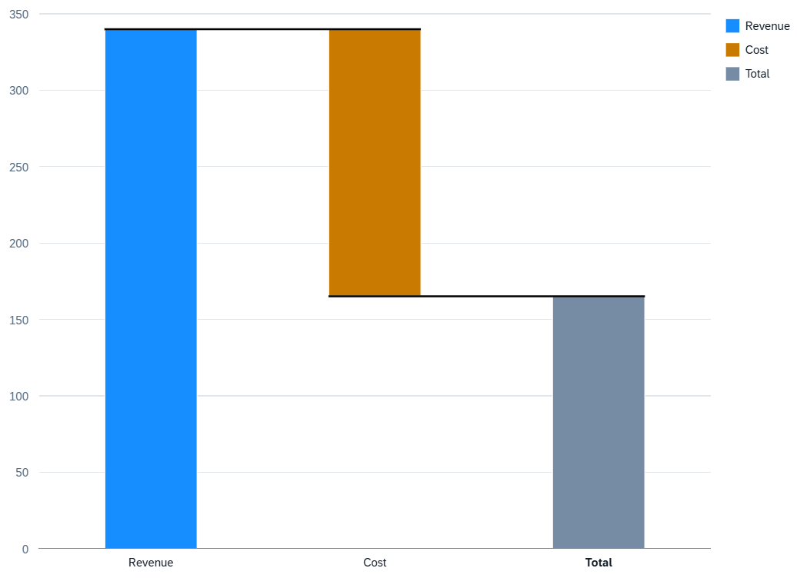

<!-- loio06636736c5c74fa1b849210ce98550a2 -->

# Waterfall Chart Card

You can render the chart as a waterfall chart to analyze a cumulative value.

  
  
**Example of a Waterfall Chart Card**



Waterfall charts allow you to see the change in cumulative values from the initial state to the final state by representing the accumulation of successive values.

The following waterfall chart types are available:

-   Waterfall charts without a time dimension

-   Waterfall charts with a time dimension represent the change of a cumulative value over time

-   Semantic waterfall charts \(semantic coloring based on `com.sap.vocabularies.UI.v1.CriticalityCalculation` or `com.sap.vocabularies.UI.v1.Criticality` in the datapoint annotation\)


> ### Note:  
> By default, the legend shows the name of the measure mapped to the chart and two groups `<0` and `>0`. If there is more than one measure, all measures are displayed instead of the measure names.

A waterfall chart has the following requirements:

-   At least one measure.

-   At least one dimension.


Measures make up the y-axis \(value axis\)

Dimensions are visualized based on the following roles:

-   `Category` role: Forms the x-axis \(category axis\). If no dimension is specified with a role, the first dimension is used as the x-axis.

-   `Series` role: Forms the cumulative data points in the chart. A waterfall chart can have only one dimension per role.

-   Role mapped to `waterfallType`: Shows intermediate totals and subtotals. The following values are supported:

    -   `null`: no aggregation

    -   `subtotal:2`: combines the previous two data points and shows a new column in the chart as a subtotal.

    -   `total`: combines all the data points and shows a new column as the total.


The following code samples show how to configure a waterfall chart with one measure \(`Finances`\) and two dimensions \(`SpendType` as `Category`, `Type` as `Series`\):

> ### Sample Code:  
> XML Annotation
> 
> ```xml
> <Annotation Term="UI.Chart" Qualifier="Waterfall_Eval_by_Country">
>     <Record Type="UI.ChartDefinitionType">
>         <PropertyValue Property="Title" String="Revenue Waterfall" />
>         <PropertyValue Property="ChartType" EnumMember="UI.ChartType/Waterfall"/>
>         <PropertyValue Property="MeasureAttributes">
>             <Collection>
>                 <Record Type="UI.ChartMeasureAttributeType">
>                     <PropertyValue Property="Measure" PropertyPath="Finances" />
>                     <PropertyValue Property="Role" EnumMember="UI.ChartMeasureRoleType/Axis2" />
>                 </Record>
>             </Collection>
>         </PropertyValue>
>         <PropertyValue Property="DimensionAttributes">
>             <Collection>
>                 <Record Type="UI.ChartDimensionAttributeType">
>                     <PropertyValue Property="Dimension" PropertyPath="SpendType" />
>                     <PropertyValue Property="Role" EnumMember="UI.ChartDimensionRoleType/Category" />
>                 </Record>
>                 <Record Type="UI.ChartDimensionAttributeType">
>                     <PropertyValue Property="Dimension" PropertyPath="Type" />
>                     <PropertyValue Property="Role" EnumMember="UI.ChartDimensionRoleType/Series" />
>                 </Record>
>             </Collection>
>         </PropertyValue>
>     </Record>
> </Annotation>
> ```

> ### Sample Code:  
> ABAP CDS Annotation
> 
> ```
> 
> @UI.Chart: [
>   {
>     title: 'Revenue Waterfall',
> 	chartType: #WATERFALL,
>     measureAttributes: [
>       {
>         measure: 'Finances',
>         role: #AXIS_2
>       }
>     ],
>     dimensionAttributes: [
>       {
>         dimension: 'SpendType',
>         role: #CATEGORY
>       },
>       {
>         dimension: 'Type',
>         role: #SERIES
>       }
>     ],
>     qualifier: 'Waterfall_Eval_by_Country'
>   }
> ]
> annotate view VIEWNAME with { }
> 
> ```

> ### Sample Code:  
> CAP CDS Annotation
> 
> ```
> 
> UI.Chart #Waterfall_Eval_by_Country : {
>     $Type : 'UI.ChartDefinitionType',
>     Title : 'Revenue Waterfall',
>     ChartType : #Waterfall,
>     MeasureAttributes : [
>         {
>             $Type : 'UI.ChartMeasureAttributeType',
>             Measure : Finances,
>             Role : #Axis2
>         },
>     ],
>     DimensionAttributes : [
>         {
>             $Type : 'UI.ChartDimensionAttributeType',
>             Dimension : SpendType,
>             Role : #Category
>         },
>         {
>             $Type : 'UI.ChartDimensionAttributeType',
>             Dimension : Type,
>             Role : #Series
>         }
>     ]
> }
> 
> ```

