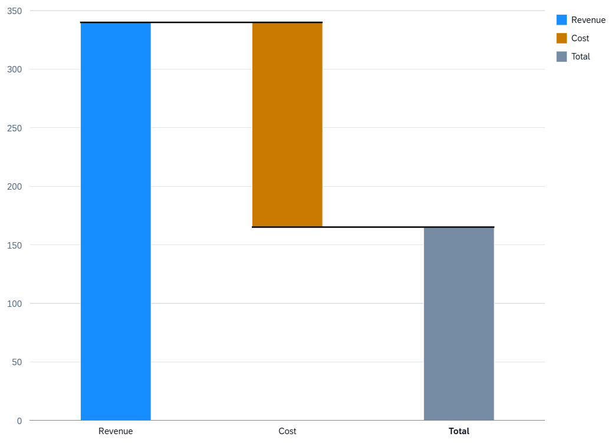

<!-- loioe8106e5a43604e9c83faafb9b0123602 -->

# Waterfall Chart Card

You use waterfall charts to analyze a cumulative value.

Waterfall charts allow you to see the change in cumulative values from the initial state to the final state by representing the accumulation of successive values. These are the available waterfall charts:

-   Waterfall charts without a time dimension

-   Waterfall charts with a time dimension represent the change of a cumulative value over time

-   Semantic waterfall charts \(semantic coloring based on `com.sap.vocabularies.UI.v1.CriticalityCalculation` or `com.sap.vocabularies.UI.v1.Criticality` in the datapoint annotation\)


> ### Note:  
> By default the legend shows the name of the measure mapped to the chart and two groups `<0` and `>0`. If there is more than one measure, all measures are displayed instead of the measure names.

> ### Remember:  
> -   Waterfall charts need at least one measure and one dimension
> 
> -   Dimensions for which a role is set \(for example, category\) make up the x-axis \(category axis\). If no dimension is specified with a role, the first dimension is used as the x-axis.
> 
> -   Dimensions for which a role is set \(for example, series\) make up the cumulative data points in the chart. A waterfall chart can have only one dimension per role.
> 
> -   Dimensions with the role mapped to the `waterfallType` UID. You use this to show the intermediate totals and subtotals in the waterfall chart. Valid values:
> 
>     -   `null`
> 
>     -   `subtotal:2` \(combines the previous two data points and shows a new column in the chart as a subtotal\)
> 
>     -   `total` \(combines all the data points and shows a new column as the total\)
> 
> 
> -   Measures make up the y-axis \(value axis\)


> ### Sample Code:  
> XML Annotation
> 
> ```xml
> <Annotation Term="UI.Chart" Qualifier="Waterfall_Eval_by_Country">
>     <Record Type="UI.ChartDefinitionType">
>         <PropertyValue Property="Title" String="Revenue Waterfall" />
>         <PropertyValue Property="ChartType" EnumMember="UI.ChartType/Waterfall"/>
>         <PropertyValue Property="MeasureAttributes">
>             <Collection>
>                 <Record Type="UI.ChartMeasureAttributeType">
>                     <PropertyValue Property="Measure" PropertyPath="Finances" />
>                     <PropertyValue Property="Role" EnumMember="UI.ChartMeasureRoleType/Axis2" />
>                 </Record>
>             </Collection>
>         </PropertyValue>
>         <PropertyValue Property="DimensionAttributes">
>             <Collection>
>                 <Record Type="UI.ChartDimensionAttributeType">
>                     <PropertyValue Property="Dimension" PropertyPath="SpendType" />
>                     <PropertyValue Property="Role" EnumMember="UI.ChartDimensionRoleType/Category" />
>                 </Record>
>                 <Record Type="UI.ChartDimensionAttributeType">
>                     <PropertyValue Property="Dimension" PropertyPath="Type" />
>                     <PropertyValue Property="Role" EnumMember="UI.ChartDimensionRoleType/Series" />
>                 </Record>
>             </Collection>
>         </PropertyValue>
>     </Record>
> </Annotation>
> ```

> ### Sample Code:  
> ABAP CDS Annotation
> 
> ```
> 
> @UI.Chart: [
>   {
>     title: 'Revenue Waterfall',
> 	chartType: #WATERFALL,
>     measureAttributes: [
>       {
>         measure: 'Finances',
>         role: #AXIS_2
>       }
>     ],
>     dimensionAttributes: [
>       {
>         dimension: 'SpendType',
>         role: #CATEGORY
>       },
>       {
>         dimension: 'Type',
>         role: #SERIES
>       }
>     ],
>     qualifier: 'Waterfall_Eval_by_Country'
>   }
> ]
> annotate view VIEWNAME with { }
> 
> ```

> ### Sample Code:  
> CAP CDS Annotation
> 
> ```
> 
> UI.Chart #Waterfall_Eval_by_Country : {
>     $Type : 'UI.ChartDefinitionType',
>     Title : 'Revenue Waterfall',
>     ChartType : #Waterfall,
>     MeasureAttributes : [
>         {
>             $Type : 'UI.ChartMeasureAttributeType',
>             Measure : Finances,
>             Role : #Axis2
>         },
>     ],
>     DimensionAttributes : [
>         {
>             $Type : 'UI.ChartDimensionAttributeType',
>             Dimension : SpendType,
>             Role : #Category
>         },
>         {
>             $Type : 'UI.ChartDimensionAttributeType',
>             Dimension : Type,
>             Role : #Series
>         }
>     ]
> }
> 
> ```

   
  
**Example of a Waterfall Chart Card**

  

