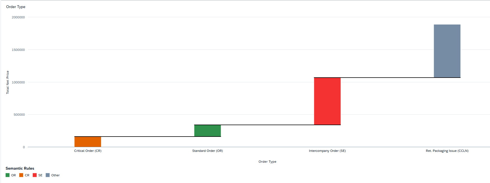

<!-- loioe8106e5a43604e9c83faafb9b0123602 -->

# Waterfall Chart

You can render the chart as a waterfall chart in SAP Fiori elements for OData V4.

A waterfall chart lets you analyze a cumulative value. This chart helps to understand how positive and negative contributions affect a total. You must configure at least one measure and one dimension.

  
  
**Example of a Waterfall Chart**



> ### Sample Code:  
> XML Annotation
> 
> ```
> <Annotation Term="UI.Chart" Qualifier="Waterfall_Revenue_by_OrderType">
>     <Record Type="UI.ChartDefinitionType">
>         <PropertyValue Property="Title" String="Revenue Waterfall"/>
>         <PropertyValue Property="ChartType" EnumMember="UI.ChartType/Waterfall"/>
>         
>         <PropertyValue Property="Measures">
>             <Collection>
>                 <PropertyPath>TotalPrice</PropertyPath>
>             </Collection>
>         </PropertyValue>
>         
>         <PropertyValue Property="MeasureAttributes">
>             <Collection>
>                 <Record Type="UI.ChartMeasureAttributeType">
>                     <PropertyValue Property="Measure" PropertyPath="TotalPrice"/>
>                     <PropertyValue Property="Role" EnumMember="UI.ChartMeasureRoleType/Axis2"/>
>                 </Record>
>             </Collection>
>         </PropertyValue>
>         
>         <PropertyValue Property="Dimensions">
>             <Collection>
>                 <PropertyPath>OrderType</PropertyPath>
>             </Collection>
>         </PropertyValue>
>         
>         <PropertyValue Property="DimensionAttributes">
>             <Collection>
>                 <Record Type="UI.ChartDimensionAttributeType">
>                     <PropertyValue Property="Dimension" PropertyPath="OrderType"/>
>                     <PropertyValue Property="Role" EnumMember="UI.ChartDimensionRoleType/Category"/>
>                 </Record>
>             </Collection>
>         </PropertyValue>
>     </Record>
> </Annotation>
> 
> ```

> ### Sample Code:  
> ABAP CDS Annotation
> 
> ```
> @UI.chart: [
>   {
>     qualifier : 'Waterfall_Revenue_by_OrderType',
>     title : 'Revenue Waterfall',
>     chartType : #WATERFALL,
>     dimensions : [ 'OrderType' ],
>     measures : [ 'TotalPrice' ],
>     dimensionAttributes : [{
>       dimension : 'OrderType',
>       role : #CATEGORY
>     }],
>     measureAttributes : [{
>       measure : 'TotalPrice',
>       role : #AXIS_2
>     }]
>   }
> ]
> 
> ```

> ### Sample Code:  
> CAP CDS Annotation
> 
> ```
> annotate service.YourEntity with @(
>     UI.Chart #Waterfall_Revenue_by_OrderType : {
>         Title : 'Revenue Waterfall',
>         ChartType : #Waterfall,
>         Measures : [ TotalPrice ],
>         MeasureAttributes : [{
>             Measure : TotalPrice,
>             Role : #Axis2
>         }],
>         Dimensions : [ OrderType ],
>         DimensionAttributes : [{
>             Dimension : OrderType,
>             Role : #Category
>         }]
>     }
> );
> ```
> 
> ```


> ### Note:  
> For information about waterfall charts on the overview page, see [Waterfall Chart Card](waterfall-chart-card-0663673.md).

