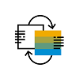

<!-- loio0a5377076f4e4ccba055a9072befadbd -->

# Why Use SAP Fiori Elements?

Here's why – in a nutshell.

<table>
<tr>
<td valign="top">

</td>
<td valign="top">

**Developer Productivity**

-   Focus on **business logic** and back-end services
-   Write **less UI code**
-   **Reduce** development and maintenance **costs**

</td>
</tr>
<tr>
<td valign="top">

</td>
<td valign="top">

**UX Consistency**

-   Comply with the **latest SAP Fiori design** specification
-   Deliver a **centrally managed** user experience
-   Include **uniform** layout, navigation, search, filtering, and more

</td>
</tr>
<tr>
<td valign="top">

</td>
<td valign="top">

**Enterprise Readiness**

-   Deliver **high-quality** SAPUI5 applications to end users
-   Ensure **stable, optimized** UI code out of the box
-   Include **standard enterprise features** \(accessibility, mobile, translation support, and more\)

</td>
</tr>
</table>

> ### Note:  
> The initial effort for creating an app using SAP Fiori elements might be higher than creating a freestyle SAP Fiori app. However, you will be richly rewarded for this effort after you've created more apps this way because your apps will benefit from using the framework and the included features.

