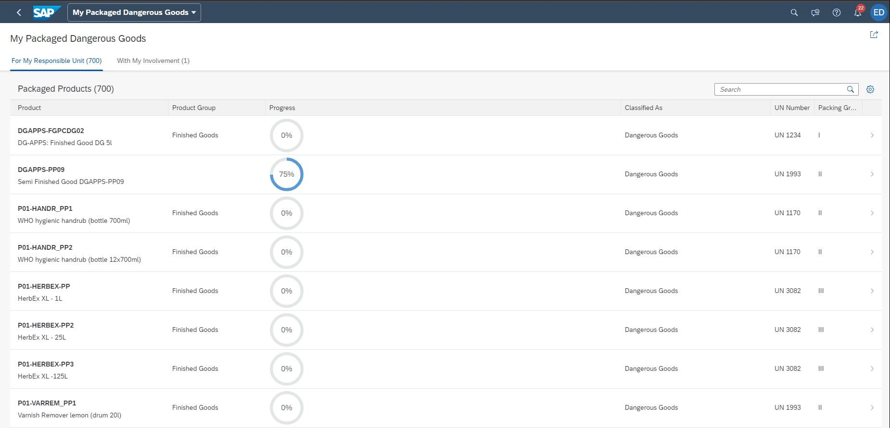

<!-- loiod1d588f1061b4bac96a1facb80d3f3a2 -->

# Worklist

A worklist displays a collection of items that are to be processed by the user.

Working through the item list usually involves reviewing details of the list items and taking action. In most cases, the user has to either complete or delegate a work item.

The focus of the worklist floorplan is on processing the items. This differs from the list report floorplan, which focuses on filtering content to create a list.

<a name="loiod1d588f1061b4bac96a1facb80d3f3a2__section_a25_1cx_nsb"/>

## Additional Features in SAP Fiori Elements for OData V2

From a technical perspective, a worklist is a simplified list report. The following aspects differ from the list report features:

-   You create a worklist using SAP Fiori application generator. In the*Template Selection* step, choose *Worklist Page* as a template. For more information, see [Building an App](building-an-app-9834a0a.md).

-   The worklist does not contain a smart filter bar. The search field is available in the table toolbar.

-   Variant management:
    -   By default, variant management is hidden. You can customize the worklist to provide variant management at table level. To do so, set the `variantManagementHidden` flag to `false` in the `manifest.json`. You can enable page level variant management by setting `smartVariantManagement` to `true` and the `variantManagementHidden` flag to `false` in the `manifest.json`. Variants can also be shared.

    -   The *Execute on Select* action is not available.

-   Smart table:

    -   The multiselect function is enabled for all tables. If there are only line item actions, a no-selection table is enabled.

    -   The *Export to Microsoft Excel* feature is not available.

    -   The default table type is **responsive**. The table title contains the row count. A fixed layout and growing using the scrolling function is enabled.

### Worklist Types

You can create a category worklist by defining multiplee views withing a table in your worklist, as described under [Defining Multiple Views on a List Report Table - Single Table Mode](defining-multiple-views-on-a-list-report-table-single-table-mode-0d390fe.md).

### Configuring the Worklist

For more information on any worklist configuration options, see [List Report and Object Page](list-report-and-object-page-c0eec49.md). Apart from the features listed above, you can also use the options described for the list report, for example:

-   [Configuring List Report Features](configuring-list-report-features-3af1d03.md)

-   [Configuring Navigation](configuring-navigation-a424275.md)

-   [Configuring Tables](configuring-tables-f4eb70f.md)

-   [Configuring Further Common Features](configuring-further-common-features-a4d3c46.md)

-   [Extending List Reports and Object Pages Using App Extensions](extending-list-reports-and-object-pages-using-app-extensions-a892eb8.md)

<a name="loiod1d588f1061b4bac96a1facb80d3f3a2__section_tqb_jcx_nsb"/>

## Additional Features in SAP Fiori Elements for OData V4

From a technical perspective, a worklist is a simplified list report without a filter bar. You can create a worklist template using the SAP Fiori application generator. For more information, see [Configuring Filter Bars](configuring-filter-bars-4bd7590.md).

For general information about the worklist floorplan, see  [SAP Fiori Design Guidelines](https://experience.sap.com/fiori-design-web/).

