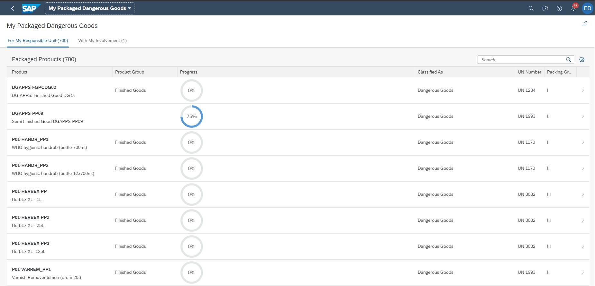

<!-- loiod1d588f1061b4bac96a1facb80d3f3a2 -->

# Worklist Page

You can use the worklist page floorplan to display a collection of items that the user must process.

Working through the item list usually involves reviewing details of the list items and taking action. In most cases, the user has to either complete or delegate a work item.

The focus of the worklist page floorplan is on processing the items. This differs from the list report page floorplan, which focuses on filtering content to create a list.

From a technical perspective, a worklist page is a simplified list report page without a filter bar. You can create a worklist page template using the SAP Fiori application generator. For more information, see [Configuring Filter Bars](configuring-filter-bars-4bd7590.md).

For general information about the worklist page floorplan, see the [SAP Fiori Design Guidelines](https://experience.sap.com/fiori-design-web/).

> ### Note:  
> For information about SAP Fiori elements for OData V2, see [Worklist Page](worklist-page-f412dea.md).

