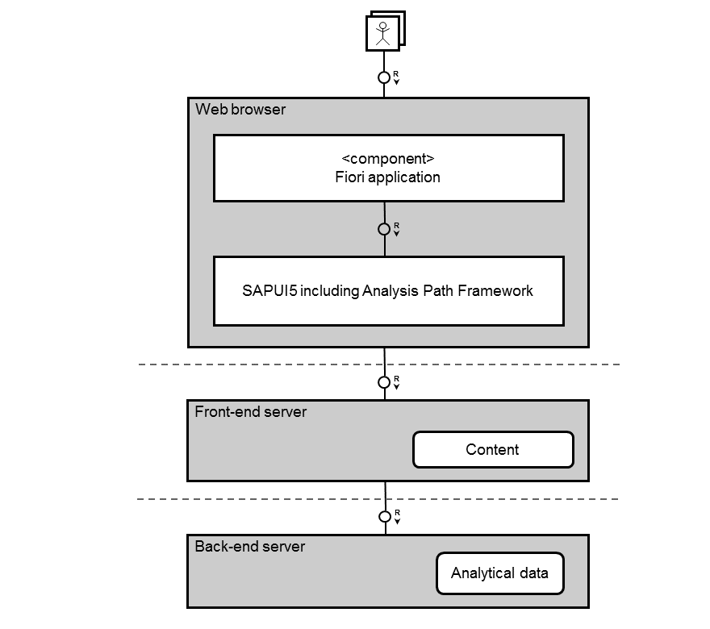

<!-- loio46467c53595a6655e10000000a423f68 -->

# Analytical Applications Based on APF

APF supports a sophisticated user interaction paradigm that you can apply to your own APF-based analytical Web application. Users can perform a step-by-step analysis of KPIs by looking at them from different perspectives. For example, they can compare a KPI across different countries or customers, and they can examine tendencies over time. To cover these aspects, you can define different **analysis steps** that the users can then choose from in an analysis step gallery. Analysis steps consist of data that is depicted on the UI in various types of representations, such as charts or tables.

In each analysis step, the users can select data to filter the information provided in subsequent steps. By combining different analysis steps and applying filters, they interactively create their own flexible **analysis paths**.

To get an overview of how an APF-based app looks and how to use it, you can view the [APF Demo App](https://ui5.sap.com/test-resources/sap/apf/demokit/app/index.html) in the Demo Kit and watch the following videos:

<table>
<tr>
<th valign="top">

Title

</th>
<th valign="top">

Video

</th>
</tr>
<tr>
<td valign="top">

UI Overview

</td>
<td valign="top">

  

</td>
</tr>
<tr>
<td valign="top">

Creating an Analysis Path

</td>
<td valign="top">

  

</td>
</tr>
<tr>
<td valign="top">

Further Options for Analysis Paths

</td>
<td valign="top">

  

</td>
</tr>
<tr>
<td valign="top">

Filtering Data in Analysis Paths

</td>
<td valign="top">

  

</td>
</tr>
<tr>
<td valign="top">

Insight to Action

</td>
<td valign="top">

  

</td>
</tr>
</table>

## Configured APF-Based Applications

A number of APF-based applications are available that are already configured and ready to be used.

APF-based applications that are shipped by SAP consist of a Business Server Page \(BSP\) application along with an app descriptor, the `manifest.json` file. This `manifest.json` file refers to the analytical configuration file, also in JSON format. If you want to run an APF-based application without making any changes to it, the configuration can be read directly from the JSON files. You don't need the APF Configuration Modeler to use this scenario.

When you import the JSON file of a shipped application into the APF Configuration Modeler to enhance the application, the configuration is written into a repository. For more information, see [Import](import-6528aa8.md) and [Enhancing an APF-Based Application](enhancing-an-apf-based-application-b247999.md).

For information about shipped APF-based apps, see the documentation of the individual apps.

## Architecture

APF-based Web applications run in a Web browser and communicate with a server using OData service requests.

The architecture is depicted in the following figure:

