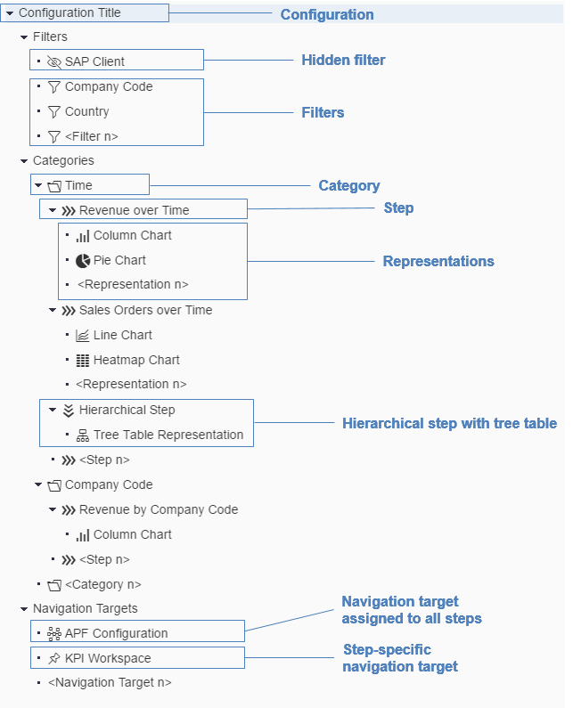

<!-- loioae92e0f629ae4e84a6f247d63621dd16 -->

# Creating a Configuration

Once you have created an application, you can add a configuration to it. First, navigate to the application by clicking the corresponding row in the application overview. If the application does not yet have any configurations, you are immediately directed to the screen where you can define one. If you want to create an additional configuration, click *Add* \> *New Configuration*. In both cases, enter the following:

<table>
<tr>
<th valign="top">

Field

</th>
<th valign="top">

Explanation

</th>
</tr>
<tr>
<td valign="top">

Configuration Title

</td>
<td valign="top">

Text used as title at runtime. This title is translated.

</td>
</tr>
<tr>
<td valign="top">

Configuration ID

</td>
<td valign="top">

Generated GUID that is required for configuring a Fiori app launcher tile. This ID cannot be changed.

</td>
</tr>
<tr>
<td valign="top">

Semantic Object

</td>
<td valign="top">

Inherited from the application. It is displayed for information only and cannot be changed here.

</td>
</tr>
<tr>
<td valign="top">

Filter Type

</td>
<td valign="top">

Choose which filter type you want to use for the entire configuration:

-   Smart filter bar, rendered using the `SmartFilterBar` control, which uses the OData metadata of an entity type

-   Individually configured filters, rendered using the `FacetFilter` control

-   No filters

</td>
</tr>
</table>

## Adding Objects to a Configuration

Within a configuration, you can now start adding objects according to the following structure:

The design time layout of these objects is organized as a tree structure to reflect the dependencies between them. For example, steps can only be added under a category, and representations can only be added under a step.

The order in which the objects are arranged in the APF Configuration Modeler also determines the order in which they are displayed on the UI at runtime. In the analysis step gallery, the categories, for instance, are listed in the same order as they were designed in the APF Configuration Modeler.

When you add a new object, for example, an additional step in a category, it is always added at the end of the list. You can use the *Up* and *Down* arrows to move an object to another position in the list.

## Copying Objects

The following objects can be copied:

-   Configuration
-   Filters
-   Categories
-   Steps
-   Representations
-   Navigation targets

In all cases, the object is always copied including all subordinate objects. For example, a category is copied including all steps and representations assigned to it.

A copy is always added in the same place as the original object. For example, when you copy a configuration, the application GUID is retained so that the new configuration is created in the same application. The same applies to, for example, a step: The copy of a step is added in the same category as the original step. You can move the copy to a different category by changing the category assignment in the step itself.

