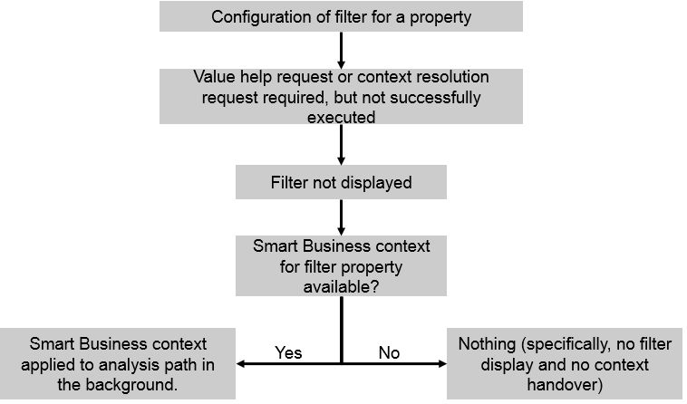

<!-- loio048278fb732e41d3993211b741b7959b -->

# Erroneous Filter Configuration

If a filter has been configured for a property, situations may occur where the filter cannot be displayed. This can be the case, for example, if a context resolution is required, but a context resolution request has not been configured or the request fails. As in use case 4, if a filter is passed with the Smart Business context, it is directly applied to the analysis path.

The option described above is depicted in the following figure:

