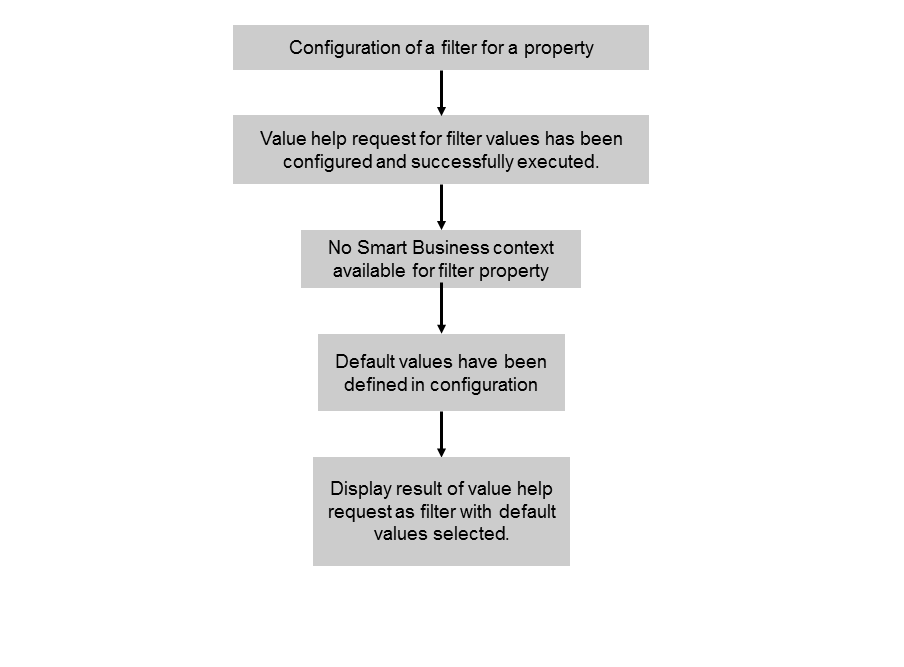

<!-- loio8680ca3c1a7d411494f75e6d7d3d81c7 -->

# Use Case 1: Filter Independent of Smart Business

For this use case, all of the following apply:

-   You configure a filter for a property in your application.
-   You configure a value help request to determine the entries in the value help list.
-   The Smart Business KPI tile does not pass a corresponding filter in the context.

As a result, the filter is displayed in the application and its value help is populated with all values retrieved by the configured value help request.

To configure the filter for this use case, you must enter basic data for the filter and information for the value help. No entries for the context resolution are required.

You can configure whether multiple selections are possible in the value help or not. If multiple selections are possible you can specify one or several values that are used as default values or you can enter a function that determines the default values. If you select *Automatic Values*, all values are selected in the filter by default.

If only single selection is allowed, you can specify one value that is used as default value or you can enter a function that determines the default value. If you select *Automatic Values*, the first entry in the value help of the filter is automatically selected by default.

> ### Note:  
> If you specify default values that do not exist in the value help, these values will occur in the filter in addition to the values provided by the value help request.

The option described above is depicted in the following figure:

  

