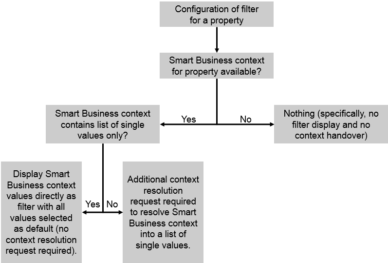

<!-- loio3d2dbf58a11c467fbd02881620c97cba -->

# Use Case 2: Filter Determined by Smart Business Context Only

For this use case, all of the following apply:

-   You configure a filter for a property in your application.
-   No value help request has been specified.
-   The Smart Business KPI tile passes a filter for the same property in the context.

In this case, the filter is displayed in the application and its content is determined by the information passed in the Smart Business context. If the context contains a list of single values only, the value help lists all these values and by default, all values are selected. If the context contains other operators, an additional context resolution request is required. This request resolves the context into a list of single values. The value help then lists all these single values and by default, all values are selected.

To configure a filter for this use case, only the basic data for the filter is required. You don’t have to enter information for the value help request.

To configure the context resolution request, enter the required information in the *Context Resolution* section.

> ### Note:  
> If you did not specify a context resolution request, but a context resolution is necessary to be able to display the values in the value help, the filter for the corresponding property is not displayed on the UI. Instead, the context is applied to the analysis path in the background.

The options described above are depicted in the following figure:

  

