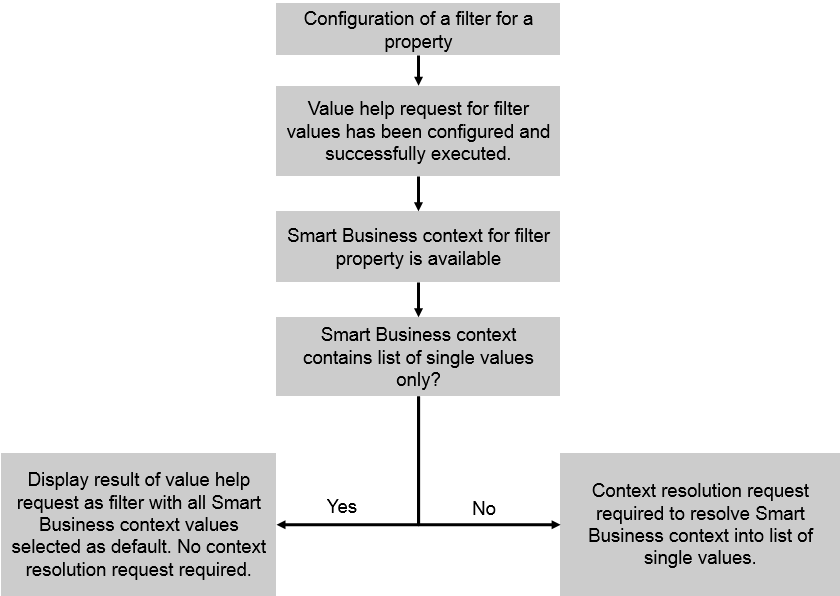

<!-- loiofc2f9b3aa1864bdc9845eedd4d7729cf -->

# Use Case 3: Filter with Default Values Determined by Smart Business Context

For this use case, all of the following apply:

-   You configure a filter for a property in your application.
-   A value help request determines the entries in the value help list.
-   The Smart Business KPI tile passes a filter for the same property in the context.

As a result, the value help for the filter lists all values retrieved by the value help request. By default, those values are preselected that were passed as filters with the Smart Business context.

As in use case 2, if the context contains operators other than just single values, an additional context resolution request is required. This request resolves the context into a list of single values. In the value help, these single values are then selected by default.

To configure a filter for this use case, you must enter basic data for the filter definition and information for the value help.

To configure the context resolution request, enter the required information in the *Context Resolution* section.

The option described above is depicted in the following figure:

  

You configure a filter for the property `CompanyCode`. You define a value help request that retrieves all company codes that are available. These are listed in the value help for the filter.

The Smart Business context passes company codes 1000 and 2000 as filters. These company codes are then preselected in the filter. The user can, for example, add more company codes to the analysis as required.

