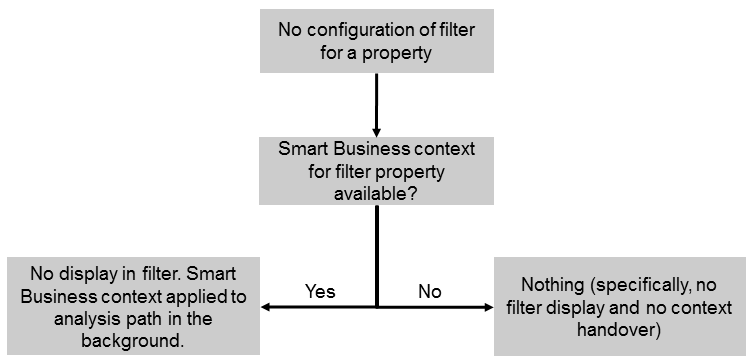

<!-- loio459e718dcb79423dbf57ceb27e2a6953 -->

# Use Case 4: No Filter

For this use case, the following applies:

-   The Smart Business KPI tile passes a context for a property.
-   It is not required to display the corresponding filter on the UI and it shall not be changed by the user. Therefore, you don’t configure a filter for this property.

In this case, the context is applied to the analysis path in the background. This is useful, for example, for technical properties or for properties that the user shall not be able to change, such as, `SAPClient`.

The option described above is depicted in the following figure:

