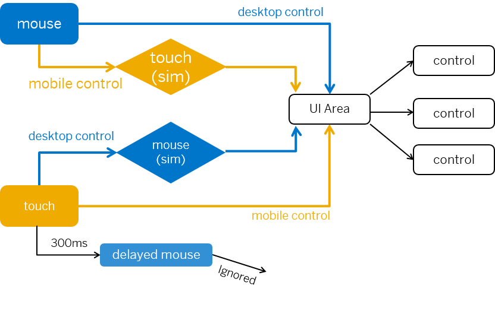

<!-- loio1f9de72bea734beaafa86b80c2c4222c -->

# Devices Supporting both Mouse and Touch Input

Devices such as touch-enabled laptops support simultaneous mouse and touch input. As a control developer you have to take this into consideration.

> ### Note:  
> SAPUI5 event delegation is adapted so that the `ontouch*` and `ontap*` functions on the control prototype are called on both touch and mouse events \(excluding the emulated mouse events on touch interfaces\). This enables controls that only use SAPUI5 event delegation for event handling to work seamlessly on touch-enabled devices. As an SAPUI5 application developer there is no need for you to change or adapt your applications to support devices that allow input from both mouse and touch.

When you develop your own controls, consider the following:

## Background: How SAPUI5 handles events

With the introduction of touch-enabled devices, touch is becoming part of the expected desktop experience. In the past, UI5 statically detected whether the running environment supported touch events. Then the assumption was made that only touch \(and not mouse\) events need to be supported. This assumption became faulty with the emerging of touch-enabled laptops and desktop PCs. The fact that touch events are supported does not mean that users won't use other input devices as well. Therefore, "support touch" is no longer equal to "doesn't need mouse support". We don't switch between touch and mouse - we now support both at the same time!

The following figure shows how this is implemented:

  

A desktop control is defined as a control that listens to mouse events, whereas a mobile control listens to touch events. To ensure that all events can be received, touch simulation events are created for mouse events, and mouse simulation events for touch events, respectively. So the UI Area, which acts as an event delegate, receives the correct events. In detail:

-   When a mouse event is triggered for a desktop control, it's handed over to the UI area directly.
-   When a mouse event is triggered for a mobile control, a touch event is simulated and handed over to the UI area.
-   When a touch event is triggered for a mobile control, it's handed over to the UI area directly.
-   When a touch event is triggered for a desktop control, a mouse event is simulated and handed over to the UI area.
-   Some browsers send a delayed mouse event after a touch event. This is simply ignored.

So it is ensured that all events can be handled and no event is triggered twice.

## Support mouse and touch events together

Touch interfaces try to emulate mouse/click events, because they need to interact with applications that previously only interacted with mouse events. For a single tap on touch interfaces, the following events are fired in the given order:

1.  `touchstart`
2.  `touchend`
3.  `mousedown`
4.  `mouseup`
5.  `click`

If we support mouse and touch input together, the event handler is called twice for a single tap, because there are additional `touchstart` and `mousedown` events fired by the browser. Fortunately, we have found a way to set a flag on emulated mouse events from touch interfaces and suppress those events when they reach the event handler.

**Related Information**  

[Adapting Event Handling for Devices Supporting both Mouse and Touch Input](adapting-event-handling-for-devices-supporting-both-mouse-and-touch-input-b54d7d7.md "SAPUI5 event delegation automatically handles both mouse and touch events simultaneously. If you are using jQuery or native browser API (domElement.addEventListener) to handle events, you have to adapt your coding to support both.")

[Device-specific Behavior of Controls](device-specific-behavior-of-controls-a53ec81.md "Some controls have different behaviors between running on different device types (mobile, desktop, tablet).")

