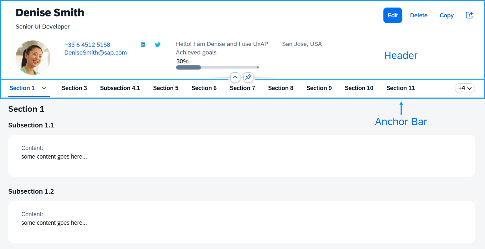

<!-- loio370b67986497463187336fa130aebbf1 -->

# Anchor Bar

Displays the titles of the sections and subsections in the `ObjectPageLayout` and allows the user to scroll to the respective content.


<a name="loio370b67986497463187336fa130aebbf1__section_zyk_srs_ncb"/>

## Overview

The anchor bar is an automatically generated internal menu that shows the titles of the sections and subsections and allows the user to scroll to the respective section and subsection content.

   
  
**Anchor Bar with Sections and Subsections**

  

When the user scrolls the page content, the anchor bar remains at the top of the screen.


<a name="loio370b67986497463187336fa130aebbf1__section_xxc_xc1_4cb"/>

## Usage

The anchor bar is displayed by default. You can hide it by using the `showAnchorBar` property:

```xml
<ObjectPageLayout id="ObjectPageLayout" showAnchorBar="false">
</ObjectPageLayout>
```

In some apps or in some rendering modes of apps, it may not be desirable or necessary to display the anchor bar. In these cases, you can hide it using the `setShowAnchorBar` function.

```js
oObjectPage.setShowAnchorBar(false);
```

The `toggleAnchorBar` event is fired by the `ObjectPageLayout` control when the anchor bar is switched from moving to fixed.

An additional option for displaying the anchor bar is to use a `sap.m.IconTabBar` control instead of the default `sap.uxap.AnchorBar`. This is done with the `useIconTabBar` boolean property. If set to `true`, it will also set `showAnchorBar` to `false` in order to avoid showing two navigation bars. This is how it looks in the two views:

XML view:

```xml
<ObjectPageLayout id="ObjectPageLayout" useIconTabBar="true">
</ObjectPageLayout>
```

JavaScript:

```js
oObjectPage.setUseIconTabBar(true);
```


## Custom Anchor Bar Buttons

By default, you don’t need to specify anything for a `sap.uxap.ObjectPageSectionBase` to have its button included in the anchor bar. At runtime, the `ObjectPageLayout` control creates a button that has the same text as the corresponding section title. However, you may want to use your own control for rendering the anchor bar button instead of the default `sap.m.Button`. You can specify the custom control at `sap.uxap.ObjectPageSectionBase` level, as shown here:

```xml
<ObjectPageSection>
    <customAnchorBarButton>
        <m:Button text="Employee Info"/>
    </customAnchorBarButton>
</ObjectPageSection>
```

Scrolling is handled automatically, so you don't need to add anything to enable this feature. However, if you want to handle the `press` event differently, then you can add an event handler to the button and can also optionally customize the button.

```xml
<ObjectPageSection>
    <customAnchorBarButton>
        <m:Button text="Employee Info" press="handleAnchorBarPress" type="Transparent"/>
    </customAnchorBarButton>
</ObjectPageSection>
```

Here is an example showing the usage of custom controls for the anchor bar buttons:

```xml
<ObjectPageLayout id="ObjectPageLayout">       
    <headerTitle>
        <ObjectPageHeader id="headerExpandedGrid" />
    </headerTitle>
    <sections>
        <ObjectPageSection id="section1" title="Employee Info" >
            <customAnchorBarButton>
                <!-- this sap.m.ToggleButton will be used in the anchor bar for navigating to that section -->
                <m:ToggleButton text="Employee Info" />
            </customAnchorBarButton>
        </ObjectPageSection>

        <ObjectPageSection  id="section2" title="Personal Info">
           <customAnchorBarButton>
                <!-- this sap.m.Button will be used in the anchor bar for navigating to that section -->
               <m:Button type="Accept" text="Personal Info" />
           </customAnchorBarButton>
        </ObjectPageSection>

    </sections>
</ObjectPageLayout>
```

**Related Information**  


[API Reference: `sap.uxap.AnchorBar`](https://ui5.sap.com/#/api/sap.uxap.AnchorBar)

