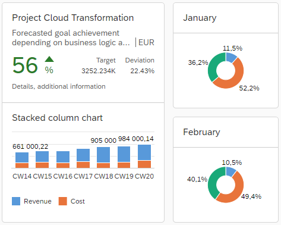
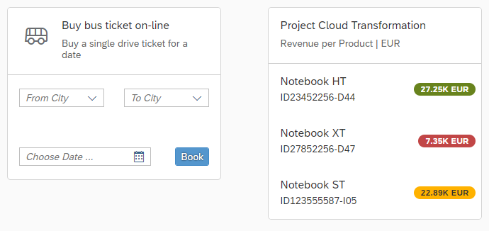

<!-- loio5b46b03f024542ba802d99d67bc1a3f4 -->

# Cards

A card is a design pattern that displays the most concise pieces of information in a limited-space container. Similar to a tile, it helps users structure their work in an intuitive and dynamic way.


<a name="loio5b46b03f024542ba802d99d67bc1a3f4__section_z5t_4x2_dhb"/>

## Overview

Cards are composite controls that follow a predefined structure and offer content in a specific context. Cards contain the most important information for a given object \(usually a task, or a list of business entities\). You can use cards for presenting information, which can be displayed in flexible layouts that work well across a variety of screens and window sizes.

With the use of cards, you can group information, link to details, or present a summary. As a result, your users get direct insights without the need to leave the current screen and choose further navigation options.

> ### Note:  
> Keep in mind, that the hereby described card controls are not related to the Overview Page Card, which is intended to be used in the context of SAP Fiori Elements. For more information, see [Developing Apps with SAP Fiori Elements](../06_SAP_Fiori_Elements/developing-apps-with-sap-fiori-elements-03265b0.md) and [Overview Page Card](../06_SAP_Fiori_Elements/overview-page-card-74332d5.md).

The following table provides an overview of the two main types of card controls in the SAPUI5 framework:

**Overview of Cards and Supported Features**


<table>
<tr>
<th valign="top" rowspan="2">

**Feature Supported** 

</th>
<th valign="top" colspan="4">

**\(Integration Card\)**

**<code><a href="cards-5b46b03.md#loio5b46b03f024542ba802d99d67bc1a3f4__section_integration_card">sap.ui.integration.widgets.Card</a></code>**

</th>
<th valign="top" rowspan="2">

\(Freestyle Card\)

**<code><a href="cards-5b46b03.md#loio5b46b03f024542ba802d99d67bc1a3f4__section_sap_f_card">sap.f.Card</a></code>**

</th>
</tr>
<tr>
<th valign="top">

**Declarative Card Types**

\(List Card, Analytical Card, Table Card, Object Card, Timeline Card, Calendar Card\)

</th>
<th valign="top">

**Adaptive Card**<sup>1</sup> 

</th>
<th valign="top">

**Component Card** 

</th>
<th valign="top">

**WebPage Card** 

</th>
</tr>
<tr>
<td valign="top">

**Fiori 3, Horizon UX** 

</td>
<td valign="top">


</td>
<td valign="top">

<sup>2</sup> 

</td>
<td valign="top">


</td>
<td valign="top">

<sup>3</sup> 

</td>
<td valign="top">


</td>
</tr>
<tr>
<td valign="top">

**Cross-product Integration** 

</td>
<td valign="top">


</td>
<td valign="top">


</td>
<td valign="top">


</td>
<td valign="top">


</td>
<td valign="top">


</td>
</tr>
<tr>
<td valign="top">

**Consumption with HTML Custom Element** 

</td>
<td valign="top">


</td>
<td valign="top">


</td>
<td valign="top">


</td>
<td valign="top">


</td>
<td valign="top">


</td>
</tr>
<tr>
<td valign="top">

**SAP Build Work Zone Integration** 

</td>
<td valign="top">


</td>
<td valign="top">


</td>
<td valign="top">


</td>
<td valign="top">


</td>
<td valign="top">


</td>
</tr>
<tr>
<td valign="top">

**Joule** 

</td>
<td valign="top">


</td>
<td valign="top">

<sup>4</sup> 

</td>
<td valign="top">


</td>
<td valign="top">


</td>
<td valign="top">


</td>
</tr>
<tr>
<td valign="top">

**SAP Mobile Start / Mobile SDK** 

</td>
<td valign="top">


</td>
<td valign="top">


</td>
<td valign="top">


</td>
<td valign="top">


</td>
<td valign="top">


</td>
</tr>
<tr>
<td valign="top">

**Can implement Application Logic** 

</td>
<td valign="top">

<sup>5</sup> 

</td>
<td valign="top">

<sup>5</sup> 

</td>
<td valign="top">


</td>
<td valign="top">


</td>
<td valign="top">


</td>
</tr>
<tr>
<td valign="top">

**Low-code / No-code Configuration Editor** 

</td>
<td valign="top">


</td>
<td valign="top">


</td>
<td valign="top">

<sup>6</sup> 

</td>
<td valign="top">

<sup>6</sup> 

</td>
<td valign="top">


</td>
</tr>
</table>

1\) We recommend using the other declarative card types.

2\) Depends on the content of the Adaptive Card.

3\) Depends on the WebPage content.

4\) The other declarative card types are highly recommended, as the Adaptive Card is currently incompatible with Joule on mobile devices.

5\) Can be implemented in JavaScript extensions.

6\) Highly depends on the Component / WebPage implementation.


<a name="loio5b46b03f024542ba802d99d67bc1a3f4__section_integration_card"/>

## `sap.ui.integration.widgets.Card` \(Integration Card\)

The `sap.ui.integration.widgets.Card` is a self-contained user interface element, connected to a manifest, and used as a widget. It consists of three elements: card container, card header area, and content area.

-   The container is the base and subdivides in a header and content area. It has a white background color and a border with radius.
-   The header area indicates what the card is about and can function as a navigation area for opening the underlying source. It also serves as a counter showing the number of items on the card in relation to the total number of relevant items \(in case multiple items are shown in the content area\). It can have a title, a subtitle, an icon, and a status indicator. If the header is of type `Numeric`, it may have different attributes, describing a KPI.
-   The content area represents data from the underlying source. It uses the interaction and visualization from the embedded controls. It depends on the card type.




### Usage

The integration card is defined in a declarative way, using a `manifest.json` so that it can be easy to integrate and reuse it.

As a card developer, you describe it in its `manifest.json` file by defining its header, content, data source, and possible actions. As an app developer, you integrate the card in your app and define its dimensions \(`height` and `width` properties\) and behaviour for the declared actions \(`action` event\).

To use the `sap.ui.integration.widgets.Card`, you should pass the path to the `manifest.json` file of the card:

```
<mvc:View xmlns:w="sap.ui.integration.widgets">
<w:Card manifest="./demo/manifest.json" />
```

For more information and examples on the usage, see the [API Reference](https://ui5.sap.com/#/api/sap.ui.integration.widgets.Card) and the [Samples](https://ui5.sap.com/#/entity/sap.ui.integration.widgets.Card).


### Content Types

Cards can be transactional \(list, table, object, unstructured content, timeline\) and analytical \(line, donut, \[stacked\] column, stacked bar chart\). Each card is designed in a different style and contains various content formats.


<table>
<tr>
<th valign="top">

Card Type

</th>
<th valign="top">

Description

</th>
</tr>
<tr>
<td valign="top">

Adaptive Card

</td>
<td valign="top">

Used to visualize and reuse cards that are created using the Microsoft Adaptive Cards specification and manifest.

</td>
</tr>
<tr>
<td valign="top">

Analytical Card<sup>1</sup>

</td>
<td valign="top">

Used for data visualization. Typically, it is defined by a numeric header and analytical data content. For example, chart types, such as line chart, donut chart, \(stacked\) column chart, \(stacked\) bar chart. For more information on the analytical card, see the [SAP Fiori Design Guidelines](https://experience.sap.com/fiori-design-web/analytical-card/).

</td>
</tr>
<tr>
<td valign="top">

Calendar Card

</td>
<td valign="top">

Used to display a schedule of a single entity \(such as person, resource\) for the selected time interval.

</td>
</tr>
<tr>
<td valign="top">

Component Card \(Experimental\)

</td>
<td valign="top">

Displays multiple controls and is used as a custom approach for use cases which do not fit in other card types and structures. The content area of the unstructured content card can be moved to the top.

> ### Note:  
> In contrast to the other integration card types, the structure and behavior of the Component card are custom-definable and are following the established SAPUI5 Component model. For more information, see [Components](../04_Essentials/components-958ead5.md).


</td>
</tr>
<tr>
<td valign="top">

List Card

</td>
<td valign="top">

Displays multiple list items of all kind. Aggregated information can also be visualized with a line item. The counter in the header area is required for this type of card.

</td>
</tr>
<tr>
<td valign="top">

Object Card

</td>
<td valign="top">

Displays the basic details for an object, for example, a person or a sales order.

</td>
</tr>
<tr>
<td valign="top">

Table Card

</td>
<td valign="top">

Displays a set of items in table format.

</td>
</tr>
<tr>
<td valign="top">

Timeline Card<sup>2</sup>

</td>
<td valign="top">

Displays time-related content.

</td>
</tr>
<tr>
<td valign="top">

WebPage Card

</td>
<td valign="top">

Allows to embed HTML page in the content area, which will be isolated in iframe.

</td>
</tr>
</table>

> ### Restriction:  
> -   1\) The Analytical Card is using `sap.viz.ui5.controls.VizFrame` charts which are part of SAPUI5 and are not available in OpenUI5.
> 
> -   2\) The Timeline Card is using the `sap.suite.ui.commons.Timeline` control which is part of SAPUI5 and is not available in OpenUI5.


<a name="loio5b46b03f024542ba802d99d67bc1a3f4__section_sap_f_card"/>

## `sap.f.Card` \(Freestyle Card\)

The `sap.f.Card` control provides more freedom in choosing the structure and the controls which you can include. The data is provided by the application with the use of data binding, thus the control can be used just as a renderer.

In contrast to the self-contained and manifest-driven Integration Card \(`sap.ui.integration.widgets.Card`\), where the design, data retrieval, and rendering are predefined and encapsulated for better integration and reuse, with `sap.f.Card` you can decide and compose the card content area according to your needs.

The `sap.f.Card` consists of three elements: a container with background color and rounded corners, a header, and content.



The header is predefined and can be an instance of either `sap.f.cards.Header` or `sap.f.cards.NumericHeader`. The content area can be built with a desired combination of the standard SAPUI5 controls.


### Usage

Considering the general purpose of the cards \(to represent most important assets of a particular business object in a limited size UI element\), it is not recommended to have very complex designs and heavy application-like interactions implemented in a `sap.f.Card` control.

Example:

```xml
<f:Card
	class="sapUiMediumMargin"
	width="300px">
	<f:header>
		<card:Header
			title="Project Cloud Transformation"
			subtitle="Revenue per Product | EUR"/>
	</f:header>
	<f:content>
		<List
			showSeparators="None"
			items="{path: '/productItems'}" >
			<CustomListItem>
			<HBox
				 alignItems="Center"
				justifyContent="SpaceBetween">
				<VBox class="sapUiSmallMarginBegin sapUiSmallMarginTopBottom" >
					<Title level="H3" text="{title}" />
						<Text text="{subtitle}"/>
				</VBox>
				<tnt:InfoLabel
					class="sapUiTinyMargin"
					text="{revenue}"
					colorScheme= "{statusSchema}"/>
			</HBox>
			</CustomListItem>
		</List>
	</f:content>
</f:Card>

```

**Related Information**  


[Components](../04_Essentials/components-958ead5.md "Components are independent and reusable parts used in SAPUI5 applications.")

[Manifest \(Descriptor for Applications, Components, and Libraries\)](../04_Essentials/manifest-descriptor-for-applications-components-and-libraries-be0cf40.md "The manifest (also known as descriptor for applications, components, and libraries, in short: app descriptor) is inspired by the WebApplication Manifest concept introduced by the W3C. The manifest provides a central, machine-readable, and easy-to-access location for storing metadata associated with an application, an application component, or a library.")

[Grid Controls](grid-controls-32d4b9c.md "SAPUI5 provides several different grid layouts that are suitable for different use cases.")

[API Reference: `sap.f.Card`](https://ui5.sap.com/#/api/sap.f.Card)

[API Reference: `sap.ui.integration.widgets.Card`](https://ui5.sap.com/#/api/sap.ui.integration.widgets.Card)

