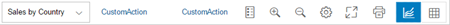
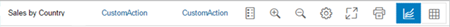

<!-- loio85b33d864c8a43b1bb65522ccb219379 -->

# Chart Container

The `ChartContainer` control contains a toolbar and the control of the content aggregation displayed under the toolbar.

## Overview

The `ChartContainer` supports the `sap.viz.ui5.controls.VizFrame` and `sap.m.Table` controls in its content area. With the toolbar, you can change the view of the content in different ways.

For more information about the `VizFrame` control, see the [API Reference](https://ui5.sap.com/#/api/sap.viz.ui5.controls.VizFrame) in the Demo Kit.

## Details

-   **Selection boxes in the toolbar**

    The control supports multiple selection boxes in the toolbar for changing dimensions, for example.

-   **Content**

    You can switch between chart types or between a chart and a table view. `ChartContainer` supports different chart and table controls, for example, `vizFrame` and `sap.m.Table`. The `sap.suite.ui.commons.ChartContainerContent` control is a wrapper control for the content to be displayed in the `ChartContainer` control. You need to provide the title and icon properties in this control when you define the content so that it is displayed in the `ChartContainer` control.

-   **Fullscreen mode**

    A fullscreen toggle button is provided in the toolbar. You can switch between fullscreen and normal mode.

-   **Personalization**

    The control provides a personalization icon. If you press the icon, a personalization event will be fired.

-   **Selection details**

    The *Details* button provides a popover that displays the details of the items selected in the chart. You can include the button into the toolbar by setting the `showSelectionDetails` property to true. Please note that `SelectionDetails` is only available when `sap.viz.ui5.controls.VizFrame` is displayed in `ChartContainer`.

-   **Custom toolbar**

    As an app developer, you can create your own toolbar inside a `ChartContainer` control in your application. To configure a custom toolbar, the toolbar aggregation can be set to the `sap.m.OverflowToolbar` control that contains your preferred SAPUI5 controls. The new `sap.suite.ui.commons.ChartContainerToolbarPlaceholder` type has been introduced to make the position of the embedded buttons configurable. To configure the position of the embedded buttons, you need to set the placeholder element to the required position in the aggregation.

    The order of the embedded buttons is set automatically by the control as shown in the image below:

    > ### Note:  
    > The displayed toolbars below are taken from an example of the `ChartContainer` toolbar with `VizFrame`.

    -   legend, zoom in, zoom out, personalization, full screen, custom icons and segmented button for content selection.

          

    -   If a dimension selector is displayed in the chart container, it will always be displayed in the first position in the toolbar. When a dimension selector is not visible, the chart container’s title \(`title` property of `ChartContainer`\) will be displayed in the first position in the toolbar as shown below.

          

    If the custom toolbar has been configured and the placeholder is missing, an information log will be displayed and the custom toolbar is ignored. The default toolbar is used instead. If a custom toolbar has been configured, the embedded buttons are still present and integrated using a placeholder.

-   **Custom Icons**

    You can also use custom icons. In this case, custom icons are rendered as `OverflowToolbar` buttons. But they offer less options as the custom toolbar, for example, there is no control option for the visibility.

## API Reference/Samples

For more information about the `ChartContainer` control, see the [API Reference Documentation](https://ui5.sap.com/#/api/sap.suite.ui.commons.ChartContainer) and the [sample](https://ui5.sap.com/#/entity/sap.suite.ui.commons.ChartContainer) in the Demo Kit.

