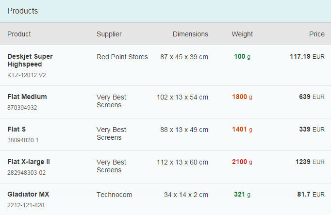
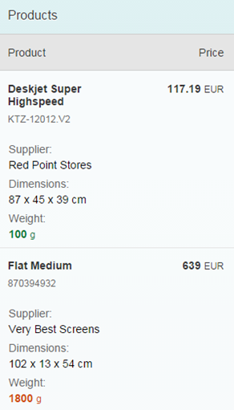

<!-- loio38855e06486f4910bfa6f4485f7c2bac -->

# Configuring Responsive Behavior of a Table

SAPUI5 supports column-based and row-based solutions to support flexible and clearly arranged tables.

One of the biggest challenges in responsive web design \(RWD\) is presenting tabular data. Large tables containing lots of columns simply don't fit on smaller screens, and there is no easy way to reformat the table content with CSS and media queries for an acceptable visual display. To address this, our framework offers a column-based solution \(column hiding\) and row-based solution \(pop-in behavior\) for displaying tables responsively and both options are applicable at the same time. This may sound rather complicated, so let's look at an example.

Say we want to build this nice table to display on a desktop:

On mobile devices, we know that we won't have enough space to show all these columns, so we need to ask ourselves which columns are most important. Let's say:

-   *Product* and *Price* are most important. So they should never be hidden.
-   *Supplier*, *Dimensions* and *Weight* are not particularly important, so we'll only show them in the pop-in area.

If we apply these decisions we just made, our mobile devices should now look like this:

## Responsive Column Control

You can control the responsive table design using the API of `sap.m.Column`. This control provides two properties to handle column hiding and the pop-in behavior.

1.  `minScreenWidth`: This value defines the break point for the column visibility. For instance: An Apple iPhone 5 device has 568px x 320px resolution \(dip/device-width\), so if we assign 400px \(or 25em based on 16px\), then this column will not be visible for portrait mode \(width 320px\) but will be visible for landscape mode \(width 568px\). Instead of specifying in px or em, you can also assign one of the predefined `sap.m.ScreenSize` types like `Tablet` \(for 600px\) or `Desktop` \(for 1024px\). The default value for this property is an empty string, meaning this column will **always** be visible.
2.  `demandPopin`: Depending on your `minScreenWidth`, the column can be hidden in different screen sizes. Setting this property to `true` shows this column in the pop-in area instead of hiding it. The default value is false.

And that's it! All you need to know are these two variables for responsive tables. So if we go back to our original example for a minute:

-   *Name* and *Status* columns should never be hidden. This is the default behavior of a column, so let's just let the default values \(`minScreenWidth:""` and `demandPopin:false`\) do their job.
-   *Model Number* column should be hidden for small devices, so our break point is `minScreenWidth:"Small"` and `demandPopin:false` \(default value\).
-   *Quantity*, *Unit Price* and *Final Price* columns should go into our pop-in area, so our break point is still `minScreenWidth:"Small"` but now with `demandPopin:true` to show the column in a pop-in area.
-   For example, on tablets and wider devices we'll have more space available, so we can show the *Final Price* column, but we'll revert to a pop-in mode for smaller devices. So here our break point should be `minScreenWidth:"Tablet"` and `demandPopin:true`.

> ### Note:  
> To achieve a valid table design, at least one column should always be visible and should **not** go into the pop-in area.

<a name="loio38855e06486f4910bfa6f4485f7c2bac__section_eyg_trg_5pb"/>

## Automatic Pop-In Feature

There is an alternative configuration for simpler cases: Let `sap.m.Table` itself take control of the responsive behavior.

The responsive table provides a feature where the table automatically moves the columns to the pop-in area based on their importance. To enable this, simply set `autoPopinMode:true` in the responsive table.

The default value of the `importance` property for a column is `"None"`. If there is no column importance defined, the responsive table treats the first column as the most important column. The following columns are treated as less important and are moved to the pop-in area as the browser window size is reduced.

You can change the default automatic pop-in behavior by defining the `importance` property for the columns.

The columns are moved to the pop-in area in the following order based on their importance:

1.  Columns with `Low` importance

2.  Columns with `Medium` and `None` importance

    These are treated as equal and moved to the pop-in area when there are no columns with `Low` importance.

3.  Columns with `High` importance

Let's take the same example as before with the *Product* and *Price* columns as the most important columns. They must move to the pop-in area last. To achieve this, `importance:"High"` must be set for the two columns. As you reduce the size of the browser window, the columns with lower importance move to the pop-in area before the two columns configured with `High` importance.

You can also hide columns with a specific importance in the pop-in area. To achieve this, `hiddenInPopin` must be configured. For example, if you want to hide all columns with `"Low"` and `"Medium"` importance, you can define `hiddenInPopin="Low,Medium"`. Additionally, you can also listen to the `popinChanged` event of the responsive table that is fired for every change of the pop-in area \(columns moved in or out of the pop-in area\).

For more information, see the [Sample](https://ui5.sap.com/#/entity/sap.m.Table/sample/sap.m.sample.TableAutoPopin).

> ### Note:  
> -   The automatic pop-in feature ensures that not all columns move to the pop-in area and there is always at least **one** visible column in the table.
> 
> -   The `demandPopin` and `minScreenWidth` properties of a column are configured by the responsive table. `minScreenWidth` is determined based on the `width` or `autoPopinWidth` properties of the column if this feature is enabled. If there are any custom settings for the `demandPopin` and `minScreenWidth` properties, they will be overwritten by this feature.

<a name="loio38855e06486f4910bfa6f4485f7c2bac__section_acy_rkh_5pb"/>

## API Reference

-   [sap.m.Table](https://ui5.sap.com/#/api/sap.m.Table)
-   [sap.m.Column](https://ui5.sap.com/#/api/sap.m.Column)

