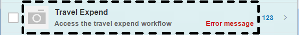
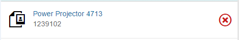

<!-- loio3e426f159c7a4ab5ae660aba288c94d2 -->

# Custom List Item

You can use the `sap.m.CustomListItem` control to create your own layout if the other list items available in SAPUI5 do not fit your needs.


## Available List Items in SAPUI5

SAPUI5 contains several list items that are used with the `sap.m.List` control to serve different standard scenarios. These are outlined in the table below, along with `sap.m.ColumnListItem`, which is used together with the `sap.m.Table` control:


<table>
<tr>
<th valign="top">

List Item


</th>
<th valign="top">

Used for...


</th>
</tr>
<tr>
<td valign="top">

 `sap.m.StandardListItem` 


</td>
<td valign="top">

Displaying list content with a title description, icon and info


</td>
</tr>
<tr>
<td valign="top">

 `sap.m.DisplayListItem` 


</td>
<td valign="top">

Displaying name/value pairs


</td>
</tr>
<tr>
<td valign="top">

 `sap.m.InputListItem` 


</td>
<td valign="top">

Building a form-like user interface on phones


</td>
</tr>
<tr>
<td valign="top">

 `sap.m.ActionListItem` 


</td>
<td valign="top">

Triggering an action directly from a list


</td>
</tr>
<tr>
<td valign="top">

 `sap.m.FeedListItem` 


</td>
<td valign="top">

Displaying a standard UI for feeds. For more information, see [Feed List Item](feed-list-item-14a9900.md) 


</td>
</tr>
<tr>
<td valign="top">

 `sap.m.ObjectListItem` 


</td>
<td valign="top">

Providing a quick overview for an object within a list


</td>
</tr>
<tr>
<td valign="top">

 `sap.m.ColumnListItem` 


</td>
<td valign="top">

Providing responsive table design in combination with `sap.m.Table` 


</td>
</tr>
<tr>
<td valign="top">

 `sap.m.CustomListItem` 


</td>
<td valign="top">

Creating custom list items if none of the list items above are suitable


</td>
</tr>
</table>

If none of the predefined list items \(the first seven entries in the table above\) fit your scenario, you can also create your own layout by using `sap.m.CustomListItem` directly, or create a new control that inherits from `sap.m.CustomListItem`.

For more information about the different list items, refer to the corresponding [API documentation](https://ui5.sap.com/#/api/sap.m.List). 


## Structure of a List Item

A list item can be split into three parts, as shown in the following graphic:

  

The parts that are to the left and right of the dotted area are part of the `ListItemBase` and are used to display the selection and deletion mode, as well as different list item type indicators such as navigation, details, and counter. The `Unread` indicator also comes from the `ListItemBase` and when it is set, any unread text will be displayed in bold format.

The dotted area is the area in which the content of a list item is placed. If you are using `sap.m.CustomListItem`, **all** of the content will be placed there. The section below explains how to use `sap.m.CustomListItem` in more detail.


## Using the `sap.m.CustomListItem` Control

As mentioned above, you can either use `sap.m.CustomListItem` directly by adding any content via content aggregation, or you can create your own control that inherits from `sap.m.CustomListItem` if you need a more sophisticated list item featuring your own properties, styling, and complex layout. Below is an example showing how you can use the `sap.m.CustomListItem` together with `sap.m` controls.

```xml

<List headerText="Custom Content" mode="Delete" items="{path: '/ProductCollection'}" >
	<CustomListItem>
		<HBox>
			<core:Icon size="2rem" src="sap-icon://attachment-photo" class="sapUiSmallMarginBegin sapUiSmallMarginTopBottom" />
			<VBox  class="sapUiSmallMarginBegin sapUiSmallMarginTopBottom" >
				<Link text="{Name}" target="{ProductPicUrl}" press="handlePress"/>
				<Label text="{ProductId}"/>
			</VBox>
		</HBox>
	</CustomListItem>
</List>
```

The example above creates an attachment list item that displays an attachment title as a link, as shown in the graphic below. Clicking on the link will open the attachment. Below the attachment title, we want to display the details of the attachment, so we have used `sap.m.HBox` and `sap.m.VBox` for basic layouting. Data binding is also supported, and here it assumes that a model featuring `ProductPicUrl` and `ProductId` properties is used.

  

The following example shows how to use a notepad control as a reusable control in an `sap.m.CustomListItem`. It assumes you want to build a product list item that shows an image of the product and displays its details:

```js
sap.ui.define(["sap/ui/core/Control", "sap/m/Image"], function (Control, Image) {
    var MyListItemContent = Control.extend("my.control.ListItemContent", {
        metadata: {
            properties : {
                "name": {type: "string", defaultValue: ""},
                "description": {type: "string", defaultValue: ""},
                "price": {type: "string", defaultValue: ""},
                "currency": {type: "string", defaultValue: ""},
                "image": {type: "string", defaultValue: ""}
            },
            events: {
                "myTap": {},
            },
        },
        init: function(){
            this._image = new Image({src:"<myImageSrc>"}).addStyleClass("myImageCSS").setParent(this);
        },
 renderer: {
            apiVersion: 2,  // see 'Renderer Methods' for an explanation of this flag
            render: function(oRm, oControl) {
                oRm.openStart("div", oControl);
                oRm.class("listItemCSS");
                oRm.openEnd();
                    oRm.renderControl(oControl._image);
                    oRm.openStart("div").class("descCSS").openEnd();
                    oRm.text(oControl.getDescription());
                    oRm.close("div");
                    oRm.openStart("div").class("priceCSS").openEnd();
                    oRm.text(oControl.getPrice());
                    oRm.close("div");
                    oRm.openStart("div").class("curCSS").openEnd();
                    oRm.text(oControl.getCurrency());
                    oRm.close("div");
                    oRm.openStart("div").class("nameCSS").openEnd();
                    oRm.text(oControl.getName());
                    oRm.close("div");
                oRm.close("div");
            }
        }
    });

    //example how to react on browser events and convert them to control events
    ListItemContent.prototype.ontap = function(){
        //your own tap logic
        this.fireMyTap({});
    };

    return ListItemContent;
});
```

After we've created this notepad control above, we consume it in the `sap.m.CustomListItem` as a content aggregation, as shown here:

```js
// "CustomListItem" required from "sap/m/CustomListItem"
var oCustomListItem = new CustomListItem({content: [new MyListItemContent({
    //usual control setup
})]});
```

