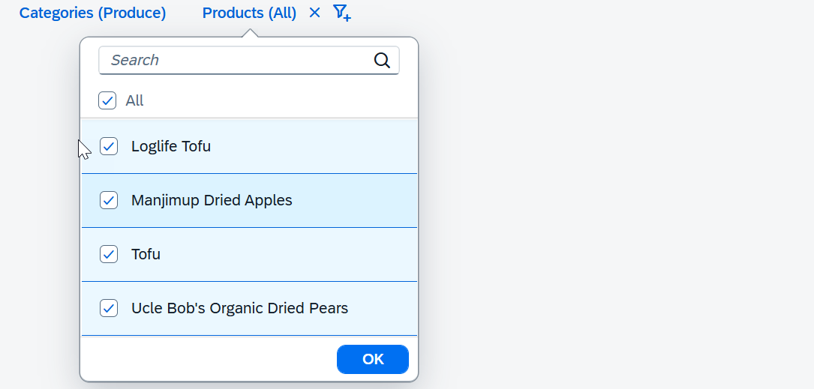

<!-- loioe7027747b8ef4ef483cadeeec4cffb1e -->

# Dependent Facets

Applications can have dependencies between facets where selection of filter items in one facet list limits the list of valid filters in another facet list.

For example, an application displays a list of products and uses a facet filter with two facets: Categories and Products. If users select a category filter, they should only be able to filter products from that selected category. Facet filter does **not** explicitly handle dependencies between facets. Instead, use `FacetFilterList` events in the application.


## Example

In this example, only products from the selected category are displayed.



```js

var oCategoriesModel = new sap.ui.model.odata.v2.ODataModel("/uilib-sample/proxy/http/services.odata.org/V3/Northwind/Northwind.svc");

var oCategoriesFFL = new sap.m.FacetFilterList({ // create the categories facet list
    title : "Categories",
    mode : sap.m.ListMode.SingleSelectMaster, // restrict to one selection for simplicity
    key : "Categories",
    items : {
        path : "/Categories",
        template : new sap.m.FacetFilterItem({
            text : "{CategoryName}",
            key : "{CategoryID}"
        })
    }
});
oCategoriesFFL.setModel(oCategoriesModel); // set the data model

// create the data model for the products facet list
var oProductsModel = new sap.ui.model.odata.v2.ODataModel("/uilib-sample/proxy/http/services.odata.org/V3/Northwind/Northwind.svc");

var oProductsFFL = new sap.m.FacetFilterList({
    title : "Products",
    key : "Products",
    items : {
        path : "/Products_by_Categories",
        template : new sap.m.FacetFilterItem({
            text : "{ProductName}",
            key : "{ProductID}"
        })
    },
    listOpen : function(oEvent) {

        // only display products from the selected category (if any)
        var aSelectedKeys = Object.getOwnPropertyNames(oCategoriesFFL.getSelectedKeys());
        if(aSelectedKeys.length > 0) {
            
            var oBinding = this.getBinding("items");
            var oUserFilter = new sap.ui.model.Filter(
            "CategoryName", 
            sap.ui.model.FilterOperator.Contains,
            oCategoriesFFL.getSelectedKeys()[aSelectedKeys[0]]);
            var oFinalFilter = new sap.ui.model.Filter([ oUserFilter ], true);
            oBinding.filter(oFinalFilter, sap.ui.model.FilterType.Application);
        }
    },
});
oProductsFFL.setModel(oProductsModel);

// create the facet filter control
var oFF = new sap.m.FacetFilter(genId(), { 
    lists : [ oCategoriesFFL, oProductsFFL ],
});

```

