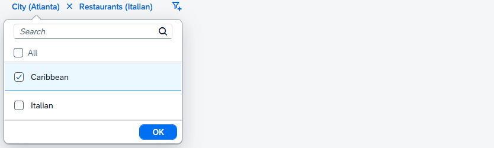

<!-- loio395392f30f2a4c4d80d110d5f923da77 -->

# Facet Filter List and Facet Filter Item

The `sap.m.FacetFilter` control uses the `FacetFilterList` and the `FacetFilterItem` controls to model facets and their associated filters.

The facet filter list aggregation is a collection of facet filter list objects, where each element in the collection represents a different facet. Likewise, the facet filter list items aggregation is a collection of facet filter item objects where each element in the collection represents a different filter items available for the facet.


## Facet Filter List

The `FacetFilterList` control extends and supports all the features of the `sap.m.List` control, for example swipe for action, growing feature, remember selections and grouping.

The following properties of `FacetFilterList` affect the display of lists in the `FacetFilter` control.


<table>
<tr>
<th valign="top">

Property

</th>
<th valign="top">

Description

</th>
</tr>
<tr>
<td valign="top">

`title`

</td>
<td valign="top">

Facet name

</td>
</tr>
<tr>
<td valign="top">

`mode`

</td>
<td valign="top">

Controls the selection mode for the list

This property is overridden from `ListBase` and only allows `SingleSelectMaster` or `MultiSelect` settings. `MultiSelect` is the default: This setting displays the *All* checkbox above the filter list to allow the user to select all filters. This does not actually select individual filters to avoid performance overhead for lists with a large number of items.

</td>
</tr>
<tr>
<td valign="top">

`sequence`

</td>
<td valign="top">

Controls the order in which the facets are displayed in the toolbar

Lists appear in the toolbar in ascending order according to sequence \(assuming left to right\). Lists with a sequence less than 0 are placed last, not before facets with sequence of zero. Only active lists are displayed regardless of sequence setting.

</td>
</tr>
<tr>
<td valign="top">

`active`

</td>
<td valign="top">

Indicates if a facet filter list is active and should appear on the toolbar; this is only applicable for the simple type as all facet filter lists are active in the light type

</td>
</tr>
<tr>
<td valign="top">

`allCount`

</td>
<td valign="top">

The `allCount` value can be set to the number of filter matches in the target data set given the currently selected filters for the facet filter list.

</td>
</tr>
</table>

> ### Note:  
> The list of properties is not complete. For a complete list, refer to the API documentation.


## Facet Filter Item

The `FacetFilterItem` control extends and supports all features of `sap.m.ListItemBase`, for example item selection and counter. `FacetFilterItem` provides the following properties:


<table>
<tr>
<th valign="top">

Property

</th>
<th valign="top">

Description

</th>
</tr>
<tr>
<td valign="top">

`text`

</td>
<td valign="top">

Filter item name

</td>
</tr>
<tr>
<td valign="top">

`key`

</td>
<td valign="top">

Unique identifier of the filter item; used to filter the target data set

If `key` is not set, `text` is used as the key value.

</td>
</tr>
</table>

> ### Note:  
> You must either set the `text` or the `key` property. Otherwise, the facet filter list can not properly maintain the selected state of the item and an error message is logged to the console.


## Example

The following example shows how you use the controls. To build the face filter in the figure, use the code below the figure:



```js
    
var oFacetFilter = new sap.m.FacetFilter({ // define FacetFilter Control
        lists : [ new sap.m.FacetFilterList({ // city facet
            title : "City",
            items : [ new sap.m.FacetFilterItem({
                text : "Waldorf",
                key : "WDF"
            }), new sap.m.FacetFilterItem({
                selected : true, // filter is selected (from ListItemBase)
                text : "Atlanta",
                key : "ATL"
            }) ]
        }), new sap.m.FacetFilterList({ // restaurant facet
            title : "Restaurants",
            items : [ new sap.m.FacetFilterItem({
                text : "Caribbean",
                key : "CRB"
            }), new sap.m.FacetFilterItem({
                selected : true, // filter is selected (from ListItemBase)
                text : "Italian",
                key : "ITL"
            }) ]
        }) ]
    });

```

> ### Note:  
> The example does not have a model binding. A binding to the filter items is required for the search.

