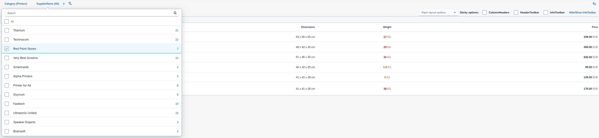

<!-- loio1586c19a9d854f6e82613fd75290c34f -->

# Facet Filter: Simple Type

The simple type of the `FacetFilter` control is only available for desktop and tablets.

The active facets are displayed as individually selectable buttons on the toolbar as shown in the following figure.

If the user selects a facet in the toolbar, a popover list of the available filters for the selected facet is displayed.

The simple type provides the following functions:

-   With the `showPopoverOkButton` property of the `FacetFilter` control you can display an *OK* button in the popover. The *OK* button enables the user to close the popover in addition to the standard behavior of `sap.m.Popover`.

-   With the `showPersonalization` property you enable the user to add facets to the toolbar by selecting the *Add Facet* icon. Personalization is disabled by default.

-   With the `showSummaryBar` property you can display the active facets as a non-selectable summary bar. You use this property if you preset facet filters and the user is not allowed to change them.

    

