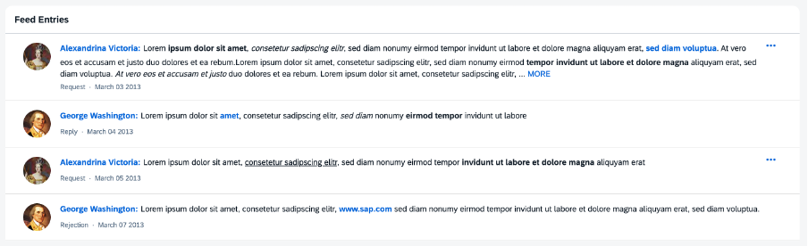

<!-- loio14a9900bcb514f89877c115046da4ff7 -->

# Feed List Item

This control provides a set of properties for a feed, such as text, sender information and timestamp.

## Overview

The `sap.m.FeedListItem` control is capable of displaying text accompanied by an optional user image.

For more information, see the [API Reference](https://ui5.sap.com/#/api/sap.m.FeedListItem) and the [Sample](https://ui5.sap.com/#/entity/sap.m.FeedListItem).

-   **Responsiveness**

    The `sap.m.FeedListItem` control can be used in both small and large containers.

-   **Layout**

    The `FeedListItem` control consists of the user's name and an optional picture of the user who wrote the note or the update \(optional\). The name can contain a link that triggers a quick overview of the user's profile data. The actual text written by the user follows the name. The `FeedListItem` control includes the `sap.m.FormattedText` control that enables you to use HTML formatted text.

    For more information about the `FormattedText` control, see the [API Reference](https://ui5.sap.com/#/api/sap.m.FormattedText) and the [Samples](https://ui5.sap.com/#/entity/sap.m.FormattedText).

-   **Behavior**

    When the text exceeds a certain number of characters \(default value can be overwritten by the consuming application\), the rest of the text is truncated and a *MORE* link appears. Clicking the link shows the entire text, and the link is renamed to *LESS*. Clicking *LESS* collapses the text back to its original truncated length.

-   **Actions**

    Each item in the feed may also include an optional *More* button that provides access to additional actions that the user can perform on this feed item. The actions available for a feed item are specified in its `actions` aggregation and are defined using `FeedListItemAction` elements.

    For more information about the `FeedListItemAction` element, see the [API Reference](https://ui5.sap.com/#/api/sap.m.FeedListItemAction).

The `sap.m.FeedListItem` control can be used in combination with the `sap.m.FeedInput` control as a feed or notes control. For more information, see [Feed Input](feed-input-0ec25a1.md).

