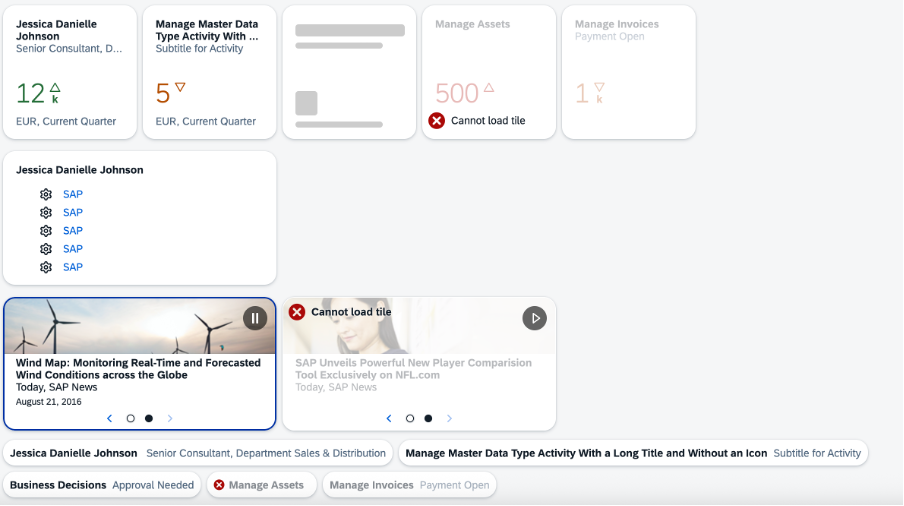

<!-- loioa1998ecc0853481891f8bc81cf900c9a -->

# Generic Tile

The `GenericTile` control is the basic concept that displays any kind of content within a tile comprising, for example, news, feeds, images, micro charts, or, numeric content.

## Overview

`GenericTile` controls are responsive and adapt their size to the size of the devices they are used on. The control is available in small and large size. Depending on the size of the screen, the appropriate size of the control is chosen automatically. Therefore, the `size` property is deprecated and should not be used anymore.

For more information, see the [API Reference](https://ui5.sap.com/#/api/sap.m.GenericTile) and the [Sample](https://ui5.sap.com/#/entity/sap.m.GenericTile).

**Layout**

The `GenericTile` control provides a header area, a content area, and a status area. Within these areas, different data can be displayed depending on the app the tile belongs to, for example, text in the header area, charts or an icon in the content area, or text only in the footer area.

-   Header area

    The headline and a subtitle can be displayed. The header area is mandatory, but if the `NewsContent` control is used in the content area, no header and subheader should be used.

    If you use `HeaderMode`, up to five lines of header can be displayed and the content area is not displayed.

-   Content area

    The `TileContent` control that represents the content area is the universal container for different content types. This means that the `TileContent` control can contain one of the following controls:

    -   `NumericContent` \(`frameType` 1x1\): numeric value and icon

    -   `FeedContent` \(`frameType` 2x1\): up to two lines of text

    -   `NewsContent` \(`frameType` 2x1\): text and background image

    -   `MicroCharts` \(`frameType` 1x1\): charts

    -   `ImageContent` \(`frameType` 1x1\): images and icons

-   Status area

    A status can be displayed. The status area is not mandatory.

**SlideTile**

`GenericTile` controls of the 2x1 `frameType` can be implemented as `SlideTile` control. The `GenericTile` control added to the `SlideTile` control appears alternately, showing one content at a time. The animated content of the slide tile includes a navigation option to pause the slide show or to navigate forward or backward to the slide. You can use `SlideTile` controls, for example, in day-to-day business to display news.

**Tooltip Rendering**

The `GenericTile` control generates a tooltip only if the header or subheader are truncated. In that case, the tooltip contains the full text of the truncated header or subheader.

If the `GenericTile` control contains a `MicroChart` control in its content area, the generated tooltip contains information about the embedded `MicroChart` content.

If an application provides an own tooltip, the generated tooltip of the `GenericTile` control is overwritten and the tooltip of the application is displayed. You can suppress the tooltip for your application by providing a tooltip consisting of whitespaces only. The ARIA label is not changed.

**Line Mode**

With this mode, you can switch the visual representation of the `GenericTile` from the rectangular format to an in-line format only by changing the value of the `mode` property and keeping all other settings as already set. After the switch, the API for the tiles and links stays consistent, and the control's ID and the contents stay the same. Only the header and subtitle are rendered.

## Constraints

With SAPUI5 1.34, the following controls are moved from the `sap.suite.ui.commons` library to the `sap.m` library:

-   `GenericTile`
-   `TileContent`
-   `FeedContent` \(formerly `JamContent`\)
-   `NewsContent`
-   `NumericContent`
-   `SlideTile` \(formerly `DynamicContainer`\)

The following controls have not been transferred to the `sap.m` library and are no longer used:

-   `GenericTile2X2`

-   `TileContent2X2`

If you have already included one of these controls before SAPUI5 1.34, a wrapper ensures that the embedding still works for each control. To benefit from all enhancements and new features for one of these controls as of SAPUI5 1.34, you need to switch to the controls in the `sap.m` library. With SAPUI5 1.34, all these controls in the `sap.suite.ui.commons` library are marked as **deprecated**.

