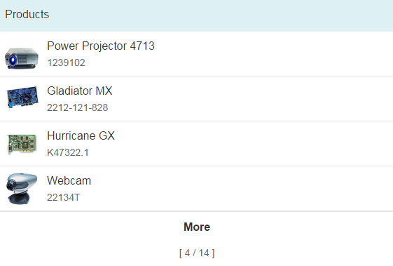

<!-- loio9164ba7047b74a25a19baf9c5bb986ae -->

# Growing Feature for Table and List

`sap.m.ListBase` provides growing-related properties, which can be used for tables and lists.

A growing list has a loading mechanism that requests data from the model in a lazy way. This enables the app to only fetch data from the server as and when necessary.

> ### Note:  
> Before release 1.16, the `sap.m.GrowingList` control existed as an extension of the `sap.m.List` control. As this is now deprecated, use the properties as described here instead.

The growing-related properties of `sap.m.ListBase` are:

-   `growing`: Boolean to set the growing feature to on or off
-   `growingScrollToLoad`: If you want to allow more data to be fetched when the user scrolls down to the end of the current items, set this boolean property to true; otherwise a trigger button must be used
-   `growingThreshold`: The number of items that are requested each time from the model
-   `growingTriggerText`: The text on a trigger button used to cause a request for more data

> ### Note:  
> For `sap.m.listbase`, the growing feature containing the growing property is not supported when used in combination with two-way binding for a table or list.
> 
> Also, as the growing feature enables extended change detection for the binding, it only updates rows that are changed. This means that if the position of a particular row has not been changed, this row will **not** be updated.

To enable data for a table to be fetched on demand like this, you just need to set the values for these properties appropriately on your table control. For example, adding the highlighted lines as shown in the following code will cause five items to be displayed in the table initially along with a *More* button \(this is the default text used if you don't set a different text using the `growingTriggerText` property\), as shown below the code:

```js

 <List
    items="{/ProductCollection}"
    headerText="Products"
    growing="true"
    growingThreshold="4"
    growingScrollToLoad="false">
    <StandardListItem
      title="{Name}"
      description="{ProductId}"
      icon="{ProductPicUrl}"
      iconDensityAware="false"
      iconInset="false" />
  </List>

```



If you want the user to have to scroll down to see more items \(by setting the `growingScrollToLoad` property to true\), you must ensure that the control is within a container that has a scroll feature, such as an `sap.m.Page` in an `sap.m.App` control, like this:

```js

<App>
   <Page title="Table Events">
      <Table>
         ...
      </Table>
   </Page>
<App>

```


## Sample

For more information, see the [sample](https://ui5.sap.com/#/entity/sap.m.List/sample/sap.m.sample.ListGrowing) in the Demo Kit.

