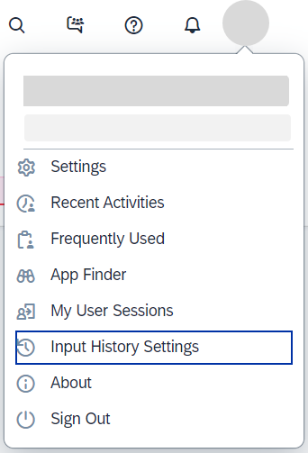
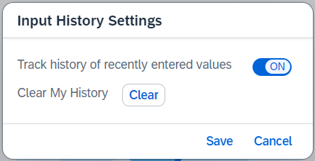
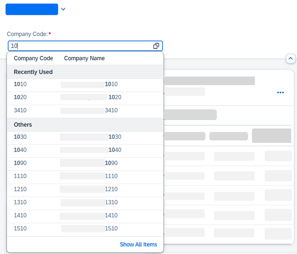

<!-- loio152f84f322f34d6f91917f8f1a35833c -->

# Input History

SAP Fiori applications using SAPUI5 can store recent history.


<a name="loio152f84f322f34d6f91917f8f1a35833c__section_dz5_mf5_w4b"/>

## Overview

The `SmartFilterBar` and the `SmartField` filter fields can use the *Recently Used* feature, which is enabled centrally by a parameter in SAP Fiori launchpad.

The feature only works in the context of SAP Fiori launchpad, so standalone apps can't benefit from it. The reason is that we use the `UI2 Personalization` service for storing the values of each field. The `Personalization` service is part of the SAP Fiori launchpad offering and provides us with a standard and secure way of storing data.

> ### Note:  
> The possibility to store recently used values was introduced with version 1.78 of SAPUI5, but we recommend using it with the long-term supported version 1.84 when the option to turn this feature on and off was introduced.
> 
> For more information about how to enable the feature in SAP Fiori launchpad, see *Manage Launchpad Settings* and *User Actions Menu* in the [SAP Fiori launchpad](https://help.sap.com/viewer/4fc8d03390c342da8a60f8ee387bca1a/latest/en-US) documentation.

> ### Remember:  
> Keep in mind that the feature is not supported by default for all fields, but only for those annotated with the `ValueList` annotation. If you have fields that contain personal sensitive data, you can use the `com.sap.vocabularies.PersonalData.v1.IsPotentiallySensitive` annotation to disable the storing of data. At the same time, the behavior of the *Recently Used* feature doesn't depend on annotations and it doesn’t take into consideration the application business logic that might apply to a field. For example, if a user's role has changed and a field contains data that shouldn't be visible to this user anymore, then do not enable history for this field at all. If enabled, this user will still see the stored values. There is a possible workaround on user level only. You can ask the user to delete history or enter 5 random values in order to remove the last 5 stored values.


<a name="loio152f84f322f34d6f91917f8f1a35833c__section_j1h_mr5_w4b"/>

## Usage and Technical Specifications


### When to use

This feature should be used only when necessary, otherwise it could have the reverse effect.

Use this feature when:

-   The user needs to select one or several values out of a larger number of values.

-   The user regularly uses the application.

-   It is highly probable that the user will select the same values repeatedly.


Don't use this feature when:

-   You have a field with only a few options, for example, true, false and N/A.
-   The user only uses the application from time to time.
-   It is highly probable that the user will select a different value each time.


### User settings

When the recently used values feature is enabled by the SAP Fiori launchpad parameter, you can see the *Input History Settings* option in the user actions menu. Otherwise, this item is not visible in the menu.



When you select *Input History Settings*, a dialog opens offering the possibility to switch off the recently used values feature. This setting is available on the user level and it's applicable for all applications for this user. There is also the option to delete all stored entries for all SAPUI5 applications running on this SAP Fiori launchpad instance. This doesn't affect the input history of other UI technologies that the applications use.




### How it works

In addition to the SAP Fiori launchpad property that needs to be enabled, we've introduced the `historyEnabled` property to switch the feature on and off on the `SmartField` level and on filter field level in the `SmartFilterBar`. The default value for `SmartField` and `SmartFilterBar` filter fields depends on what type of control they're rendered as. Here are the possible options for the `SmartField`, where true means that you'll get the value history:


<table>
<tr>
<th valign="top">

Control Type


</th>
<th valign="top">

Default Value


</th>
</tr>
<tr>
<td valign="top">

`Input` 


</td>
<td valign="top">

`true`


</td>
</tr>
<tr>
<td valign="top">

`ComboBox`


</td>
<td valign="top">

`false`


</td>
</tr>
</table>

These are the values for the `SmartFilterBar` filter fields:


<table>
<tr>
<th valign="top">

Control Type


</th>
<th valign="top">

Default Value


</th>
</tr>
<tr>
<td valign="top">

`MultiInput`


</td>
<td valign="top">

`true`


</td>
</tr>
<tr>
<td valign="top">

`MultiComboBox`


</td>
<td valign="top">

`false`


</td>
</tr>
</table>

> ### Note:  
> The default values for `ComboBox` and `MultiComboBox` are false because on existing applications fields of these control types might have too few options to select from. In these cases, instead of being helpful, the recently used values feature clutters up your screen.

You can override the `historyEnabled` property using standard means in the XML view definition.

Here is an example of how to disable the feature for the `SmartField`:

> ### Sample Code:  
> ```xml
> <smartField:SmartField id="idCategory" value="{Category}" historyEnabled="false"> <smartField:SmartField id="idCategory" value="{Category}" historyEnabled="false"> 
> ```

For the `SmartFilterBar`, the `historyEnabled` property is in the `ControlConfiguration` object so that it can control individual fields in `SmartFilterBar`. Here is an example of how to disable it for `SmartFilterBar`:

> ### Sample Code:  
> ```xml
> <smartFilterBar:controlConfiguration>
>   <smartFilterBar:ControlConfiguration key="Bukrs" historyEnabled="false" /> 
> </smartFilterBar:controlConfiguration>
> ```

This configuration will switch off history only for the field with the `Bukrs` ID and the *Company Code* description. All other filter fields whose default value is `on` in the `SmartFilterBar` will have the functionality on.


### How suggestions are visualized



If there have been previously entered values, a dropdown opens up when focusing on the input. On a mobile device, the dropdown opens as a full-screen dialog. If no previous history values are stored, the dropdown will not open. When you start typing, you’ll get filtered suggestions and recommendations, if available.

Suggested values can be part of several groups. If you have stored recently used values, they appear below the group header title *Recently Used*. *Others* shows the rest of the suggested values. If you have recommended values, as in a machine learning scenario, the *Recommended* values come on top, followed by *Recently Used* and *Others*.

If a value is already in the *Recently Used* list, it will not also appear in the *Others* group. If a value in the *Recommended* group is part of *Recently Used* or *Others*, it is only shown in *Recommended* to avoid multiple instances of the same value.

> ### Note:  
> The recently used values feature is an input support tool for fast keyboard entry. As such, it’s not meant to be part of the `ValueHelpDialog` result list, but it can be used in the filter fields.


### Language Settings

As of version 1.85 of SAPUI5, the input value is stored together with the language information and shows only input history for the selected language. For applications using the recently used values feature before this release, all stored values are considered as entered in English and are only seen when English is chosen as application language.


### Restrictions

-   For `ValueList` annotations, if there are defined `In/Out` parameters, they are not taken into account for `ComboBox` and `MultiComboBox`.

-   The invoking filtering function on the internal input control is not supported. This is because we use an internal JSON model combining all data sources that need to be displayed in the dropdown. This data model can’t be accessed and manipulated from the outside.


