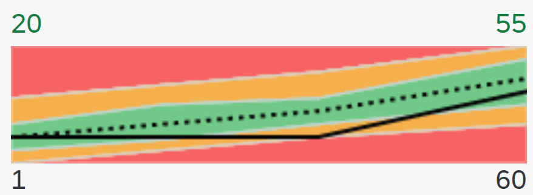

<!-- loio8664d4b534114cc1bf7c7a607840f98e -->

# Labels of the Chart

You can display a maximum of four labels.

The relationships between these four labels and their annotations are as follows:

<a name="loio8664d4b534114cc1bf7c7a607840f98e__table_ajw_lmt_ny"/>Relationship of labels and their annotations

<table>
<tr>
<th valign="top">

Chart point \(sap.suite.ui.microchart.AreaMicroChartItem\)

</th>
<th valign="top">

Coordinate

</th>
<th valign="top">

Label position

</th>
<th valign="top">

Annotation Term

</th>
<th valign="top">

Property

</th>
</tr>
<tr>
<td valign="top">

First point

</td>
<td valign="top">

x

</td>
<td valign="top">

Bottom left

</td>
<td valign="top">

UI.Chart

</td>
<td valign="top">

Dimensions

</td>
</tr>
<tr>
<td valign="top">

</td>
<td valign="top">

y

</td>
<td valign="top">

Top left

</td>
<td valign="top">

UI.Chart

</td>
<td valign="top">

Measures

</td>
</tr>
<tr>
<td valign="top">

Last point

</td>
<td valign="top">

x

</td>
<td valign="top">

Bottom right

</td>
<td valign="top">

UI.Chart

</td>
<td valign="top">

Dimensions

</td>
</tr>
<tr>
<td valign="top">

</td>
<td valign="top">

y

</td>
<td valign="top">

Top right

</td>
<td valign="top">

UI.Chart

</td>
<td valign="top">

Measures

</td>
</tr>
</table>

  

The values of the x and y coordinates of the first chart point are retrieved from the first data entry in the bound model. The formatted x-value is displayed at the bottom left of the chart. It corresponds with the `dimensions` property of the UI.Chart annotation term. Depending on the data type of the property in the entity type, an appropriate formatter is chosen so that you can format the value as needed.

The formatted y-coordinate value is displayed at the top left of the chart and is used to show the actual value. It is bound to the `measures` property of the UI.Chart annotation term. It is always formatted as a numeric value, that is, the value 20,000 is formatted to “20K”. The last data point is treated the same way: the top right label corresponds to the last data entry’s `measures` property and the bottom right label corresponds to its `dimensions` property.

