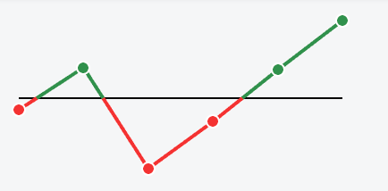
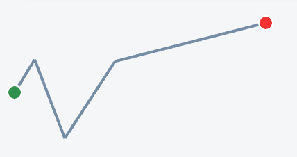
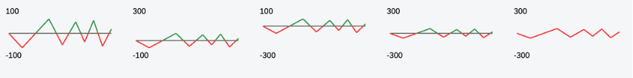

<!-- loiobb5813c4e7b2426985eed65965320f00 -->

# Line Micro Chart

Displays a series of values as segmented lines along a threshold line.

<a name="loiobb5813c4e7b2426985eed65965320f00__section_nkj_1nb_fbb"/>

## Overview

The `Line Micro Chart` control is primarily used for embedded analytics applications. It's designed to display a set of ordered points. These points are connected by lines that show a data progression for a specific data range. If you want to add further details, such as decisive values or dimensions to this chart, you can add up to four labels.

For more information, see the [API Reference](https://ui5.sap.com/#/api/sap.suite.ui.microchart.LineMicroChart) and the [Sample](https://ui5.sap.com/#/entity/sap.suite.ui.microchart.LineMicroChart).

<a name="loiobb5813c4e7b2426985eed65965320f00__section_lk1_ljh_hbb"/>

## Usage

With the line micro chart, you can visualize the diagram curve and show trends. If you want to stress values that are above or below a certain threshold, you can use data points.

By default, the line of the chart is blue. However, you can use different colors, such as semantic colors for the line, to mark positive and negative values.

You can also choose to use focus points instead of data points. Data points are useful if you want to concentrate on one or two special values, for example, the first and the last data point on the chart. For focus points, you can use any CSS color, but we recommend using semantic colors.

<a name="loiobb5813c4e7b2426985eed65965320f00__section_p51_cg3_fbb"/>

## Properties

**Color**

With the sap.m.`ValueCSSColor` type, the Line Micro Chart can use regular points or emphasized points, with or without semantic colors. For more information, see the [API Reference](https://ui5.sap.com/#/api/sap.m.ValueCSSColor).

**Data Points**

The *showPoints* property controls whether the points are displayed. The default value is false, which means that the points aren't displayed and only a continuous line is visible. You can use this configuration to show trends and to visualize the data progression. If emphasized points are used, the chart's color and *showPoints* properties don't affect. These properties can be used for regular points only. Don't use these two data point types together in one chart.

These types of data points are available:

-   LineMicroChartPoint for the *x* and *y* coordinates.

-   LineMicroChartEmphasizedPoint consists of the *color* and *show* properties and *x* and *y* properties.

**Scaling**

The chart has a built-in automatic scale that is applied based on existing values, so that all values are visible. You can also set a manual scale, but only a part of the chart may be visible. You can set a manual scale by providing values for the following properties:

-   minXValue

-   maxXValue

-   minYValue

-   maxYValue

