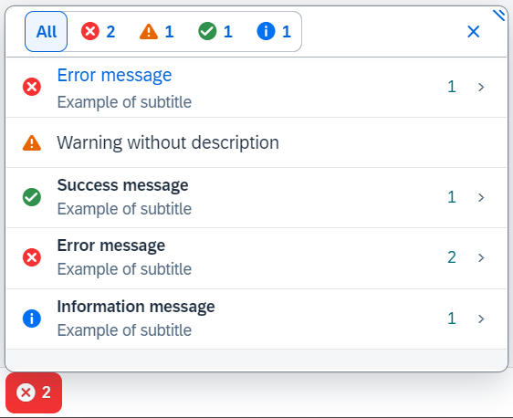
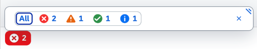

<!-- loio52824a6c316a413dbd7bd5f29522dce2 -->

# Message Popover

Message Popover is used to display a summarized list of different types of messages \(errors, warnings, success and information\). It provides a handy and systemized way to navigate and explore details for every message.


## Control overview

The `MessagePopover` control displays a list of messages which can be further drilled down to reveal more details. Typically, it will be placed in the footer and can be expanded when clicking on its icon. As it inherits from the `Popover` control, it can also be placed relative to any other SAPUI5 control using the `placement` propery and its respective values:

-   `sap.m.VerticalPlacementType.Top` - placed at the top of the reference control

-   `sap.m.VerticalPlacementType.Bottom` - placed at the bottom of the reference control

-   `sap.m.VerticalPlacementType.Vertical` \(default\) - placed at the top or bottom of the reference control


   
  
<a name="loio52824a6c316a413dbd7bd5f29522dce2__fig_plg_mg1_kv"/>Message Popover control

  

The `MessagePopover` also features the modes - collapsed \(showing only the type and number of messages\) and expanded \(showing the complete list\). An example of the collapsed mode is shown in the screenshot below.

   
  
<a name="loio52824a6c316a413dbd7bd5f29522dce2__fig_qly_5g1_kv"/>Message Popover collapsed

  


## Handling links in long-text messages

The `MessagePopover` control allows app developers to provide a long-text description for a message, which can include markup and formatting of the content. When this is the case, the control will automatically, and by default, invalidate links and will not allow clicking on them. This is due to security reasons and it is part of the app developer's responsibility to check the links for possible vulnerabilities, exploits and access policies. App developers are provided with an asynchronous function property that should be used for this matter - `asyncURLHandler`.

Sometimes, you may need to validate all links by default. You can do this with the following function property:

```js

asyncURLHandler: function(config){
	config.promise.resolve({
		allowed: true,
		id: config.id
	});
}
```

**How does it work?**

The required flag - `allowed` - is always set to **true** and the promise is resolved immediately. Therefore all of the links in the description will be automatically validated.

