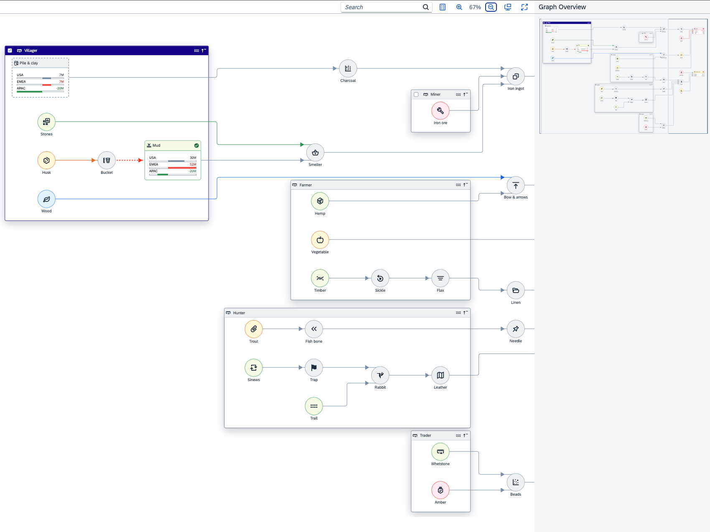

<!-- loiob5649c8de7f74739b66747dcc9356d0b -->

# Network Graph

The `NetworkGraph` control displays objects as a network of nodes connected to one another by lines.

For more information about this control, see the [API Reference](https://ui5.sap.com/#/api/sap.suite.ui.commons.networkgraph) and the [Samples](https://ui5.sap.com/#/entity/sap.suite.ui.commons.networkgraph.Graph) in the Demo Kit.


<a name="loiob5649c8de7f74739b66747dcc9356d0b__section_odd_lzj_3bb"/>

## Overview

The `NetworkGraph` control can be used to illustrate how different objects are related. In a network graph, each object is represented by a node, and the relations between objects are represented by lines connecting the nodes. Nodes can be clustered into groups that can be expanded or collapsed to show or hide a portion of the graph.

This control supports both directed and undirected graphs, as well as graphs that contain cycles. It also provides broad customization options, enabling you to separate the graph layout from its rendering and to position individual graph elements freely, for example, when displaying geospatial data on top of a map.

   
  
**Network Graph Example**

  


<a name="loiob5649c8de7f74739b66747dcc9356d0b__section_rkt_lzj_3bb"/>

## Details

**Layout**

-   There are three layout options available:

    -   Layered layout – The `LayeredLayout` algorithm arranges the nodes into a layered graph.

    -   Force-based layout – The `ForceBasedLayout` algorithm arranges the nodes into a force-based \(or force-directed\) graph.

    -   Free-form layout \(`NoopLayout`\) – No layout algorithm is applied, so the nodes can be placed anywhere within the graph.

    -   Custom layout – You can define your own algorithm that will be used to lay out your graph.


    For details, see [ `sap.suite.ui.commons.networkgraph.layout`](https://ui5.sap.com/#/api/sap.suite.ui.commons.networkgraph.layout).

-   The process of drawing the graph consists of two phases:

    -   Computing the layout based on the specified layout algorithm

    -   Visual rendering of the graph


    The first phase is marked by the `beforeLayouting` event that is fired just before the layout computation begins. The second phase starts with the `afterLayouting` event that is fired when the layout algorithm has finished arranging the graph and the visual rendering begins.

    Any change to nodes or other graph elements that happens after the layout has been computed may cause invalidation of the whole graph, making it impossible to render. It may lead to an infinite loop with graph invalidation triggering layout algorithms that trigger the event that caused the original invalidation of the graph, and so on.

    To prevent unwanted invalidation, you can call the `preventInvalidation` method on the graph:

    ```
    this._graph.attachEvent("beforeLayouting", function (oEvent) {
    	this._graph.preventInvalidation(true);
    
    	// Perform actions on the nodes that would normally trigger invalidation.
     
    	// Check out the Org Chart sample for more inspiration.
    
    	this._graph.preventInvalidation(false);
    }.bind(this));
    
    ```

    For more information, see [ `sap.suite.ui.commons.networkgraph.Graph#preventInvalidation`](https://ui5.sap.com/#/api/sap.suite.ui.commons.networkgraph.Graph/methods/preventInvalidation).


**Appearance**

-   **Grouping** – You can join nodes into a group, so they are displayed closer to one another. A group can be collapsed to hide the nodes that are included in it. Please note that grouping is available only for graphs that use layered layout.

    For details, see [ `sap.suite.ui.commons.networkgraph.Group`](https://ui5.sap.com/#/api/sap.suite.ui.commons.networkgraph.Group).

-   **Node Shape** – You can choose between two node shapes: circular or rectangular. Depending on the node shape, the `width` and `height` properties of the node are treated differently:

    -   For rectangular nodes, only the `width` property is considered, while the `height` property is ignored.

    -   For circular nodes, the `height` property determines the diameter of the circle, while the `width` property is used as the width of the node's title and description.


    For details, see [ `sap.suite.ui.commons.networkgraph.Node`](https://ui5.sap.com/#/api/sap.suite.ui.commons.networkgraph.Node).

    **Other Properties** – In addition to shape, you can define some other properties:

    -   [`icon`](https://ui5.sap.com/#/api/sap.suite.ui.commons.networkgraph.Node/methods/setIcon) – The icon to be displayed inside the node shape.

    -   [`title`](https://ui5.sap.com/#/api/sap.suite.ui.commons.networkgraph.ElementBase/methods/setTitle) – The node's title.

    -   [`description`](https://ui5.sap.com/#/api/sap.suite.ui.commons.networkgraph.ElementBase/methods/setDescription) – The node's description.

    -   [Element attributes](https://ui5.sap.com/#/api/sap.suite.ui.commons.networkgraph.ElementAttribute) – Additional attributes of the node.


-   **Line Customization** – You can choose among several connector line styles: dashed, dotted, or solid, as well as define where the arrow should be positioned and where it should point to.

    For details, see [ `sap.suite.ui.commons.networkgraph.LineType`](https://ui5.sap.com/#/api/sap.suite.ui.commons.networkgraph.LineType).

-   **Semantic Colors** – Nodes, groups of nodes, and connector lines may use semantic colors, based on their status. You can use any of the custom statuses defined by the `statuses` aggregation in the [`sap.suite.ui.commons.networkgraph.Graph`](https://ui5.sap.com/#/api/sap.suite.ui.commons.networkgraph.Graph) control or use the default statuses provided by [`sap.suite.ui.commons.networkgraph.ElementStatus`](https://ui5.sap.com/#/api/sap.suite.ui.commons.networkgraph.ElementStatus).

    For details, see [`sap.suite.ui.commons.networkgraph.ElementStatus`](https://ui5.sap.com/#/api/sap.suite.ui.commons.networkgraph.ElementStatus) and [`sap.suite.ui.commons.networkgraph.Status`](https://ui5.sap.com/#/api/sap.suite.ui.commons.networkgraph.Status).


**Customizing the Graph**

-   **Arbitrary Node Positions** – To be able to position the nodes freely, switch the layout algorithm to `NoopLayout`.

    ```
    <Graph>
       <layoutAlgorithm>
          <layout:NoopLayout/>
       </layoutAlgorithm>
    ...
    </Graph>
    
    ```

    For details, see [ `sap.suite.ui.commons.networkgraph.layout`](https://ui5.sap.com/#/api/sap.suite.ui.commons.networkgraph.layout).

    After that you can define the positions for each of your nodes using their `x` and `y` attributes that define the coordinates of the upper left corner of the node \(or upper right corner in languages that have right-to-left writings systems\).

    To redefine the positions of the lines connecting the nodes, you can use the aggregation `Coordinates` for the `Line` control. Each coordinate contains x and y coordinates of one point. It is recommended that you use the following methods to add coordinates to the `Coordinates` aggregation:

    -   `setSource` – Sets the starting point of the line.

    -   `setTarget` – Sets the end point of the line.

    -   `addBend` – Adds a point between the start and the end points of the line.


    These methods do not trigger invalidation.

    For details, see [ `sap.suite.ui.commons.networkgraph.Line`](https://ui5.sap.com/#/api/sap.suite.ui.commons.networkgraph.Line).

-   **Using Events for Graph Customization** – You can adjust the graph behavior through a variety of event calls. Such event calls may suppress the default behavior of certain events. For example, if you define the following function for a node, action buttons will no longer be displayed when the user clicks the node:

    ```
    <Node press="nodePress">
    ...
    nodePress: function (oEvent) {
          // Prevents the rendering of default action buttons
          oEvent.preventDefault();
    };
    
    ```

    Similarly, you can suppress the following events:


    <table>
    <tr>
    <th valign="top">

    Object


    
    </th>
    <th valign="top">

    Suppressed Event


    
    </th>
    <th valign="top">

    Result


    
    </th>
    </tr>
    <tr>
    <td valign="top">

    Node


    
    </td>
    <td valign="top">

     `press` 


    
    </td>
    <td valign="top">

    Action buttons will not be displayed when the user clicks the node.


    
    </td>
    </tr>
    <tr>
    <td valign="top">

    Node


    
    </td>
    <td valign="top">

     `collapseExpand` 


    
    </td>
    <td valign="top">

    The node will not be expanded or collapsed when the user clicks the *Collapse/Expand* button.


    
    </td>
    </tr>
    <tr>
    <td valign="top">

    Node


    
    </td>
    <td valign="top">

     `hover` 


    
    </td>
    <td valign="top">

    Moving the mouse over the node will have no effect on the node appearance.


    
    </td>
    </tr>
    <tr>
    <td valign="top">

    Line


    
    </td>
    <td valign="top">

     `press` 


    
    </td>
    <td valign="top">

    Details popup will not be displayed when the user clicks the line.


    
    </td>
    </tr>
    <tr>
    <td valign="top">

    Line


    
    </td>
    <td valign="top">

     `hover` 


    
    </td>
    <td valign="top">

    Moving the mouse over the line will have no effect on the line appearance.


    
    </td>
    </tr>
    <tr>
    <td valign="top">

    Group


    
    </td>
    <td valign="top">

     `showDetail` 


    
    </td>
    <td valign="top">

    Details dialog will not be displayed when the user clicks the *Group Details* icon.


    
    </td>
    </tr>
    </table>
    

**Zooming**

-   The predefined zooming scale used by the `NetworkGraph` control supports zooming levels ranging from 5 to 500 percent of the original graph size. The zooming level is updated when the user clicks the *Zoom In* or *Zoom Out* buttons or uses a mouse, a trackpad, or a touch screen to zoom in or out.

    -   When the user clicks  \(*Zoom In*\) or  \(*Zoom Out*\), the graph is scaled up or down to the next zooming level.

    -   When the user clicks  \(*Zoom to Fit*\), the graph is scaled up or down, so all nodes and lines it includes are visible on the screen. The optimal zooming level is selected from the predefined scale: 5%, 10%, 25%, 33%, and so on up to 500%.

        If the original graph size is out of scale, taking up less than 5 percent or more than 500 percent of the screen, clicking *Zoom to Fit* scales the graph up or down to the closest minimum or maximum zooming level, 5% or 500%. For example, if the original graph takes 1 percent of the screen, when the user clicks *Zoom to Fit*, the graph is scaled up to the 5% zooming level.


