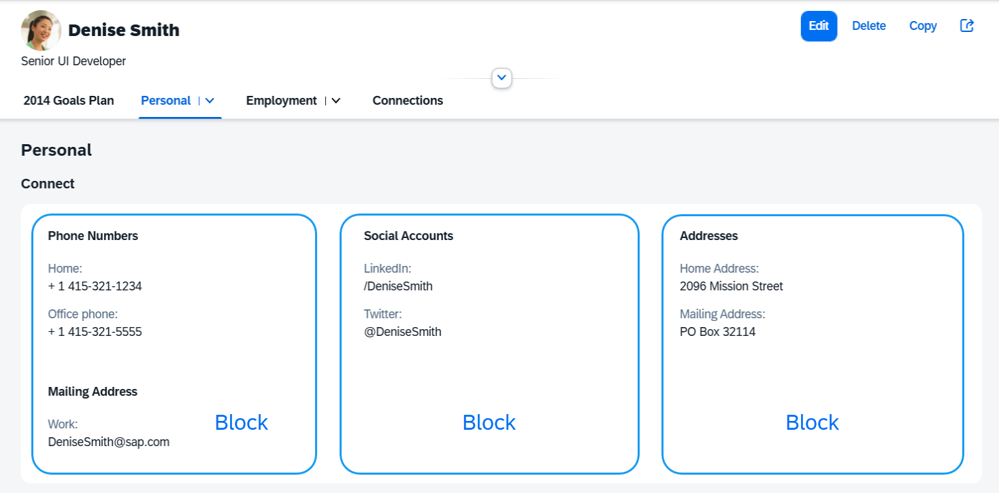

<!-- loio4527729576cb4a4888275b6935aad03a -->

# Object Page Blocks

The contents of the subsections in the `ObjectPageLayout` control are organized into blocks.

The blocks are used to group the app content that is displayed in the sections and subsections of the `ObjectPageLayout`.

  
  
**Object Page content grouped in Blocks**



To add blocks, use the `blocks` aggregation of `sap.uxap.ObjectPageSubSection`:

```xml
 <ObjectPageLayout id="ObjectPageLayout" subSectionLayout="titleOnTop">
        <sections>
            <ObjectPageSection title="Payroll" >
                <subSections>
                    <ObjectPageSubSection title="sub payroll title">
                        <blocks>
                            <myNameSpace:myBlock/>
                            <myNameSpace:myBlock/>
                            <myNameSpace:myBlock/>
                        </blocks>
                    </ObjectPageSubSection>
                </subSections>
            </ObjectPageSection>
        </sections>
    </ObjectPageLayout>
```

Any control can be a block. However, the blocks that extend `sap.uxap.BlockBase` provide additional features:

-   Lazy loading: Only the blocks that are currently displayed and those in their direct proximity are instantiated

-   Column layout: Blocks provide information to the subsection only on the width they should be using for an optimal experience


## Blocks API & Guidelines

Blocks that are used in an `ObjectPageLayout` have to comply with the following rules regarding their API. They must:

-   Extend `sap.uxap.BlockBase`

    ```js
    sap.uxap.BlockBase.extend("<BlockName>", {
            metadata: {
             }
         });
    ```

-   Support the modes described in `sap.uxap.ObjectPageSubSectionMode.type` - `Collapsed` and `Expanded`. For each mode, declare its associated view. It is recommended you use the XML view if no templating is needed:

    ```js
    sap.uxap.BlockBase.extend("<BlockName>", {
            metadata: {
                views: {
                    Collapsed: {
                        viewName: "<collapsedViewName>",
                        type: "XML"
                    },
                    Expanded: {
                        viewName: "<expendedViewName>",
                        type: "XML"
    
                    }
                }
             }
         });
    ```

-   Come with their own controller \(if needed\). This controller should just react to the internal events of the block, as the `ObjectPageLayout`'s own controller should only manage the page and its sections and subsections.

-   Follow the SAPUI5 naming guidelines: see *Related Information*

-   Use the `modelMapping` mechanism to declare distinct model per logical entity.


> ### Example:  
> Let’s consider an *Employee Goals* block that displays an employee together with his or her goals.
> 
> One *Employee* model for the employee entity:
> 
> ```xml
> <Text text="{Employee>FirstName}"></Text>
> ```
> 
> One *Goals* model for the goal collections:
> 
> ```xml
> <List items="{Goals>}">
> ```

In one backend service, goals may be a navigation property of employees, but in another this may not be the case. For this reason, when implementing the *Employee Goals* block, you should use two distinct models in the block views.

> ### Example:  
> An app wants to use the *Employee Goals* blocks described above. These are therefore embedded into a page that has a model named `ApplicationModel`, in which `Goals` are a navigation property of employees:
> 
> ```xml
> <EmployeeGoals>
>     <mappings>
>         <uxap:ModelMapping externalModelName="ApplicationModel" externalPath="/Employee('121')" internalModelName="Employee" />
>         <uxap:ModelMapping externalModelName="ApplicationModel" externalPath="/Employee('121')/Goals" internalModelName="Goals" />
>     </mappings>
> </EmployeeGoals>
> ```
> 
> A second app uses the same blocks, but in its service, `Goals` and `Employees` are unrelated entities:
> 
> ```xml
> <EmployeeGoals>
>     <mappings>
>         <uxap:ModelMapping externalModelName="ApplicationModel2" externalPath="/Employee('121')" internalModelName="Employee" />
>         <uxap:ModelMapping externalModelName="ApplicationModel2" externalPath="/Goals" internalModelName="Goals" />
>     </mappings>
> </EmployeeGoals>
> ```

`BlockBase` interprets this in the following order:

1.  Looks for a model with the name specified in the `externalModelName`.

2.  Sets this model on itself with the name specified in the `internalModelName`.

3.  Creates a context corresponding to the path.


> ### Note:  
> This model mapping is not mandatory as models used in a view can also be provided by standard SAPUI5 techniques \(model inheritance, setModel\).


## Standard Block Implementation

The standard block implementation is to extend the `sap.uxap.BlockBase` control and inherit the default implementation of `setMode` and rendering. `setMode` in `BlockBase` supports two different ways of building blocks:

-   Single view blocks: A single XML view is used for all layout modes. This XML view should be named `<name>.view.xml`.

-   Multiple view blocks: Different views are provided for the different layout modes.

    -   These views should be added in the `views` section of the block metadata \(this section is added by the `BlockBase` class\).

    -   For each mode, the `BlockBase` class must declare a view name and type:

        ```
        sap.uxap.BlockBase.extend("<BlockName>", {
                metadata: {
                    views: {
                        Collapsed: {
                            viewName: "<collapsedViewName>",
                            type: "XML"
                        },
                        Expanded: {
                            viewName: "<expendedViewName>",
                            type: "XML"
                        }
                    }
                 }
             });
        ```


**Related Information**  


[Creating Blocks](creating-blocks-2978f60.md "Important points when creating blocks for the sap.uxap.ObjectPageLayout")

[API Reference: `sap.uxap.BlockBase`](https://ui5.sap.com/#/api/sap.uxap.BlockBase)

