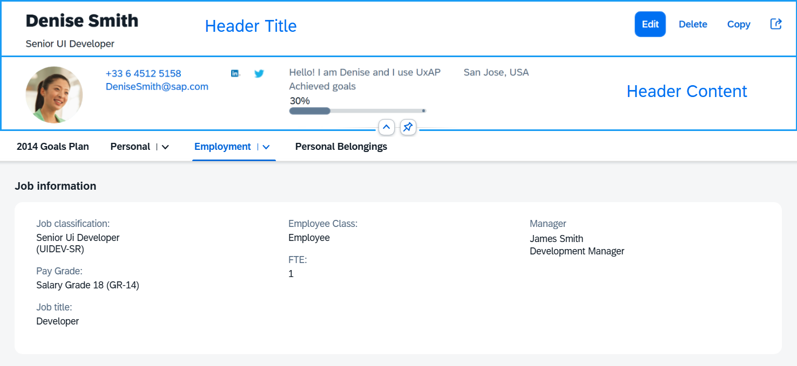

<!-- loio6e340c119ddd4c778b315f65a0432420 -->

# Object Page Dynamic Header

Overview of the structure and features for `sap.uxap.ObjectPageLayout`'s dynamic header.

The `sap.uxap.ObjectPage`'s dynamic header is flexible and provides general-purpose aggregations that allow you to build a custom header layout.

It consists of two parts - Header Title and Header Content.

  

The upper part of the Header Title is reserved for `breadcrumbs` navigation. The opposite side of this upper area is occupied by the `navigationActions` after a certain breakpoint.

   
  
**Breadcrumbs and Navigation Actions in the Header Title**

  

The Header Title area can be clicked/tapped to expand/collapse the dynamic header. Whenever the feature is enabled \(`toggleHeaderOnTitleClick` is set to `true`\), an arrow button is positioned either below the Header Content \(when header is expanded\) or below the Header Title \(when header is collapsed\). The expand/collapsed state of the header can be toggled by either clicking on the Header Title area, or the arrow button.

When hovering over the arrow button or the Header Title area, both areas are highlighted indicating to the user that an action can be taken.

   
  
**Expanding/Collapsing the Header Using Arrow Button and Title Click**

  

The Header Content can be pinnable \(`headerContentPinnable` is set to `true`\). When the feature is enabled, a pin toggle button is available allowing the header content to remain expanded when scrolling the page.

   
  
**Pinning the Header to Remain Expanded when Scrolling the Page**

  

<a name="loio6e340c119ddd4c778b315f65a0432420__section_cht_tws_sbb"/>

## Header Title

To implement the dynamic header, the app developer needs to provide an instance of the `sap.uxap.ObjectPageDynamicHeaderTitle` control for the `headerTitle` aggregation of the `sap.uxap.ObjectPageLayout` control.

The `sap.uxap.ObjectPageDynamicHeaderTitle` extends `sap.f.DynamicPageTitle`. It can hold any control and displays the most important information regarding the object that will always remain visible when scrolling.

<a name="loio6e340c119ddd4c778b315f65a0432420__section_z5r_q1t_sbb"/>

## Header Content

To populate the header content area, provide an array of desired controls to the `headerContent` aggregation of the `sap.uxap.ObjectPageLayout` control. `sap.uxap.ObjectPageLayout` uses internally `sap.uxap.ObjectPageDynamicHeaderContent` to layout the controls.

**Related Information**  

[API Reference: `sap.uxap.ObjectPageDynamicHeaderTitle`](https://ui5.sap.com/#/api/sap.uxap.ObjectPageDynamicHeaderTitle)

[API Reference: `sap.uxap.ObjectPageLayout`](https://ui5.sap.com/#/api/sap.uxap.ObjectPageLayout)

[Object Page Headers](object-page-headers-d2ef009.md "The sap.uxap.ObjectPageLayout control has two types of header - classic header and dynamic header.")

[Object Page Headers Comparison](object-page-headers-comparison-9c9d94f.md "This section explains the differences and similarities between the two types of header of the sap.uxap.ObjectPageLayout control.")

