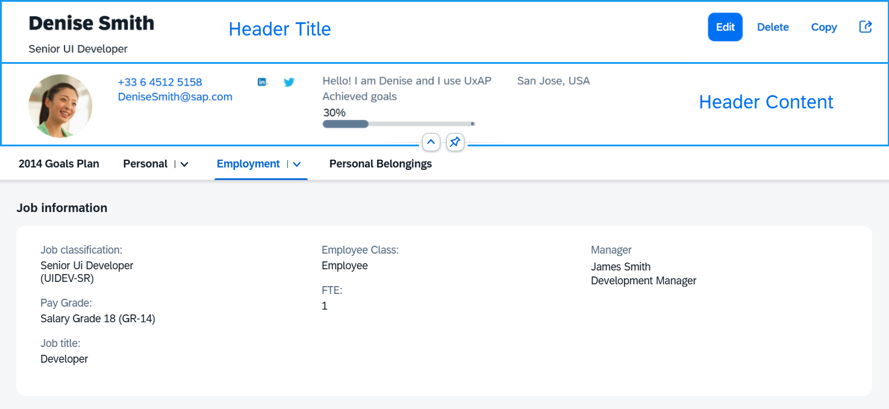
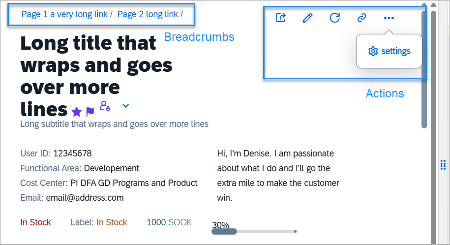
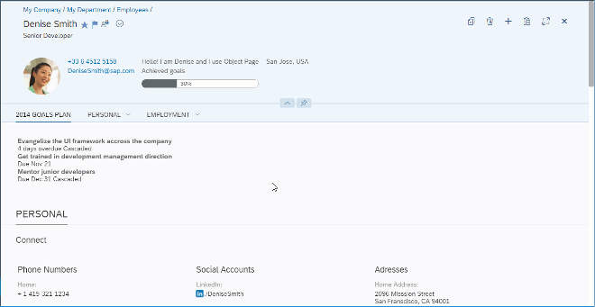

<!-- loio6e340c119ddd4c778b315f65a0432420 -->

# Object Page Header

Overview of the structure and features for `sap.uxap.ObjectPageLayout`'s dynamic header.

The `sap.uxap.ObjectPage`'s dynamic header is flexible and provides general-purpose aggregations that allow you to build a custom header layout.

It consists of two parts - Header Title and Header Content.

The upper part of the Header Title is reserved for `breadcrumbs` navigation. The opposite side of this upper area is occupied by the `navigationActions` after a certain breakpoint.

  
  
**Breadcrumbs and Actions in the Header Title**

The Header Title area can be clicked/tapped to expand/collapse the dynamic header. Whenever the feature is enabled \(`toggleHeaderOnTitleClick` is set to `true`\), an arrow button is positioned either below the Header Content \(when header is expanded\) or below the Header Title \(when header is collapsed\). The expand/collapsed state of the header can be toggled by either clicking on the Header Title area, or the arrow button.

When hovering over the arrow button or the Header Title area, both areas are highlighted indicating to the user that an action can be taken.

  
  
**Expanding/Collapsing the Header Using Arrow Button and Title Click**

The Header Content can be pinnable \(`headerContentPinnable` is set to `true`\). When the feature is enabled, a pin toggle button is available allowing the header content to remain expanded when scrolling the page.

  
  
**Pinning the Header to Remain Expanded when Scrolling the Page**

<a name="loio6e340c119ddd4c778b315f65a0432420__section_cht_tws_sbb"/>

## Header Title

To implement the dynamic header, the app developer needs to provide an instance of the `sap.uxap.ObjectPageDynamicHeaderTitle` control for the `headerTitle` aggregation of the `sap.uxap.ObjectPageLayout` control.

The `sap.uxap.ObjectPageDynamicHeaderTitle` extends `sap.f.DynamicPageTitle`. It can hold any control and displays the most important information regarding the object that will always remain visible when scrolling.

<a name="loio6e340c119ddd4c778b315f65a0432420__section_z5r_q1t_sbb"/>

## Header Content

To populate the header content area, provide an array of desired controls to the `headerContent` aggregation of the `sap.uxap.ObjectPageLayout` control. `sap.uxap.ObjectPageLayout` uses internally `sap.uxap.ObjectPageDynamicHeaderContent` to layout the controls.

<a name="loio6e340c119ddd4c778b315f65a0432420__section_q23_hsy_dfc"/>

## Header Features

The following table represents an overview of the header features all of which are `ObjectPageLayout` properties.

**Overview of the Header Features**

<table>
<tr>
<th valign="top">

Feature

</th>
<th valign="top">

Description

</th>
</tr>
<tr>
<td valign="top">

`headerContentPinnable` 

</td>
<td valign="top">

Determines whether the Header Content area can be pinned.

When set to true, a pin button is displayed within the Header Content area. The pin button allows the user to make the Header Content always visible at the top of the page above any scrollable content.

</td>
</tr>
<tr>
<td valign="top">

`toggleHeaderOnTitleClick` 

</td>
<td valign="top">

Determines whether the user can switch between the expanded/collapsed states of the dynamic header by clicking/tapping on the Header Title. If set to `false`, the Header Title is not clickable and the app must provide other means for expanding/collapsing the dynamic header, if necessary.

</td>
</tr>
<tr>
<td valign="top">

`preserveHeaderStateOnScroll` 

</td>
<td valign="top">

Preserves the current header state when scrolling. For example, if the user expands the header by clicking on the title and then scrolls down the page, the header will remain expanded.

</td>
</tr>
<tr>
<td valign="top">

`toggleHeaderOnTitleClick` 

</td>
<td valign="top">

When the feature is enabled, arrow buttons below the Header Content appear, the Header Title and the arrow buttons can be clicked/tapped for collapsing/expanding the header and there is additional visual indication while hovering over the Header Title area or the arrow buttons.

</td>
</tr>
</table>

**Related Information**  

[API Reference: `sap.uxap.ObjectPageDynamicHeaderTitle`](https://ui5.sap.com/#/api/sap.uxap.ObjectPageDynamicHeaderTitle)

[API Reference: `sap.uxap.ObjectPageLayout`](https://ui5.sap.com/#/api/sap.uxap.ObjectPageLayout)

