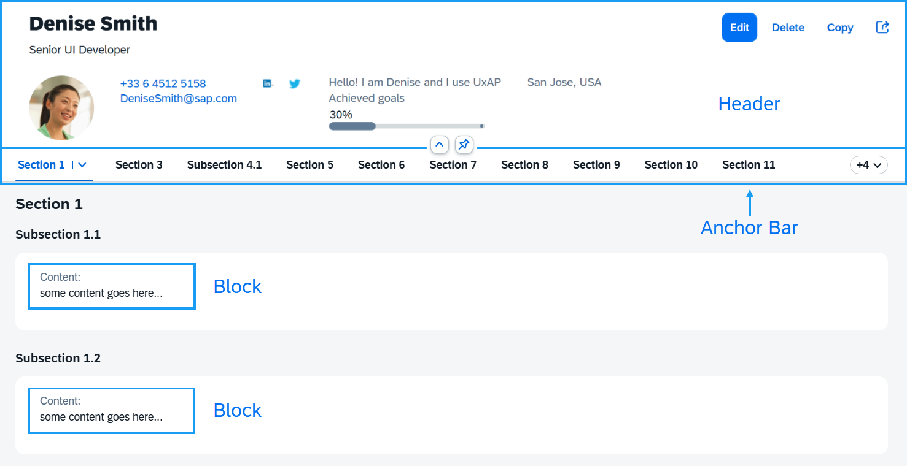
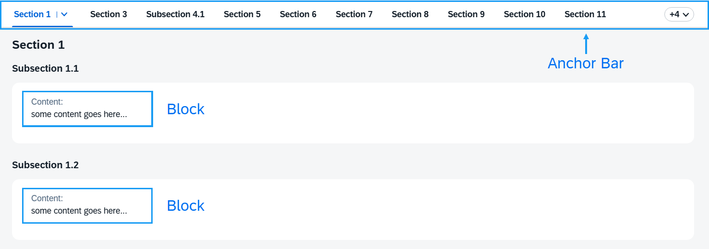
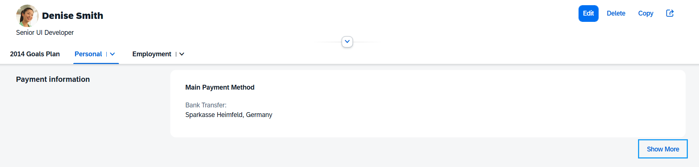

<!-- loio2e61ab6c68a2480eb666c1927a707658 -->

# Object Page Layout

The `ObjectPageLayout` control provides a layout that allows apps to easily display information related to a business object.


<a name="loio2e61ab6c68a2480eb666c1927a707658__section_hby_mpx_mcb"/>

## Overview

The `ObjectPageLayout` layout is composed of a header \(title and content\), an optional anchor bar, and block content wrapped in sections and subsections that structure the information.

   
  
<a name="loio2e61ab6c68a2480eb666c1927a707658__fig_lyy_3qx_mcb"/>`ObjectPageLayout` Main Structure

  


<a name="loio2e61ab6c68a2480eb666c1927a707658__section_xy2_fsx_mcb"/>

## Header \(Title and Content\)

The `ObjectPageLayout`'s header consists of two parts: header title and header content.

The header title is the topmost part of the `ObjectPageLayout` that is always visible. Its main purpose is to display the name of the represented business object along with actions that the user can perform.

The header content scrolls along with the content of the page until it disappears \(collapsed header\). When scrolled back to the top it becomes visible again \(expanded header\). It contains all the additional information of the object.

Here is how the header title and header content are defined in both views:

XML view:

```xml
<ObjectPageLayout id="ObjectPageLayout">

	 <headerTitle>
		<ObjectPageHeader objectTitle="John Smith">
			<actions>
				<ObjectPageHeaderActionButton icon="sap-icon://edit" text="Edit" />
				<ObjectPageHeaderActionButton icon="sap-icon://save" text="Save" />
			</actions>
		</ObjectPageHeader>
	</headerTitle>

	<headerContent>
		<m:Label text="Personal description"/>                                                
		<m:Text value="some KPI info"/>
	</headerContent>

</ObjectPageLayout>
```

JavaScript view:

```js
// Create a header title, set the objectTitle property and add some action buttons
var oHeaderTitle = new sap.uxap.ObjectPageHeader();
oHeaderTitle.setObjectTitle("John Smith");
oHeaderTitle.addAction(new sap.uxap.ObjectPageHeaderActionButton({icon: "sap-icon://edit", text: "Edit"}));
oHeaderTitle.addAction(new sap.uxap.ObjectPageHeaderActionButton({icon: "sap-icon://save", text: "Save"}));
oObjectPage.setHeaderTitle(oHeaderTitle);

// Add arbitrary header content
oObjectPage.addHeaderContent(new sap.m.Label({text:"Personal description"}));
oObjectPage.addHeaderContent(new sap.m.Text({value:"some KPI info"}));
```


<a name="loio2e61ab6c68a2480eb666c1927a707658__section_hd5_ysx_mcb"/>

## Sections, Subsections, Blocks

The content of the page that appears below the header is composed of blocks structured into sections and subsections.

   
  
<a name="loio2e61ab6c68a2480eb666c1927a707658__fig_gbq_lvx_mcb"/>Blocks Structured into Sections and Subsections

  

The blocks hold the actual app content, while the purpose of the sections and subsections is to define grouping.

A subsection groups together a set of blocks \(under a common title\), while a section groups together a set of subsections \(under a common title\).

The grouping enables the control to automatically create an internal menu \(anchor bar\) that shows the titles of the sections and subsections as separate anchors. The user can select them to scroll to the respective section or subsection content.

Here are some examples of how sections are initialized in both views:

XML view:

```xml
<ObjectPageLayout id="ObjectPageLayout" >
        <sections>
            <ObjectPageSection title="Payroll" >
                <subSections>
                    <ObjectPageSubSection title="sub payroll title">
                        <blocks>
                            <myNameSpace:myBlock/>
                            <myNameSpace:myBlock/>
                            <myNameSpace:myBlock/>
                        </blocks>
                    </ObjectPageSubSection>
                </subSections>
            </ObjectPageSection>
        </sections>
    </ObjectPageLayout>
```

JavaScript view:

```js
var oSubSection1 = new sap.uxap.ObjectPageSubSection({title:"sub payroll title"});
    var oSection1 = new sap.uxap.ObjectPageSection({title:"Payroll"});
    oSection1.addSubSection(oSubSection1);
    oObjectPage.addSection(oSection1);
```


<a name="loio2e61ab6c68a2480eb666c1927a707658__section_olf_1cr_ncb"/>

## Layout Options

The `subSectionLayout` property provides information on how all the underlying subsections arrange the blocks within their internal grid. The default is set to `titleOnTop`, which arranges the blocks content in columns where the first column is below the section and subsection titles.

   
  
<a name="loio2e61ab6c68a2480eb666c1927a707658__fig_c2l_fcr_ncb"/>Blocks Content Arranged in Columns with Section and Subsection Titles Displayed on Top

  

Additionally, a second layout named `titleOnLeft` arranges the blocks content from the second column, leaving the first one for section and subsection titles only.

   
  
<a name="loio2e61ab6c68a2480eb666c1927a707658__fig_s45_fcr_ncb"/>Blocks Content Arranged in Columns with Section and Subsection Titles Displayed on the Left

  

Here is how this property is set in the XML view:

```xml
<ObjectPageLayout id="ObjectPageLayout" subSectionLayout="titleOnTop">
        <sections>
            <ObjectPageSection title="Payroll" >
                <subSections>
                    <ObjectPageSubSection title="sub payroll title">
                        <blocks>
                            <myNameSpace:myBlock/>
                            <myNameSpace:myBlock/>
                            <myNameSpace:myBlock/>
                        </blocks>
                    </ObjectPageSubSection>
                </subSections>
            </ObjectPageSection>
        </sections>
    </ObjectPageLayout>
```

The `moreBlocks` aggregation of `sap.uxap.ObjectPageSubSection` allows you to specify blocks to be displayed only after the user clicks the internally created *See more* button:

  

The *See more* button is only displayed for subsections that contain one of the following:

-   Visible blocks in the `moreBlocks` aggregation

-   Visible `BlockBase` block that has the `showSubSectionMore` property set to `true`


<a name="loio2e61ab6c68a2480eb666c1927a707658__section_jzh_b2r_ncb"/>

## Additional Rules for Displaying Sections and Subsections

The following additional rules are internally applied to display the contents of the `ObjectPageLayout` correctly. Each rule is applied to the output of the preceding rule.

1.  If the subsection content is empty \(contains no blocks\), it isn’t displayed \(no anchor is displayed for that subsection in the anchor bar and no title is displayed in the page body\).

2.  If the section content is empty \(contains no subsections\), it isn’t displayed \(no anchor is displayed for that section in the anchor bar and no title is displayed in the page body\).

3.  If a section without a title contains only one subsection with a title, the section gets the title of the subsection \(`SectionTitle`=`SubsectionTitle` and `SubsectionTitle`=`NULL`\).

4.  If the `ObjectPageLayout` contains only one section, no anchor bar is displayed.

5.  If there are more than one sections, the first one doesn't have a title.


<a name="loio2e61ab6c68a2480eb666c1927a707658__section_q1l_f2r_ncb"/>

## Lazy Loading SAPUI5

The lazy loading mechanism allows you to load data only when the subsection blocks are inside or near the visible area on the screen. This way, you avoid sending too many requests from the start of the page loading.

Lazy loading is disabled by default. To enable it, set the `enableLazyLoading` property to `true`:

```js
<ObjectPageLayout id="ObjectPageLayout" enableLazyLoading="true">
```

Next, you have to complete the setup of the blocks. There are two ways to set up lazy loading on the subsection blocks. For the first one, all your subsection blocks must be based on `BlockBase`, otherwise they’re loaded as normal SAPUI5 components. The second one is stashed-based and the content of subsection blocks must we wrapped inside an `ObjectPageLazyLoader`.

Setting up lazy loading with `BlockBase`:

1.  Set the `enableLazyLoading` property to `true`.

2.  Each subsection block has modes and a view associated to each mode. At rendering time, the view associated to the mode is rendered.

3.  Extend `sap.uxap.BlockBase`:

    ```js
    **sap.uxap.BlockBase.extend**("<BlockName>", {
            metadata: {
             }
         });
    ```

4.  For each mode, declare its associated view:

    ```js
    sap.uxap.BlockBase.extend("<BlockName>", {
            metadata: {
                views: {
                    **Collapsed: \{
                        viewName: "<collapsedViewName\>",
                        type: "XML"
                    \},
                    Expanded: \{
                        viewName: "<expendedViewName\>",
                        type: "XML"
    **
                    }
                }
             }
         });
    ```


Setting up stashed-based lazy loading:

1.  Set the `enableLazyLoading` property to `true`.

2.  Subsection block content must be wrapped inside `ObjectpageLazyLoader`.

3.  The `stashed` property of `ObjectpageLazyLoader` must be set to `true`:

    ```js
    <ObjectPageLazyLoader stashed=”true” id=”SectionStashed”>
    ```


This unstashes the content automatically as the user scrolls.

> ### Note:  
> Subsections are required to have an ID when used with `ObjectPageLazyLoader`, otherwise the content doesn't become unstashed.

The `ObjectPageLayout` control ensures that only the visible blocks and those next to them have loaded their data, but not the entire page. As the user scrolls or navigates within the page, new data is requested as needed.

> ### Note:  
> Setting `enableLazyLoading` to `true` after the `ObjectPageLayout` has been instantiated doesn’t work, as all bindings are resolved by then.

**Related Information**  


[Object Page Headers](object-page-headers-d2ef009.md "The sap.uxap.ObjectPageLayout control has two types of header - classic header and dynamic header.")

[Anchor Bar](anchor-bar-370b679.md "Displays the titles of the sections and subsections in the ObjectPageLayout and allows the user to scroll to the respective content.")

[Object Page Blocks](object-page-blocks-4527729.md "The contents of the subsections in the ObjectPageLayout control are organized into blocks.")

[Creating Blocks](creating-blocks-2978f60.md "Important points when creating blocks for the sap.uxap.ObjectPageLayout")

[Object Page Scrolling](object-page-scrolling-bc410e9.md "The object page offers different ways to handle specific scrolling scenarios.")

[API Reference: `sap.uxap.ObjectPageLayout`](https://ui5.sap.com/#/api/sap.uxap.ObjectPageLayout)

[API Reference: `sap.uxap.ObjectPageSection`](https://ui5.sap.com/#/api/sap.uxap.ObjectPageSection)

[API Reference: `sap.uxap.ObjectPageSubSection`](https://ui5.sap.com/#/api/sap.uxap.ObjectPageSubSection)

[API Reference: `sap.uxap.BlockBase`](https://ui5.sap.com/#/api/sap.uxap.BlockBase)

