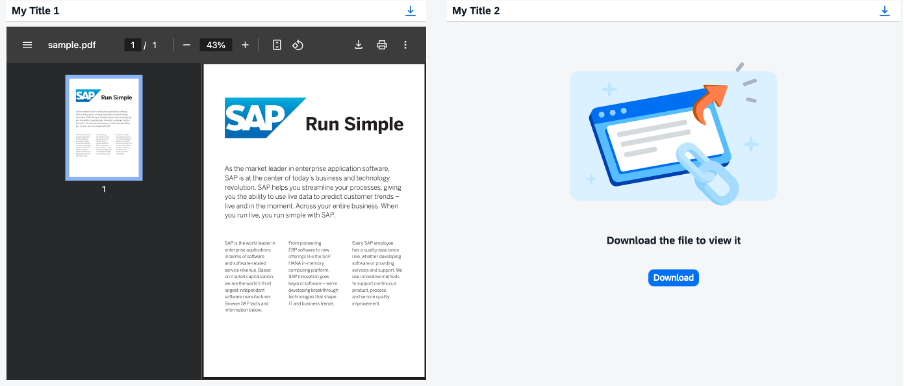

<!-- loiocd80a8bca4ac450b86547d78f0653330 -->

# PDF Viewer

PDF viewer is used to display PDF documents within your app, that enables your users to preview PDF documents before printing or downloading them.

<a name="loiocd80a8bca4ac450b86547d78f0653330__section_eqr_vr3_yz"/>

## Overview

The `PDFViewer` control displays PDF documents right inside your app. It can be embedded into your page layout, or you can set it to open in a popup dialog. In addition, this control allows you to download the PDF documents it displays.

For more information, see the [API Reference](https://ui5.sap.com/#/api/sap.m.PDFViewer) and the [Sample](https://ui5.sap.com/#/entity/sap.m.PDFViewer).

<a name="loiocd80a8bca4ac450b86547d78f0653330__section_xwt_xr3_yz"/>

## Details

**PDF File Source**

You can specify the source of the PDF document that you want to display using the `source` property that points to a PDF file path. This property can be set to a relative or an absolute path.

Optionally, you can set the `source` property to a data URI or a blob URL in all major web browsers except Internet Explorer and Microsoft Edge. If you want to use a data URI or a blob URL, you need to make sure that this data URI or blob URL has been validated in advance.For more information, see [URL List Validation](../05_Developing_Apps/url-list-validation-91f3768.md).

**Content Caching**

PDF documents displayed in the PDF viewer may or may not be cached, depending on the app that uses the PDF viewer control. It's up to you to decide how often the content should be refreshed and whether to use caching or not.

<a name="loiocd80a8bca4ac450b86547d78f0653330__section_j2j_csg_h1b"/>

## Constraints

**Supported Device Types**

-   The PDF Viewer control is fully displayed on desktop devices only.

-   On mobile devices, the PDF document is not displayed. Only the toolbar with a download button is visible. Click the download button to download and open the PDF document.

**Browser Restrictions**

-   Microsoft Edge \(Chromium\)2

    -   When the PDF viewer is open in the Microsoft Edge \(Chromium\)2 browser, the displayed PDF document may appear on top of all other page elements. To work around this issue, insert another `iframe` element between the PDF viewer and the rest of the elements on the page.

    -   Data URI paths and blob URLs used as the PDF source are not supported in Microsoft Edge \(Chromium\)2 browser.

-   Mozilla Firefox

    The sourceValidationFailed event is not fired for PDF documents loaded in the Mozilla Firefox browser.

-   Safari

    Data URI paths and blob URLs used as the PDF source are not supported in Safari.

**Embedding the PDF Viewer into a Tab**

-   When the PDF viewer is embedded into the [`sap.m.IconTabBar`](https://ui5.sap.com/#/api/sap.m.IconTabBar) control, the PDF documents may fail to reload when you switch tabs. To work around this issue, you can do either of the following:

    -   Set the visibility of the PDF viewer to `false` when the user is switching between tabs.

    -   Remove the PDF viewer `iframe` element from the DOM each time the user navigates to a different tab. The PDF viewer element can be removed by calling the `sap.m.PDFViewer#invalidate` method.

        For more information, see the [API Reference: `sap.ui.core.Control.html#invalidate`](https://ui5.sap.com/#/api/sap.m.PDFViewer/methods/invalidate).

**Accessibility**

Accessibility features available to the user may vary, depending on the version of the Adobe Acrobat Reader installed.

**Fillable PDF Forms**

Support for fillable PDF forms depends on the browser and device restrictions.

**Related Information**  

[URL List Validation](../05_Developing_Apps/url-list-validation-91f3768.md "The SAPUI5 framework provides a client-side API to manage allowed URLs using the URLListValidator. It can be used to validate arbitrary URLs.")

