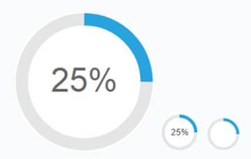

<!-- loioaa93bdb245914ebba9583b24dad94938 -->

# Radial Micro Chart

Displays a ring chart that represents a percentage value.

## Overview

The `RadialMicroChart` control provides a ring chart that displays the percentage value in the center of the chart. To indicate the significance of the displayed percentage value, you can define the status as `Good`, `Neutral`, `Critical`, or `Error`.

  

## Details

The percentage value in the `RadialMicroChart` control can be defined by:

-   Inserting the percentage property directly.

-   Setting the total and the fraction property and calculating the percentage value automatically.

    > ### Note:  
    > If the total property is set to `0`, only a blank circle gets rendered because no valid value is returned. The error is described in the error log.

**Colors**

The color of the circle is defined by setting the `valueColor` property to one of the following types:

-   `sap.m.ValueColor`: The possible value color settings are listed and show the status `Good`, `Neutral`, `Critical`, or `Error`.

-   `sap.ui.core.CSSColor`: All CSS color values are allowed.

**Sizes**

The `RadialMicroChart` control is rendered in a responsive way. Thus, the size of the control adapts automatically to the size of the surrounding container and does not have a defined width or height. Alternatively, you can use the `size` property with the control, so that the Radial Micro Chart can also be rendered in fixed sizes that are available in `sap.m.Size`. There, you can choose between the sizes `S`, `M`, `L`, `Auto` and `Responsive`.

## API Reference/Samples

For more information about the `RadialMicroChart` control, see the [API Reference](https://ui5.sap.com/#/api/sap.suite.ui.microchart.RadialMicroChart) in the Demo Kit and the [sample](https://ui5.sap.com/#/entity/sap.suite.ui.microchart.RadialMicroChart) in the Demo Kit.

