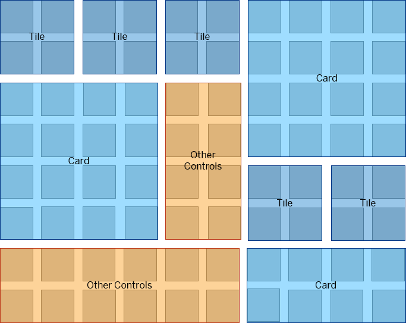

<!-- loiocca5ee5d63ca44c89318f8496a58f9f2 -->

# sap.f.GridContainer

The `GridContainer` allows you to align tiles, cards or other controls in configuration, such as an overview page.

<a name="loiocca5ee5d63ca44c89318f8496a58f9f2__section_gs3_qlx_hhb"/>

## Overview

The `GridContainer` allows the positioning of items \(Tiles, Cards, or others\) in a two-dimensional mesh. The mesh consists of rows with the same height and columns with the same width. Those height and width sizes along with the gap size are configurable.

The control provides responsiveness and automatically aligns the items depending on the available space.

-   In contrast to the `sap.ui.layout.cssgrid.CSSGrid`, the `GridContainer` allows the rows per item to be automatically increased, if the item does not fit and is cut off.

-   The `GridContainer` provides control over the behavior of the items if they are smaller in height than the given space. For example, if an item has a width of 4 rows, but its height is only 3.5 rows, then the item could either remain 3.5 rows or stretch to 4 rows. This behavior can be controlled through the `snapToRow` property.

The `GridContainer` also supports layout breakpoints based on the screen size. As a result, on smaller screens, the gaps, rows, and columns can be smaller. You can configure them through different `GridContainerSettings` for the different layouts.

**Related Information**  

[API Reference: `sap.f.GridContainer`](https://ui5.sap.com/#/api/sap.f.GridContainer)

[Samples: `sap.f.GridContainer`](https://ui5.sap.com/#/entity/sap.f.GridContainer)

