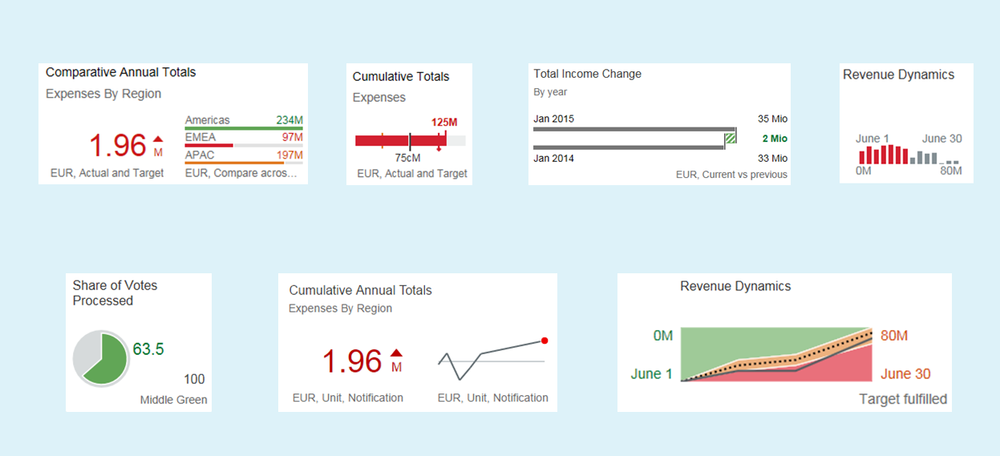

<!-- loio9cbe3f06465e47b8a136956034a718ed -->

# sap.suite.ui.microchart

This library contains controls to visualize charts and diagrams that are lightweight and easy to use.

> ### Note:  
> The following sections only provide additional information for some of the controls. For a complete list of all controls and their documentation, see the [API Reference](https://ui5.sap.com/#/api) and the [Samples](https://ui5.sap.com/#/controls). 

`MicroCharts` give a quick overview of customer-defined key figures like KPIs as graphical items and display the current status of defined key figures or thresholds.

The different values can be visualized in the charts by a semantically-colored representation and can be defined by the customer to correspond to the significance of the figures. For example, you can display critical statuses in red or you can display thresholds in specific colors to represent the significant values of your business data.

`MicroCharts` have a responsive design and can adapt their appearance and functions to the screen size of the devices. In the responsive mode, if `MicroCharts` are included in further controls \(for example generic tiles or flex boxes\), the control adapts to the available space provided by the parent control.

> ### Note:  
> You can include a `MicroChart` control into a `GenericTile` control in the responsive mode only. However, if you define a width, a height, and size properties, this data is overwritten and the responsive mode is used.

  

## Prerequisites

With the new `sap.suite.ui.microchart` library, the available MicroChart controls of the `sap.suite.ui.commons` library have been moved to their own library with SAPUI5 version 1.34.

-   If you have already included a `MicroChart` control before SAPUI5 version 1.34, a wrapper ensures that the embedding still works for each control. To benefit from all enhancements or new features for the `MicroChart` controls as of SAPUI5 1.34, you need to switch to the controls to the new library. With SAPUI5 1.34, all `MicroChart` controls in the `sap.suite.ui.commons` library are marked as deprecated. The respective controls are as follows:

    -   `AreaMicroChart`
    -   `BulletMicroChart`
    -   `ColumnMicroChart`
    -   `ComparisonMicroChart` 
    -   `DeltaMicroChart`
    -   `HarveyBallMicroChart`

    > ### Note:  
    > During the move, the following controls and their elements have been renamed:
    > 
    > -   `MicroAreaChart` to `AreaMicroChart`
    > -   `ComparisonChart` to `ComparisonMicroChart`
    > -   `BulletChart` to `BulletMicroChart`

**Related Information**  

[Browser and Platform Support](../02_Read-Me-First/browser-and-platform-support-74b59ef.md "Here you can find information on the browser and platform support for the SAPUI5 libraries on iOS, Android, macOS, and Windows platforms.")

[Supported Library Combinations](../02_Read-Me-First/supported-library-combinations-363cd16.md "SAPUI5 provides a set of JavaScript and CSS libraries, which can be combined in an application using the combinations that are supported.")

[API Reference: `sap.suite.ui.microchart`](https://ui5.sap.com/#/api/sap.suite.ui.microchart)

