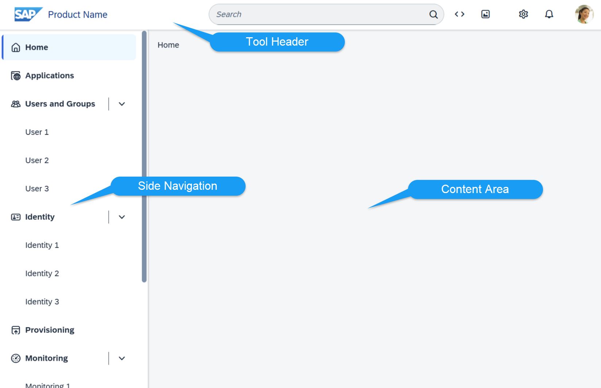

<!-- loiod8374d578a4c4f9498f9f14a6672c8bb -->

# sap.tnt

This library contains controls that provide the basic structure of a tool app.

The goal of these controls is to ensure consistency of the user interfaces in the tools area and the implementation of a common design language of applications and tools on the basis of SAP Fiori.

  
  
**Basic Page Structure of a Tool**

> ### Note:  
> This set of controls described in this article has been designed exclusively for the SAP tool landscape for the SAP Business Technology Platform.
> 
> Do not use these controls in regular SAP Fiori applications. This highly specialized set of controls targets the specific needs of the tools user group \(typically developers and administrators\).

For more information, check out the concept guidelines at [https://experience.sap.com/fiori-design-web/overview/](https://experience.sap.com/fiori-design-web/overview/).

**Related Information**  

[Supported Library Combinations](../02_Read-Me-First/supported-library-combinations-363cd16.md "SAPUI5 provides a set of JavaScript and CSS libraries, which can be combined in an application using the combinations that are supported.")

[API Reference: `sap.tnt`](https://ui5.sap.com/#/api/sap.tnt)

