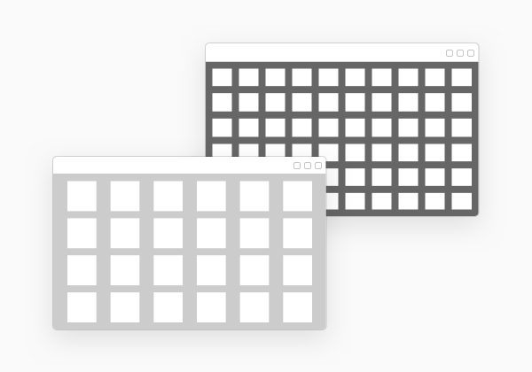
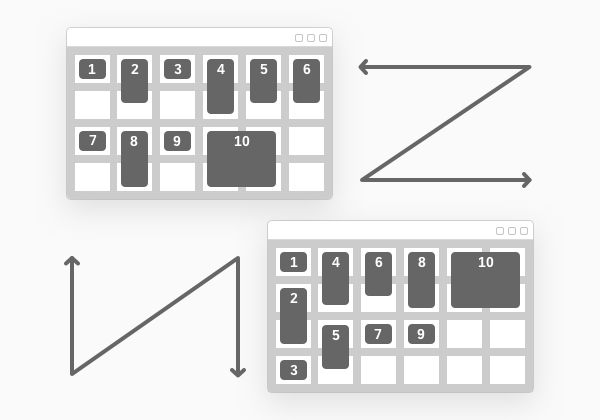
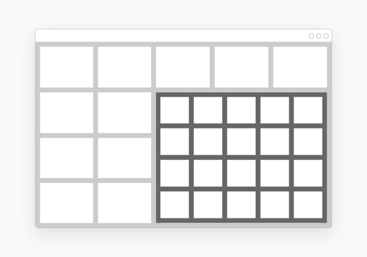
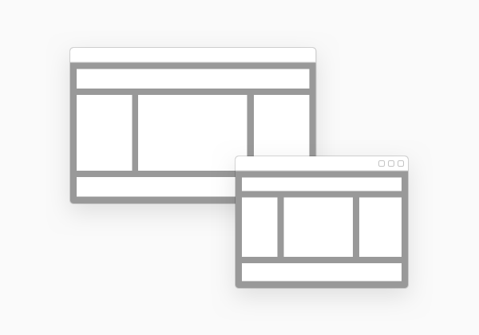

<!-- loiod6fc40bab9b549828782ba4846298417 -->

# sap.ui.layout.cssgrid.CSSGrid

The `CSSGrid` is a flexible layout, based on the two-dimensional, browser-native grid system, using the standard CSS property `display` with value `grid`. It allows for flexible positioning of user interface elements, inside horizontal and vertical grid structures.

<a name="loiod6fc40bab9b549828782ba4846298417__section_r1y_nf5_xfb"/>

## Overview

The `CSSGrid` is a powerful grid system that can be configured to display a variable number of columns and rows, depending on the available space. You can achieve complex but flexible layouts for both full-page and in-container page layouts. With the `CSSGrid` control, you can define a logical two-dimensional grid structure.

> ### Note:  
> You can use the `CSSGrid` layout to divide a page into regions or define the size, position, and layer between parts of a control, and easily align elements into columns and rows.
> 
> For more information, see [https://developer.mozilla.org/en-US/docs/Web/CSS/CSS\_Grid\_Layout](https://developer.mozilla.org/en-US/docs/Web/CSS/CSS_Grid_Layout)

You can achieve the desired layout, using a flexible set of configuration properties, including responsive positioning of grid cells along different container break-point sizes.

The grid cells created by the grid layout are empty containers that can be filled with controls.

  

<a name="loiod6fc40bab9b549828782ba4846298417__section_py1_5f5_xfb"/>

## Usage

The grid layout allows for the placement of multiple elements on the user interface to display structured content. This helps to maintain one coherent experience within pages as well as across all pages and/or layouts.

Features and behaviors are configurable to enable the grid layout for a variety of use cases:

-   You can define and control the elements flow, positioning the elements either horizontally in rows or vertically in columns.

      

-   Nesting:

    -   The grid layout can be used standalone or inside other layout containers, such as another page, a header or a dialog.

    -   The grid layout supports nesting, which allows for the placement of a grid layout inside another grid layout.

      

-   Size/dimensions configuration: you can configure either every row and column specifically, or using a template definition \(`gridTemplateRows`, `gridTemplateColumns`\), and you can configure the gaps too by using the `gridGap`, `gridRowGap`, `gridColumnGap` properties.

-   Responsiveness: The ability to adjust grid size and reorganize the grid content, depending on pre-defined break points. \(S, M, L, XL\).

      

**Related Information**  

[API Reference: `sap.ui.layout.cssgrid.CSSGrid`](https://ui5.sap.com/#/api/sap.ui.layout.cssgrid.CSSGrid)

[Samples: `sap.ui.layout.cssgrid.CSSGrid`](https://ui5.sap.com/#/entity/sap.ui.layout.cssgrid.CSSGrid)

