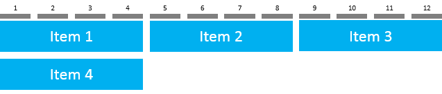
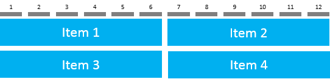
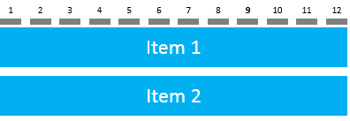
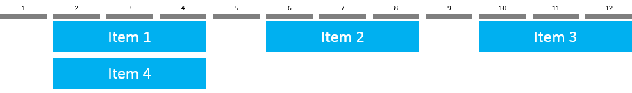

<!-- loio43ae317cf39640a88bc8be979d2671df -->

# sap.ui.layout.Grid

A flexible layout that positions its items in a 12-column flow layout.


<a name="loio43ae317cf39640a88bc8be979d2671df__section_r1y_nf5_xfb"/>

## Overview

The `sap.ui.layout.Grid` is a powerful grid system that can be configured to display a variable number of columns depending on the available screen size. You can achieve complex but flexible layouts and line breaks for extra large, large, medium, and small-sized screens, such as desktop, tablet, and mobile.

With this control, you can define how many items are displayed per row depending on the available screen size, with a maximum of 12. The height of a single row is always based on the content of the highest item in that row.

The flow direction of the items is horizontal only. For example, if the control is configured to display six items per row, the seventh item is displayed on the next row.


<a name="loio43ae317cf39640a88bc8be979d2671df__section_py1_5f5_xfb"/>

## Usage

You can use the `sap.ui.layout.Grid` on its own or in combination with the `sap.ui.layout.GridData`. The APIs in the `sap.ui.layout.Grid` apply for all grid items while with the `sap.ui.layout.GridData` you can manipulate individual grid items.


### Using `sap.ui.layout.Grid` on its own

`defaultSpan` and `defaultIndent` are the main two properties that enable you to define a specific layout for the grid. The number of grid columns is always 12 but the span and indentation of the items determine how many are displayed in one row.


<table>
<tr>
<th valign="top">

Property

</th>
<th valign="top">

Example Values

</th>
<th valign="top">

Description

</th>
</tr>
<tr>
<td valign="top">

`defaultSpan`

</td>
<td valign="top">

`"XL3 L4 M6 S12"`  
`"XL6 M6"`  
`"S2"`

</td>
<td valign="top">

Determines the span of the items for the different screen/container sizes \(XL, L, M, and S\). Each item can be set to span over several grid columns \(from 1 to 12\).

</td>
</tr>
<tr>
<td valign="top">

`defaultIndent`

</td>
<td valign="top">

`"XL4 L3 M2 S1"`  
`"XL2 L1"`  
`"S6"`

</td>
<td valign="top">

Defines the number of columns with which each item is indented for the different screen/container sizes \(XL, L, M, and S\). Each item can be indented with several grid columns \(from 0 to 11\).

</td>
</tr>
</table>

More properties are available for defining the horizontal and vertical spacing between the grid items, setting a specific width, defining the position for the grid as a whole, and so on.For more information, see the available properties in the [API Reference](https://ui5.sap.com/#/api/sap.ui.layout.Grid/controlProperties).


### Using `sap.ui.layout.GridData` to manipulate individual grid items

To achieve a layout where the individual grid items have a different configuration, use `sap.ui.layout.GridData`.

In addition to individual span and indentation, there is a large number of properties that allow for setting the visibility of items and adding line breaks.For more information, see the available properties in the [API Reference](https://ui5.sap.com/#/api/sap.ui.layout.GridData/controlProperties).


### Examples


<table>
<tr>
<td valign="top">

```xml
<l:Grid
		defaultSpan="XL3 L4 M6 S12">
	<Image src="/item1.png" width="100%"></Image>
	<Image src="/item2.png" width="100%"></Image>
	<Image src="/item3.png" width="100%"></Image>
	<Image src="/item4.png" width="100%"></Image>
</l:Grid>
```


</td>
<td valign="top">

XL container/screen size \(one item spans over 3 columns\)


L container/screen size \(one item spans over 4 columns\)



M container/screen size \(one item spans over 6 columns\)



S container/screen size \(one item spans over 12 columns\)



</td>
</tr>
<tr>
<td valign="top">

```xml
<l:Grid
		defaultSpan="XL3 L4 M6 S12"
		defaultIndent="XL1 L1 M1 S1">
	<Image src="/item1.png" width="100%"></Image>
	<Image src="/item2.png" width="100%"></Image>
	<Image src="/item3.png" width="100%"></Image>
	<Image src="/item4.png" width="100%"></Image>
</l:Grid>
```


</td>
<td valign="top">

XL container/screen size \(items are indented with 1 column\)



</td>
</tr>
<tr>
<td valign="top">

```xml
<l:Grid
		defaultSpan="XL3 L4 M6 S6">
	<Image src="/item1.png" width="100%"></Image>
	<Image src="/item2.png" width="100%">
		<layoutData>
			<l:GridData span="XL4"/>
		</layoutData>
	</Image>
	<Image src="/item3.png" width="100%"></Image>
	<Image src="/item4.png" width="100%">
		<layoutData>
			<l:GridData span="XL2"/>
		</layoutData>
	</Image>
</l:Grid>
```


</td>
<td valign="top">

Individual span for item2 and item4 using `sap.ui.layout.GridData`


</td>
</tr>
</table>

**Related Information**  


[API Reference: `sap.ui.layout.Grid`](https://ui5.sap.com/#/api/sap.ui.layout.Grid)

[API Reference: `sap.ui.layout.GridData`](https://ui5.sap.com/#/api/sap.ui.layout.GridData)

[Samples: `sap.ui.layout.Grid`](https://ui5.sap.com/#/entity/sap.ui.layout.Grid)

